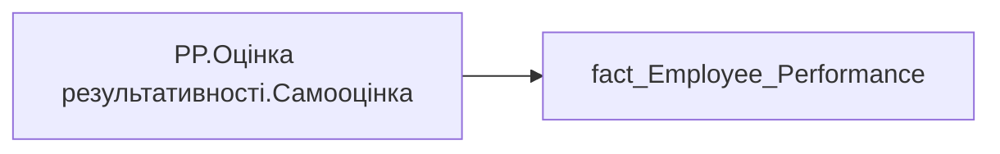

# PP.Оцінка результативності.Самооцінка

*тека `Personal_Profile\Результативність та оцінка\Результативність`*

## Технічний опис

| Властивість | Значення |
|---|---|
| Тип | міра |
| Home table | _Measures |
| displayFolder | `Personal_Profile\Результативність та оцінка\Результативність` |
| formatString | — |
| dataType | — |
| Прихована | ні |

### DAX

```dax
CALCULATE(AVERAGE('fact_Employee_Performance'[Salf_Rate]))
```

### Джерела даних

Вихідні таблиці: `DM.vw_R27_fact_Employee_Performance_PBI`

Колонки: `Salf_Rate`

Power Query: `fact_Employee_Performance`

### Залежності (таблиці й колонки)

Таблиці: `fact_Employee_Performance`

Колонки: `fact_Employee_Performance[Salf_Rate]`

### Схема



---

## Бізнес-суть

Salf_Rate → Оцінка кожного індикатора працівником

**Вимоги:** `Командний-профіль/Сторінка-Моя-команда/ТЗ.-Деталізація-метрик-групового-профілю-звіту`

## На сторінках звіту

_Не використовується на основних сторінках звіту._

## Пов'язані міри

**Використовується в:** [PP.SVG.Оцінка результативності](../measures/pp-svg-otsinka-rezultatyvnosti.md), [PP.Оцінка результативності](../measures/pp-otsinka-rezultatyvnosti.md), [PP.Оцінка результативності.Дані відсутні](../measures/pp-otsinka-rezultatyvnosti-dani-vidsutni.md)

## Нотатки

_порожньо_
