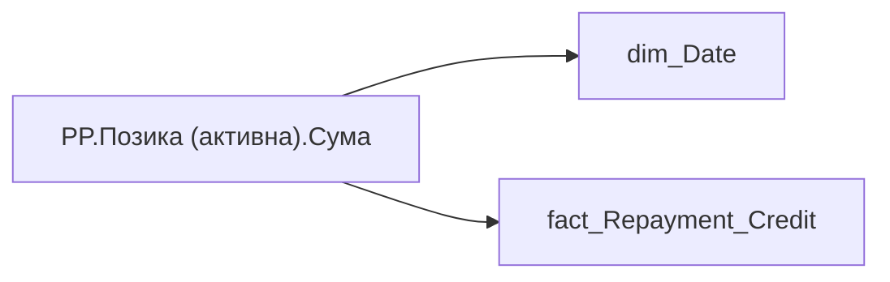

# PP.Позика (активна).Сума

*тека `Personal_Profile\TRS` · формат `#,0`*

## Технічний опис

| Властивість | Значення |
|---|---|
| Тип | міра |
| Home table | _Measures |
| displayFolder | `Personal_Profile\TRS` |
| formatString | `#,0` |
| dataType | — |
| Прихована | ні |

### DAX

```dax
CALCULATE(
    LASTNONBLANKVALUE(
        'dim_Date'[Date],
        CALCULATE(SUM(fact_Repayment_Credit[LAND_SHARE_CONTRACT_SUM]))
    ),
    'fact_Repayment_Credit'[IS_INCOMING] = TRUE(),
    'fact_Repayment_Credit'[ACTION_END_DATE] >= EDATE(TODAY(), -12)
)
```

### Джерела даних

Вихідні таблиці: `DM.vw_R27_fact_Repayment_Credit_PDP`

Колонки: `ACTION_END_DATE`, `Date`, `IS_INCOMING`, `LAND_SHARE_CONTRACT_SUM`

Power Query: `dim_Date`

### Залежності (таблиці й колонки)

Таблиці: `dim_Date`, `fact_Repayment_Credit`

Колонки: `dim_Date[Date]`, `fact_Repayment_Credit[ACTION_END_DATE]`, `fact_Repayment_Credit[IS_INCOMING]`, `fact_Repayment_Credit[LAND_SHARE_CONTRACT_SUM]`

### Схема



---

## Бізнес-суть

ACTION_END_DATE → Доля команди із позиками; LAND_SHARE_CONTRACT_SUM → Сума позики; LAND_SHARE_CONTRACT_SUM → Позика на ноутбук (остання); LAND_SHARE_CONTRACT_SUM → Доля команди з позикою на ноутбук (%) (діюча); LAND_SHARE_CONTRACT_SUM → Середній розмір позики; LAND_SHARE_CONTRACT_SUM → Позики

Потрібно підрахувати кількість працівників у команді, по яким є записи в таблиці DM.vw_R27_fact_Repayment_Credit_PDP та поле action_end_date>поточна дата (діюча позика) та поділити на поточну кількість членів команди. В деталізацію вивести ПІБ таких працівників, вид і розмір позики, дати видачі та погашення. Потрібно відібрати всі записи по працівнику [person_key], періоду [Period], організації [organization_key] ,  договору [CONTRACT_KEY], де [BUDGET_ITEM_CODE] = '0000008240'  <br>Якщо по працівнику не знайшлося запису, то вивести прочерк "-" Розрахункове поле: відношення кількості працівникі

**Вимоги:** `Індивідуальний-профіль-працівника/Сторінка-Винагорода-працівника`, `Індивідуальний-профіль-працівника/Сторінка-Винагорода-працівника/Доопрацювання-сторінки-ТРС`, `Командний-профіль/Сторінка-TRS-команди`, `Командний-профіль/Сторінка-TRS-команди/Доопрацювання-сторінки-TRS`, `Командний-профіль/Сторінка-TRS-команди/Сторінка-Винагорода-групового-профілю#вимоги-до-звіту`, `Командний-профіль/Сторінка-Моя-команда/ТЗ.-Деталізація-метрик-групового-профілю-звіту`

## На сторінках звіту

[Personal Profile](../report/personal-profile.md)

## Пов'язані міри

_Прямих зв'язків з іншими мірами немає._

## Нотатки

_порожньо_
