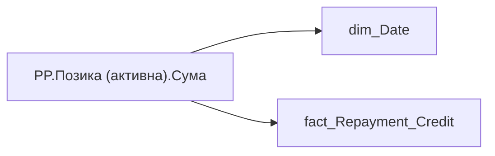

# PP.Позика (активна).Сума

*тека `Personal_Profile\TRS` · формат `#,0`*

## Технічний опис

| Властивість | Значення |
|---|---|
| Тип | міра |
| Home table | _Measures |
| displayFolder | `Personal_Profile\TRS` |
| formatString | `#,0` |
| dataType | — |
| Прихована | ні |

### DAX

```dax
CALCULATE(
    LASTNONBLANKVALUE(
        'dim_Date'[Date],
        CALCULATE(SUM(fact_Repayment_Credit[LAND_SHARE_CONTRACT_SUM]))
    ),
    'fact_Repayment_Credit'[IS_INCOMING] = TRUE(),
    'fact_Repayment_Credit'[ACTION_END_DATE] >= EDATE(TODAY(), -12)
)
```

### Джерела даних

Вихідні таблиці: `DM.vw_R27_fact_Repayment_Credit_PDP`

Колонки: `ACTION_END_DATE`, `Date`, `IS_INCOMING`, `LAND_SHARE_CONTRACT_SUM`

Power Query: `dim_Date`

### Залежності (таблиці й колонки)

Таблиці: `dim_Date`, `fact_Repayment_Credit`

Колонки: `dim_Date[Date]`, `fact_Repayment_Credit[ACTION_END_DATE]`, `fact_Repayment_Credit[IS_INCOMING]`, `fact_Repayment_Credit[LAND_SHARE_CONTRACT_SUM]`

### Схема



---

## Бізнес-суть

!!! note "Бізнес-визначення відсутнє"
    Поля міри не зіставлено з wiki «Таблицями джерел даних». Можна заповнити вручну в `manualNotes`.

## На сторінках звіту

- [Personal Profile](../report/personal-profile.md) — Винагорода

## Пов'язані міри

_Прямих зв'язків з іншими мірами немає._

## Нотатки

_порожньо_
