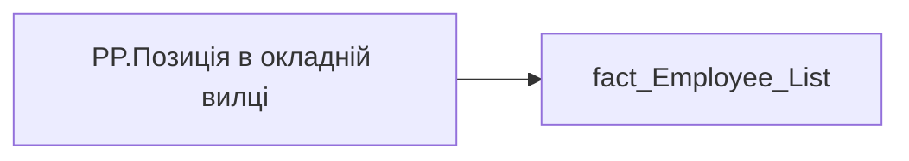

# PP.Позиція в окладній вилці

*тека `Personal_Profile\TRS`*

## Технічний опис

| Властивість | Значення |
|---|---|
| Тип | міра |
| Home table | _Measures |
| displayFolder | `Personal_Profile\TRS` |
| formatString | — |
| dataType | — |
| Прихована | ні |

### DAX

```dax
VAR _salary = MAX(fact_Employee_List[MIN_TARIFF_RATE])
vAR _salary_total = _salary + [PP.Роз'їзний характер роботи, грн] +[PP.Доплата за шкідливі умови праці,грн] + [PP.Премія за місяць, грн]
VAR _min = MAX(fact_Employee_List[min_salary_range])
VAR _max = MAX(fact_Employee_List[max_salary_range])
VAR _mid_range = MAX(fact_Employee_List[AVG_TARIFF_RATE])
VAR _position =  DIVIDE(_salary - _mid_range, _mid_range)
VAR _result = 
SWITCH(
	TRUE(),
	_salary_total < _min, "Нижче мінімума",
    _salary_total > _max, "Вище максимуму",
	_position <= -0.051, "Мінімум-середина",
	_position <= 0.05 , "Cередина",
	_position > 0.05, "Середина-Максимум",
	"Дані відсутні"
)
RETURN --_result & ":  " & 
DIVIDE(_salary_total, _mid_range)
```

### Джерела даних


Колонки: `AVG_TARIFF_RATE`, `MIN_TARIFF_RATE`, `max_salary_range`, `min_salary_range`

Power Query: `fact_Employee_List`

### Залежності (таблиці й колонки)

Таблиці: `fact_Employee_List`

Колонки: `fact_Employee_List[AVG_TARIFF_RATE]`, `fact_Employee_List[MIN_TARIFF_RATE]`, `fact_Employee_List[max_salary_range]`, `fact_Employee_List[min_salary_range]`

### Схема



---

## Бізнес-суть

**Бізнес-назва:** Позиція в окладній вилці

### Опис із ТЗ

Розрахункове поле.   Потрібно визначити в якому діапазоні знаходиться сума значень (`min_tariff_rate` + сума доплати за роз'їзний характер роботи+сума доплати за шкідливі умови праці+премія за місяць.)   Сума доплати за роз'їзний характер роботи - значення поля `PAYMENT_PLAN_SUM`, де  `ACCRUAL_ORG_CODE` = 00193, `IS_ACTUAL`  = "1", `END_DATE` > поточна дата, або `END_DATE` = "01.01.2001   Сума доплати за шкідливі умови праці - значення поля `PAYMENT_PLAN_SUM`, де  `ACCRUAL_ORG_CODE` = 00146, `IS_ACTUAL`  = "1", `END_DATE` > поточна дата, або `END_DATE` = "01.01.2001 Премія за місяць - значення поля `PAYMENT_PLAN_SUM`, де  `ACCRUAL_ORG_CODE` = 00148, `IS_ACTUAL`  = "1", `END_DATE` > поточна дата, або `END_DATE` = "01.01.2001   Положення окладу (%) = ((Оклад+сума доплати за роз'їзний характер роботи+сума доплати за шкідливі умови праці+премія за місяць) - Середина вилки) / Середина вилки) × 100   Нижче мінімума - якщо `min_tariff_rate` <`min_salary_range`   Мінімум-середина: Позиція –5,1% і нижче.   Середина: Позиція між -5,0% та +5,0% (навіть якщо рівно середина).   Середина-максимум: Позиція + 5,1% і вище.  Вище максимуму - коли сума більше `max_salary_range`  Якщо для працівника відсутня вилка або оклад, то вивести "Дані відсутні"

Розрахункове поле.   Потрібно визначити в якому діапазоні знаходиться значення `min_tariff_rate`.   Положення окладу (%) = ((Оклад - Середина вилки) / Середина вилки) × 100   Положення `min_tariff_rate` = ((`min_tariff_rate`- `avg_tariff_rate`) / `avg_tariff_rate`) × 100   **Нижче мінімума** - якщо `min_tariff_rate` <`min_salary_range`  **Мінімум-середина**: Позиція –5,1% і нижче.   Середина: Позиція між -5,0% та +5,0% (навіть якщо рівно середина).   **Середина-максимум**: Позиція + 5,1% і вище. Якщо для працівника відсутня вилка, то вивести "Дані відсутні"

**Вимоги (ТЗ):**

- [Індивідуальний профіль працівника › Сторінка Винагорода працівника](https://dev.azure.com/MHPITDepProjects/People%20Digital%20Profile%20%28PDP%29/_wiki/wikis/PDP.wiki?pagePath=/%D0%A4%D1%83%D0%BD%D0%BA%D1%86%D1%96%D0%BE%D0%BD%D0%B0%D0%BB%D1%8C%D0%BD%D1%96%20%D0%B2%D0%B8%D0%BC%D0%BE%D0%B3%D0%B8/%D0%92%D0%B8%D0%BC%D0%BE%D0%B3%D0%B8%20%D0%B4%D0%BE%20%D0%B7%D0%B2%D1%96%D1%82%D1%83%20People%20Digital%20Profile/%D0%86%D0%BD%D0%B4%D0%B8%D0%B2%D1%96%D0%B4%D1%83%D0%B0%D0%BB%D1%8C%D0%BD%D0%B8%D0%B9%20%D0%BF%D1%80%D0%BE%D1%84%D1%96%D0%BB%D1%8C%20%D0%BF%D1%80%D0%B0%D1%86%D1%96%D0%B2%D0%BD%D0%B8%D0%BA%D0%B0/%D0%A1%D1%82%D0%BE%D1%80%D1%96%D0%BD%D0%BA%D0%B0%20%D0%92%D0%B8%D0%BD%D0%B0%D0%B3%D0%BE%D1%80%D0%BE%D0%B4%D0%B0%20%D0%BF%D1%80%D0%B0%D1%86%D1%96%D0%B2%D0%BD%D0%B8%D0%BA%D0%B0)
- [Індивідуальний профіль працівника › Сторінка Винагорода працівника › Доопрацювання сторінки ТРС](https://dev.azure.com/MHPITDepProjects/People%20Digital%20Profile%20%28PDP%29/_wiki/wikis/PDP.wiki?pagePath=/%D0%A4%D1%83%D0%BD%D0%BA%D1%86%D1%96%D0%BE%D0%BD%D0%B0%D0%BB%D1%8C%D0%BD%D1%96%20%D0%B2%D0%B8%D0%BC%D0%BE%D0%B3%D0%B8/%D0%92%D0%B8%D0%BC%D0%BE%D0%B3%D0%B8%20%D0%B4%D0%BE%20%D0%B7%D0%B2%D1%96%D1%82%D1%83%20People%20Digital%20Profile/%D0%86%D0%BD%D0%B4%D0%B8%D0%B2%D1%96%D0%B4%D1%83%D0%B0%D0%BB%D1%8C%D0%BD%D0%B8%D0%B9%20%D0%BF%D1%80%D0%BE%D1%84%D1%96%D0%BB%D1%8C%20%D0%BF%D1%80%D0%B0%D1%86%D1%96%D0%B2%D0%BD%D0%B8%D0%BA%D0%B0/%D0%A1%D1%82%D0%BE%D1%80%D1%96%D0%BD%D0%BA%D0%B0%20%D0%92%D0%B8%D0%BD%D0%B0%D0%B3%D0%BE%D1%80%D0%BE%D0%B4%D0%B0%20%D0%BF%D1%80%D0%B0%D1%86%D1%96%D0%B2%D0%BD%D0%B8%D0%BA%D0%B0/%D0%94%D0%BE%D0%BE%D0%BF%D1%80%D0%B0%D1%86%D1%8E%D0%B2%D0%B0%D0%BD%D0%BD%D1%8F%20%D1%81%D1%82%D0%BE%D1%80%D1%96%D0%BD%D0%BA%D0%B8%20%D0%A2%D0%A0%D0%A1)

## На сторінках звіту

_Не використовується на основних сторінках звіту._

## Пов'язані міри

**Використовує:** [PP.Доплата за шкідливі умови праці,грн](../measures/pp-doplata-za-shkidlyvi-umovy-pratsi-hrn.md), [PP.Премія за місяць, грн](../measures/pp-premiia-za-misiats-hrn.md)

**Використовується в:** [PP.SVG.Позиція в окладній вилці](../measures/pp-svg-pozytsiia-v-okladnii-vyltsi.md)

## Нотатки

_порожньо_
