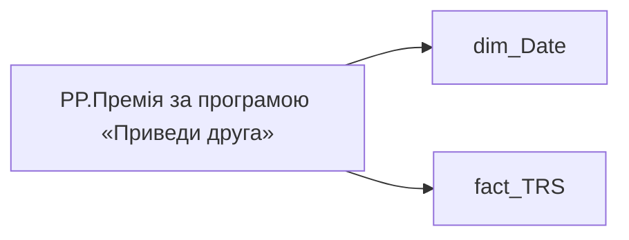

# PP.Премія за програмою «Приведи друга»

*тека `Personal_Profile\TRS` · формат `0`*

## Технічний опис

| Властивість | Значення |
|---|---|
| Тип | міра |
| Home table | _Measures |
| displayFolder | `Personal_Profile\TRS` |
| formatString | `0` |
| dataType | — |
| Прихована | ні |

### DAX

```dax
CALCULATE(
	SUM(fact_TRS[payments_fact_UAH]),
	fact_TRS[accrual_types_key]="7d01305e-3c3a-afe0-427c-2c0dcfcf9310",
	fact_TRS[category_of_accrual_sort]=3,
	DATESINPERIOD('dim_Date'[Date],EOMONTH(TODAY(),-1),-12,MONTH)
)
```

### Джерела даних

Вихідні таблиці: `DM.vw_R27_fact_TRS_PDP`

Колонки: `Date`, `accrual_types_key`, `category_of_accrual_sort`, `payments_fact_UAH`

Power Query: `dim_Date`

### Залежності (таблиці й колонки)

Таблиці: `dim_Date`, `fact_TRS`

Колонки: `dim_Date[Date]`, `fact_TRS[accrual_types_key]`, `fact_TRS[category_of_accrual_sort]`, `fact_TRS[payments_fact_UAH]`

### Схема



---

## Бізнес-суть

**Бізнес-назва:** Премія за програмою «Приведи друга»

### Опис із ТЗ

Потрібно відібрати всі записи по працівнику `person_key`, періоду `Period`, організації `organization_key` , підрозділу `division_key`, посаді `position_key`, де  поле `accrual_types_key` = 7d01305e-3c3a-afe0-427c-2c0dcfcf9310'   та `category_of_accrual_sort`  = '3' за останні 12 місяців, НЕ включаючи поточний.   Якщо по працівнику записи відсутні, то показати прочерк "-".   В деталізацію винести дані в табличному вигляді суму та місяць, за який було здійснено нарахування

**Вимоги (ТЗ):**

- [Індивідуальний профіль працівника › Сторінка Винагорода працівника](https://dev.azure.com/MHPITDepProjects/People%20Digital%20Profile%20%28PDP%29/_wiki/wikis/PDP.wiki?pagePath=/%D0%A4%D1%83%D0%BD%D0%BA%D1%86%D1%96%D0%BE%D0%BD%D0%B0%D0%BB%D1%8C%D0%BD%D1%96%20%D0%B2%D0%B8%D0%BC%D0%BE%D0%B3%D0%B8/%D0%92%D0%B8%D0%BC%D0%BE%D0%B3%D0%B8%20%D0%B4%D0%BE%20%D0%B7%D0%B2%D1%96%D1%82%D1%83%20People%20Digital%20Profile/%D0%86%D0%BD%D0%B4%D0%B8%D0%B2%D1%96%D0%B4%D1%83%D0%B0%D0%BB%D1%8C%D0%BD%D0%B8%D0%B9%20%D0%BF%D1%80%D0%BE%D1%84%D1%96%D0%BB%D1%8C%20%D0%BF%D1%80%D0%B0%D1%86%D1%96%D0%B2%D0%BD%D0%B8%D0%BA%D0%B0/%D0%A1%D1%82%D0%BE%D1%80%D1%96%D0%BD%D0%BA%D0%B0%20%D0%92%D0%B8%D0%BD%D0%B0%D0%B3%D0%BE%D1%80%D0%BE%D0%B4%D0%B0%20%D0%BF%D1%80%D0%B0%D1%86%D1%96%D0%B2%D0%BD%D0%B8%D0%BA%D0%B0)

## На сторінках звіту

- [Personal Profile](../report/personal-profile.md) — Винагорода

## Пов'язані міри

_Прямих зв'язків з іншими мірами немає._

## Нотатки

_порожньо_
