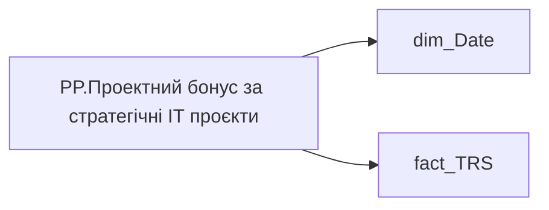

# PP.Проектний бонус за стратегічні ІТ проєкти

*тека `Personal_Profile\TRS` · формат `0`*

## Технічний опис

| Властивість | Значення |
|---|---|
| Тип | міра |
| Home table | _Measures |
| displayFolder | `Personal_Profile\TRS` |
| formatString | `0` |
| dataType | — |
| Прихована | ні |

### DAX

```dax
CALCULATE(
	SUM(fact_TRS[payments_fact_UAH]),
	fact_TRS[accrual_types_key]="8892e575-4037-2f78-ec86-2cdea2b3fbae",
	fact_TRS[category_of_accrual_sort]=2,
	DATESINPERIOD('dim_Date'[Date],EOMONTH(TODAY(),-1),-12,MONTH)
)
```

### Джерела даних

Вихідні таблиці: `DM.vw_R27_fact_TRS_PDP`

Колонки: `Date`, `accrual_types_key`, `category_of_accrual_sort`, `payments_fact_UAH`

Power Query: `dim_Date`

### Залежності (таблиці й колонки)

Таблиці: `dim_Date`, `fact_TRS`

Колонки: `dim_Date[Date]`, `fact_TRS[accrual_types_key]`, `fact_TRS[category_of_accrual_sort]`, `fact_TRS[payments_fact_UAH]`

### Схема



---

## Бізнес-суть

payments_fact_UAH → Зірка МХП; payments_fact_UAH → Наставництво (ост. 12 міс); payments_fact_UAH → Доплати за суміщення; payments_fact_UAH → Щомісячні премії; payments_fact_UAH → Квартальні премії; payments_fact_UAH → Річні бонуси; payments_fact_UAH → Інші доплати; payments_fact_UAH → Премія МХП Зірки; payments_fact_UAH → Проектний бонус за стратегічні ІТ проєкти; payments_fact_UAH → Інвестиційний проєктний бонус; payments_fact_UAH → Премія за збереження та розширення земельного банку; payments_fact_UAH → Разова премія за програмою визнання; payments_fact_UAH → Премія за внутрішнє тренерство; payments_fact_UAH → Доплата за наставництво; payments_fact_UAH → Премія за програмою «Приведи друга»; payments_fact_UAH → Премія за Банк ідей; payments_fact_UAH → Соціальна підтримка; payments_fact_UAH → Внутрішнє тренерство; payments_fact_UAH → Наставництво; payments_fact_UAH → Програма визнання; payments_fact_UAH → Сума нарахування; payments_fact_UAH → Місячний дохід з річним бонусом; payments_fact_UAH → Місячний дохід без річного бонусу; payments_fact_UAH → Доля команди із премією МХП Зірки, %; payments_fact_UAH → Доля команди із проектним бонусом за стратегічні ІТ проєкти, %; payments_fact_UAH → Доля команди із інвестиційним проєктним бонусом, %; payments_fact_UAH → Доля команди із премією за збереження та розширення земельного банку, %; payments_fact_UAH → Середній розмір премії МХП Зірки; payments_fact_UAH → Середній розмір проектного бонус за стратегічні ІТ проєкти; payments_fact_UAH → Середній розмір інвестиційного проєктного бонусу; payments_fact_UAH → Середній розмір премії за збереження та розширення земельного банку; payments_fact_UAH → Доля команди із разовою премією за програмою визнання, %; payments_fact_UAH → Доля команди із премією за внутрішнє тренерство, %; payments_fact_UAH → Доля команди із доплатою за наставництво, %; payments_fact_UAH → Доля команди із премією за програмою «Приведи друга», %; payments_fact_UAH → Доля команди із премією за Банк ідей, %; payments_fact_UAH → Середній розмір разової премії за програмою визнання; payments_fact_UAH → Середній розмір премії за внутрішнє тренерство; payments_fact_UAH → Середній розмір доплати за наставництво; payments_fact_UAH → Середній розмір премії за програмою «Приведи друга»; payments_fact_UAH → Середній розмір премії за Банк ідей; payments_fact_UAH → Доля команди з соціальними виплатами, %; payments_fact_UAH → Середній розмір соціальної підтримки; payments_fact_UAH → Середня заробітна плата; payments_fact_UAH → Діапазон фіксованої винагороди (факт); payments_fact_UAH → Доля команди з премією за місяць, % факт; payments_fact_UAH → Середній розмір премії за місяць факт; payments_fact_UAH → Доля команди з доплатою за шкідливі умови праці, % факт; payments_fact_UAH → Середній розмір доплати за шкідливі умови праці; payments_fact_UAH → Доля команди з доплатою за роз’їзний характер роботи, % факт; payments_fact_UAH → Середній розмір доплати за роз’їзний характер роботи факт; payments_fact_UAH → Доля команди із щомісячними преміями; payments_fact_UAH → Середній розмір щомісячних премій; payments_fact_UAH → Доля команди із квартальними преміями; payments_fact_UAH → Середній розмір квартальних премій; payments_fact_UAH → Доля команди із річними бонусами; payments_fact_UAH → Середній розмір річних бонусів; payments_fact_UAH → Доля команди із доплатами за суміщення; payments_fact_UAH → Середній розмір доплат за суміщення; payments_fact_UAH → Соціальні виплати

Потрібно відібрати останній запис по працівнику на дату, де  поле accrual_types_key = '9781d4aa-3a0d-1458-623a-7a93e90a2284'   та category_of_accrual_sort  = '2' Потрібно відібрати всі записи по працівнику, де  поле accrual_types_key = '9781d4aa-3a0d-1458-623a-7a93e90a2284'   та category_of_accrual_sort  = '2'  <br>Рік визначати за полем period Якщо по працівнику [person_key], періоду [Period], організації [organization_key] , працевлаштуванню [employment_type_key] є значення по полю [ACCRUAL_TYPES_KEY] ='83ce68c2-8a36-d6d5-21bd-27fc6b970114" то Так. Інакше - Ні Відібрати записи за останні 12 

**Вимоги:** `Індивідуальний-профіль-працівника/Історія-по-посадам`, `Індивідуальний-профіль-працівника/Історія-по-посадам/Реліз-1.-Історія-по-посадам`, `Індивідуальний-профіль-працівника/Паспортна-частина-індивідуального-профілю-співробітника`, `Індивідуальний-профіль-працівника/Паспортна-частина-індивідуального-профілю-співробітника/Бейджики-під-фото-працівника`, `Індивідуальний-профіль-працівника/Паспортна-частина-індивідуального-профілю-співробітника/Сторінка-Картка-(паспорт)-працівника/Редизайн-паспортної-частини`, `Індивідуальний-профіль-працівника/Сторінка-Взаємодія-Viva-та-залученість-працівника`, `Індивідуальний-профіль-працівника/Сторінка-Винагорода-працівника`, `Індивідуальний-профіль-працівника/Сторінка-Винагорода-працівника/Деталізація-на-сторінці-Винагорода`, `Індивідуальний-профіль-працівника/Сторінка-Винагорода-працівника/Доопрацювання-сторінки-ТРС`, `Допоміжні-вітрини-для-звіту/Таблиця-періодична-(попередні-12-міс)-для-розрахунку-метрики-Середній-дохід`, `Командний-профіль/Паспортна-частина-групового-профілю/Сторінка-Картка-команди`, `Командний-профіль/Сторінка-TRS-команди`, `Командний-профіль/Сторінка-TRS-команди/Доопрацювання-сторінки-TRS`, `Командний-профіль/Сторінка-TRS-команди/Сторінка-Винагорода-групового-профілю#вимоги-до-звіту`, `Командний-профіль/Сторінка-Моя-команда/ТЗ.-Деталізація-метрик-групового-профілю-звіту`

## На сторінках звіту

_Не використовується на основних сторінках звіту._

## Пов'язані міри

_Прямих зв'язків з іншими мірами немає._

## Нотатки

_порожньо_
