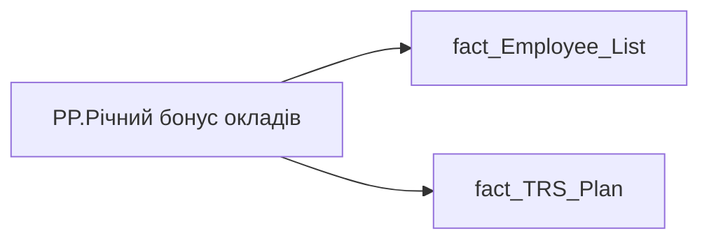

# PP.Річний бонус окладів

*тека `Personal_Profile\TRS`*

## Технічний опис

| Властивість | Значення |
|---|---|
| Тип | міра |
| Home table | _Measures |
| displayFolder | `Personal_Profile\TRS` |
| formatString | — |
| dataType | — |
| Прихована | ні |

### DAX

```dax
VAR _v = 
	CALCULATE(
		MAXX(
			'fact_Employee_List',
			'fact_Employee_List'[BONUS_YEAR_SALARY_CNT]
		)
	)

// VAR _v = 
//     CALCULATE(
//         MAXX(
//             'fact_TRS_Plan',
//             'fact_TRS_Plan'[BONUS_YEAR_SALARY_CNT]
//         ),
//         fact_TRS_Plan[IS_ACTUAL]=TRUE(),
//         fact_TRS_Plan[CALC_TYPE_CODE]="UAH",
//         fact_TRS_Plan[category_name]="Фіксована винагорода"
//     )
RETURN "Окладів: "&_v
```

### Джерела даних

Вихідні таблиці: `DM.vw_R27_fact_TRS_Plan_PDP`

Колонки: `BONUS_YEAR_SALARY_CNT`, `CALC_TYPE_CODE`, `IS_ACTUAL`, `category_name`

Power Query: `fact_Employee_List`

### Залежності (таблиці й колонки)

Таблиці: `fact_Employee_List`, `fact_TRS_Plan`

Колонки: `fact_Employee_List[BONUS_YEAR_SALARY_CNT]`, `fact_TRS_Plan[BONUS_YEAR_SALARY_CNT]`, `fact_TRS_Plan[CALC_TYPE_CODE]`, `fact_TRS_Plan[IS_ACTUAL]`, `fact_TRS_Plan[category_name]`

### Схема



---

## Бізнес-суть

!!! note "Бізнес-визначення відсутнє"
    Поля міри не зіставлено з wiki «Таблицями джерел даних». Можна заповнити вручну в `manualNotes`.

## На сторінках звіту

- [Personal Profile](../report/personal-profile.md) — Винагорода

## Пов'язані міри

_Прямих зв'язків з іншими мірами немає._

## Нотатки

_порожньо_
