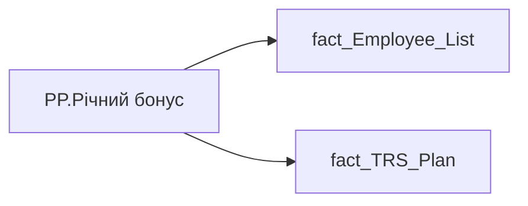

# PP.Річний бонус

*тека `Personal_Profile\TRS` · формат `#,##0" ₴";-#,##0" ₴";0" ₴"`*

!!! abstract "Джерела даних"
    `DM.vw_R27_fact_TRS_Plan_PDP`

## Бізнес-суть

BONUS_YEAR_SALARY_CNT → Премія річна кіл-ть окладів; BONUS_YEAR_SALARY_CNT → Річний бонус; BONUS_YEAR_SALARY_CNT → Доля команди з річним бонусом, %; MIN_TARIFF_RATE → Оклад; MIN_TARIFF_RATE → Позиція в окладній вилці; MIN_TARIFF_RATE → Зарплата (вилки); MIN_TARIFF_RATE → Розподіл за вилкою зарплат; MIN_TARIFF_RATE → Положення у вилці; category_name → Назва блоку

Станом на дату події <br>Це поле має бути доступне у візуалізаціях, побудованих на основі фактової таблиці [DM.vw_R27_fact_Employee_List_PDP]  <br>Відібрати записи по працівнику по працівнику [person_key], періоду [Period], організації [organization_key], підрозділу [division_key], посаді [position_key]<br> BONUS_YEAR_SALARY_CNT - кількість окладів  <br>Розмір премії = Min_Tariff_Rate помножити на BONUS_MONTH_SALARY_CNT - сума (к-сть окладів*оклад)  <br>Якщо по працівнику записи відсутні, то показати прочерк "-". Відбір робити за період станом на 12 міс. тому  <br>BONUS_YEAR_SALARY_CNT- кількі

**Вимоги:** `Індивідуальний-профіль-працівника/Історія-по-посадам`, `Індивідуальний-профіль-працівника/Історія-по-посадам/Реліз-1.-Історія-по-посадам`, `Індивідуальний-профіль-працівника/Сторінка-Винагорода-працівника`, `Індивідуальний-профіль-працівника/Сторінка-Винагорода-працівника/Деталізація-на-сторінці-Винагорода`, `Індивідуальний-профіль-працівника/Сторінка-Винагорода-працівника/Доопрацювання-сторінки-ТРС`, `Індивідуальний-профіль-працівника/Сторінка-Результативність-та-оцінка/Блок-Оцінка-компетенцій`, `Допоміжні-вітрини-для-звіту/Таблиця-для-розрахунку-агрегованих-метрик-по-звіту`, `Командний-профіль/Сторінка-TRS-команди`, `Командний-профіль/Сторінка-TRS-команди/Сторінка-Винагорода-групового-профілю#вимоги-до-звіту`, `Командний-профіль/Сторінка-Моя-команда/ТЗ.-Деталізація-метрик-групового-профілю-звіту`, `Командний-профіль/Сторінка-Результативність-та-оцінка-команди/Блок-Оцінка-компетенцій-(груповий-профіль)`

## На сторінках звіту

[Personal Profile](../report/personal-profile.md)

## Пов'язані міри

_Прямих зв'язків з іншими мірами немає._

---

## Технічний опис

| Властивість | Значення |
|---|---|
| Тип | міра |
| Home table | _Measures |
| displayFolder | `Personal_Profile\TRS` |
| formatString | `#,##0" ₴";-#,##0" ₴";0" ₴"` |
| dataType | — |
| Прихована | ні |

### DAX

```dax
CALCULATE(
	SUMX(
		'fact_Employee_List',
		'fact_Employee_List'[MIN_TARIFF_RATE] * 'fact_Employee_List'[BONUS_YEAR_SALARY_CNT]
	)
)

// CALCULATE(
//     SUMX(
//         'fact_TRS_Plan',
//         fact_TRS_Plan[MIN_TARIFF_RATE] * 'fact_TRS_Plan'[BONUS_YEAR_SALARY_CNT]
//     ),
//     fact_TRS_Plan[IS_ACTUAL]=TRUE(),
//     fact_TRS_Plan[CALC_TYPE_CODE]="UAH",
//     fact_TRS_Plan[category_name]="Фіксована винагорода"
// )
```

### Джерела даних

Вихідні таблиці: `DM.vw_R27_fact_TRS_Plan_PDP`

Колонки: `BONUS_YEAR_SALARY_CNT`, `CALC_TYPE_CODE`, `IS_ACTUAL`, `MIN_TARIFF_RATE`, `category_name`

Power Query: `fact_Employee_List`

### Залежності (таблиці й колонки)

Таблиці: `fact_Employee_List`, `fact_TRS_Plan`

Колонки: `fact_Employee_List[BONUS_YEAR_SALARY_CNT]`, `fact_Employee_List[MIN_TARIFF_RATE]`, `fact_TRS_Plan[BONUS_YEAR_SALARY_CNT]`, `fact_TRS_Plan[CALC_TYPE_CODE]`, `fact_TRS_Plan[IS_ACTUAL]`, `fact_TRS_Plan[MIN_TARIFF_RATE]`, `fact_TRS_Plan[category_name]`

### Схема



## Нотатки

_порожньо_
