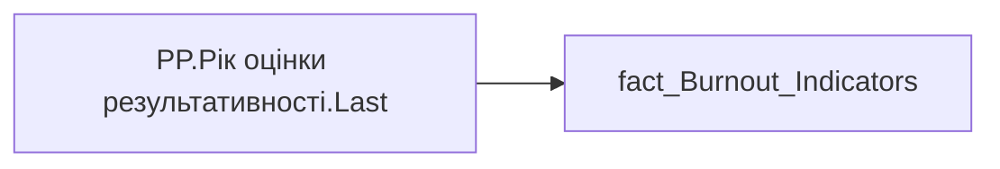

# PP.Рік оцінки результативності.Last

*тека `Personal_Profile\Паспорт\Результативність`*

## Технічний опис

| Властивість | Значення |
|---|---|
| Тип | міра |
| Home table | _Measures |
| displayFolder | `Personal_Profile\Паспорт\Результативність` |
| formatString | — |
| dataType | — |
| Прихована | ні |

### DAX

```dax
"Динаміка OKR" 
--AVERAGE('fact_Burnout_Indicators'[LAST_YEAR_PERFORMANCE])
```

### Джерела даних


Колонки: `LAST_YEAR_PERFORMANCE`

Power Query: `fact_Burnout_Indicators`

### Залежності (таблиці й колонки)

Таблиці: `fact_Burnout_Indicators`

Колонки: `fact_Burnout_Indicators[LAST_YEAR_PERFORMANCE]`

### Схема



---

## Бізнес-суть

LAST_YEAR_PERFORMANCE → Значення останнього року оцінки результативності

Ці дані виводяться в деталізацію по тренду оцінки результативності

**Вимоги:** `Індивідуальний-профіль-працівника/Паспортна-частина-індивідуального-профілю-співробітника/Сторінка-Картка-(паспорт)-працівника/Додати-інформацію-про-оцінку-результативності-працівника-в-Картку-працівника`, `Кейс-Утримання-працівників/Опис-джерел-для-сторінки-%22Кейс-звільнення-(вигорання)%22`, `Командний-профіль/Паспортна-частина-групового-профілю/Додати-інформацію-про-ОКР-команди-та-середню-оцінку-результативності-по-команді`

## На сторінках звіту

[Personal Profile](../report/personal-profile.md)

## Пов'язані міри

_Прямих зв'язків з іншими мірами немає._

## Нотатки

_порожньо_
