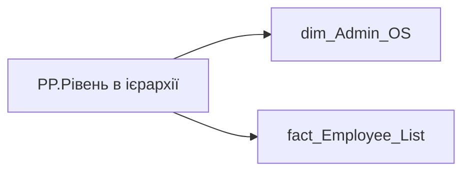

# PP.Рівень в ієрархії

*тека `Personal_Profile\Загальна інформація`*

## Технічний опис

| Властивість | Значення |
|---|---|
| Тип | міра |
| Home table | _Measures |
| displayFolder | `Personal_Profile\Загальна інформація` |
| formatString | — |
| dataType | — |
| Прихована | ні |

### DAX

```dax
VAR _value = SELECTEDVALUE('dim_Admin_OS'[EMP_HIERARCHY_LEVEL])
--SELECTEDVALUE('fact_Employee_List'[HIERARCHY_LEVEL])

RETURN IF(_value = "", "-", _value)
```

### Джерела даних

Вихідні таблиці: `DM.vw_R27_dim_Employee_Access_List`

Колонки: `EMP_HIERARCHY_LEVEL`, `HIERARCHY_LEVEL`

Power Query: `dim_Admin_OS`

### Залежності (таблиці й колонки)

Таблиці: `dim_Admin_OS`, `fact_Employee_List`

Колонки: `dim_Admin_OS[EMP_HIERARCHY_LEVEL]`, `fact_Employee_List[HIERARCHY_LEVEL]`

### Схема



---

## Бізнес-суть

EMP_HIERARCHY_LEVEL → Рівень в ієрархії; HIERARCHY_LEVEL → Рівень посади працівника в ієрархії; HIERARCHY_LEVEL → Рівень в ієрархії

Якщо значення в полі відсутнє, то потрібно визначити проблему та виправити Потрібно буде доопрацювання після розробки окремої вітрини по історизації керівників. Якщо значення в полі відсутнє, то показати текст "Дані відсутні"

**Вимоги:** `Індивідуальний-профіль-працівника/Історія-по-посадам`, `Індивідуальний-профіль-працівника/Сторінка-Індивідуальний-профіль-працівника`, `Індивідуальний-профіль-працівника/Сторінка-Загальна-інформація-про-працівника`, `Командний-профіль/Сторінка-Ефективність`

## На сторінках звіту

[Personal Profile](../report/personal-profile.md)

## Пов'язані міри

_Прямих зв'язків з іншими мірами немає._

## Нотатки

_порожньо_
