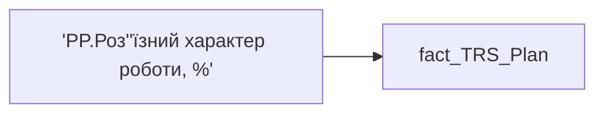

# 'PP.Роз''їзний характер роботи, %'

*тека `Personal_Profile\TRS` · формат `0`*

## Технічний опис

| Властивість | Значення |
|---|---|
| Тип | міра |
| Home table | _Measures |
| displayFolder | `Personal_Profile\TRS` |
| formatString | `0` |
| dataType | — |
| Прихована | ні |

### DAX

```dax
CALCULATE(
	MAX(fact_TRS_Plan[INIT_PAYMENT_PLAN_SUM]),
	fact_TRS_Plan[IS_ACTUAL]=TRUE(),
	fact_TRS_Plan[ACCRUAL_ORG_CODE]="00193"
)
```

### Джерела даних

Вихідні таблиці: `DM.vw_R27_fact_TRS_Plan_PDP`

Колонки: `ACCRUAL_ORG_CODE`, `INIT_PAYMENT_PLAN_SUM`, `IS_ACTUAL`

Power Query: `fact_TRS_Plan`

### Залежності (таблиці й колонки)

Таблиці: `fact_TRS_Plan`

Колонки: `fact_TRS_Plan[ACCRUAL_ORG_CODE]`, `fact_TRS_Plan[INIT_PAYMENT_PLAN_SUM]`, `fact_TRS_Plan[IS_ACTUAL]`

### Схема



---

## Бізнес-суть

### Опис із ТЗ

Це сума по блокам Фіксована винагорода, всього х 12, Змінна винагорода (Щомісячна премія+ Квартальна премія+ Річний бонус) приведена до річної суми.   - **Фіксована винагорода** = Відібрати записи по працівнику `person_key`, періоду `Period`, організації `organization_key`, підрозділу `division_key`, де `category_name` = Фіксована винагорода, `IS_ACTUAL`  = "1",  `TARIFF_RATE_TYPE_CODE` <> "СДЕЛЬНАЯ", `END_DATE` > поточна дата, або `END_DATE` = "01.01.2001".   Значення брати з `INIT_PAYMENT_PLAN_SUM`, якщо `CALC_TYPE_CODE` = "UAH", інакше - `PAYMENT_PLAN_SUM`.    - **Змінна винагорода**(визначається по атрибутах із таблиці DM.`vw_R27_fact_Employee_List_PDP`) = Сума Розмірів премій місячних, квартальних і річних **Розмір місячної премії** = `Min_Tariff_Rate` х `BONUS_MONTH_SALARY_CNT` х 12 - сума (к-сть окладівхОкладх12)   Якщо по працівнику записи відсутні, то показати 0,00 грн.  **Розмір квартальної премії** = `Min_Tariff_Rate` х `BONUS_QUARTER_SALARY_CNT` х 4 - сума (к-сть окладівхОкладх4)   Якщо по працівнику записи відсутні, то показати 0,00 грн.  **Розмір річної премії** = `Min_Tariff_Rate` х `BONUS_YEAR_SALARY_CNT` - сума (к-сть окладівхОклад)   Якщо по працівнику записи відсутні, то показати 0,00 грн.

Це поле має бути доступне у візуалізаціях, побудованих на основі фактової таблиці `DM.vw_R29_fact_TRS_Plan`   Відібрати записи по працівнику по працівнику `person_key`, періоду `Period`, організації `organization_key` ,  підрозділу `division_key` де `ACCRUAL_ORG_CODE` = 00002, `IS_ACTUAL`  = "1", `END_DATE` > поточна дата, або `END_DATE` = "01.01.2001   Якщо для працівника застосовується інший вид оплати праці, то вивести "Дані відсутні"

Це поле має бути доступне у візуалізаціях, побудованих на основі фактової таблиці `DM.vw_R29_fact_TRS_Plan`   Відібрати записи по працівнику по працівнику `person_key`, періоду `Period`, організації `organization_key` , підрозділу `division_key`, посаді `position_key`, де `ACCRUAL_ORG_CODE` = 00001, `IS_ACTUAL`  = "1", `END_DATE` > поточна дата, або `END_DATE` = "01.01.2001   Якщо для працівника застосовується інший вид оплати праці, то вивести "Дані відсутні"

Це поле має бути доступне у візуалізаціях, побудованих на основі фактової таблиці `DM.vw_R29_fact_TRS_Plan`   Відібрати записи по працівнику по працівнику `person_key`, періоду `Period`, організації `organization_key` , підрозділу `division_key`, посаді `position_key`, де `ACCRUAL_ORG_CODE` = 00148, `IS_ACTUAL`  = "1", `END_DATE` > поточна дата, або `END_DATE` = "01.01.2001   Відсоток = значення поля `INIT_PAYMENT_PLAN_SUM`   Сума = значення поля `PAYMENT_PLAN_SUM`.   Для відрядної форми оплати праці буде 0,00 грн, так як оклад не встановлено.   Якщо по працівнику записи відсутні, то показати прочерк "-".

Це поле має бути доступне у візуалізаціях, побудованих на основі фактової таблиці `DM.vw_R29_fact_TRS_Plan`   Відібрати записи по працівнику по працівнику `person_key`, періоду `Period`, організації `organization_key` , підрозділу `division_key`, посаді `position_key`, де `ACCRUAL_ORG_CODE` = 00146, `IS_ACTUAL`  = "1", `END_DATE` > поточна дата, або `END_DATE` = "01.01.2001   Відсоток = значення поля `INIT_PAYMENT_PLAN_SUM`   Сума = значення поля `PAYMENT_PLAN_SUM`.   Для відрядної форми оплати праці буде 0,00 грн, так як оклад не встановлено.   Якщо по працівнику записи відсутні, то показати прочерк "-".

??? note "Поля-джерела та пов'язані бізнес-метрики (17)"
    | Поле | Бізнес-метрики |
    |---|---|
    | `INIT_PAYMENT_PLAN_SUM` | Цільовий розмір річної винагороди, до оподаткування · Оклад по годинах · Оклад по днях · Премія за місяць, % · Доплата за шкідливі умови праці, % · Роз'їзний характер роботи, % · Оренда житла · Середній цільовий розмір річної винагороди, до оподаткування · Середня зарплата (оклад) · Доля команди з премією за місяць, % · Доля команди з доплатою за шкідливі умови праці, % · Доля команди з доплатою за роз’їзний характер роботи, % · Середній розмір доплати за шкідливі умови праці · Середній розмір доплати за роз’їзний характер роботи · Середні витрати на оренду житла · Річний цільовий дохід (РЦД) · Оклад |

**Вимоги (ТЗ):**

- [Індивідуальний профіль працівника › Сторінка Винагорода працівника](https://dev.azure.com/MHPITDepProjects/People%20Digital%20Profile%20%28PDP%29/_wiki/wikis/PDP.wiki?pagePath=/%D0%A4%D1%83%D0%BD%D0%BA%D1%86%D1%96%D0%BE%D0%BD%D0%B0%D0%BB%D1%8C%D0%BD%D1%96%20%D0%B2%D0%B8%D0%BC%D0%BE%D0%B3%D0%B8/%D0%92%D0%B8%D0%BC%D0%BE%D0%B3%D0%B8%20%D0%B4%D0%BE%20%D0%B7%D0%B2%D1%96%D1%82%D1%83%20People%20Digital%20Profile/%D0%86%D0%BD%D0%B4%D0%B8%D0%B2%D1%96%D0%B4%D1%83%D0%B0%D0%BB%D1%8C%D0%BD%D0%B8%D0%B9%20%D0%BF%D1%80%D0%BE%D1%84%D1%96%D0%BB%D1%8C%20%D0%BF%D1%80%D0%B0%D1%86%D1%96%D0%B2%D0%BD%D0%B8%D0%BA%D0%B0/%D0%A1%D1%82%D0%BE%D1%80%D1%96%D0%BD%D0%BA%D0%B0%20%D0%92%D0%B8%D0%BD%D0%B0%D0%B3%D0%BE%D1%80%D0%BE%D0%B4%D0%B0%20%D0%BF%D1%80%D0%B0%D1%86%D1%96%D0%B2%D0%BD%D0%B8%D0%BA%D0%B0)
- [Індивідуальний профіль працівника › Сторінка Винагорода працівника › РВІ. Зміна алгоритму розрахунку Річного цільового доходу](https://dev.azure.com/MHPITDepProjects/People%20Digital%20Profile%20%28PDP%29/_wiki/wikis/PDP.wiki?pagePath=/%D0%A4%D1%83%D0%BD%D0%BA%D1%86%D1%96%D0%BE%D0%BD%D0%B0%D0%BB%D1%8C%D0%BD%D1%96%20%D0%B2%D0%B8%D0%BC%D0%BE%D0%B3%D0%B8/%D0%92%D0%B8%D0%BC%D0%BE%D0%B3%D0%B8%20%D0%B4%D0%BE%20%D0%B7%D0%B2%D1%96%D1%82%D1%83%20People%20Digital%20Profile/%D0%86%D0%BD%D0%B4%D0%B8%D0%B2%D1%96%D0%B4%D1%83%D0%B0%D0%BB%D1%8C%D0%BD%D0%B8%D0%B9%20%D0%BF%D1%80%D0%BE%D1%84%D1%96%D0%BB%D1%8C%20%D0%BF%D1%80%D0%B0%D1%86%D1%96%D0%B2%D0%BD%D0%B8%D0%BA%D0%B0/%D0%A1%D1%82%D0%BE%D1%80%D1%96%D0%BD%D0%BA%D0%B0%20%D0%92%D0%B8%D0%BD%D0%B0%D0%B3%D0%BE%D1%80%D0%BE%D0%B4%D0%B0%20%D0%BF%D1%80%D0%B0%D1%86%D1%96%D0%B2%D0%BD%D0%B8%D0%BA%D0%B0/%D0%A0%D0%92%D0%86.%20%D0%97%D0%BC%D1%96%D0%BD%D0%B0%20%D0%B0%D0%BB%D0%B3%D0%BE%D1%80%D0%B8%D1%82%D0%BC%D1%83%20%D1%80%D0%BE%D0%B7%D1%80%D0%B0%D1%85%D1%83%D0%BD%D0%BA%D1%83%20%D0%A0%D1%96%D1%87%D0%BD%D0%BE%D0%B3%D0%BE%20%D1%86%D1%96%D0%BB%D1%8C%D0%BE%D0%B2%D0%BE%D0%B3%D0%BE%20%D0%B4%D0%BE%D1%85%D0%BE%D0%B4%D1%83)
- [Командний профіль › Сторінка TRS команди](https://dev.azure.com/MHPITDepProjects/People%20Digital%20Profile%20%28PDP%29/_wiki/wikis/PDP.wiki?pagePath=/%D0%A4%D1%83%D0%BD%D0%BA%D1%86%D1%96%D0%BE%D0%BD%D0%B0%D0%BB%D1%8C%D0%BD%D1%96%20%D0%B2%D0%B8%D0%BC%D0%BE%D0%B3%D0%B8/%D0%92%D0%B8%D0%BC%D0%BE%D0%B3%D0%B8%20%D0%B4%D0%BE%20%D0%B7%D0%B2%D1%96%D1%82%D1%83%20People%20Digital%20Profile/%D0%9A%D0%BE%D0%BC%D0%B0%D0%BD%D0%B4%D0%BD%D0%B8%D0%B9%20%D0%BF%D1%80%D0%BE%D1%84%D1%96%D0%BB%D1%8C/%D0%A1%D1%82%D0%BE%D1%80%D1%96%D0%BD%D0%BA%D0%B0%20TRS%20%D0%BA%D0%BE%D0%BC%D0%B0%D0%BD%D0%B4%D0%B8)
- [Командний профіль › Сторінка TRS команди › Сторінка Винагорода групового профілю › вимоги до звіту](https://dev.azure.com/MHPITDepProjects/People%20Digital%20Profile%20%28PDP%29/_wiki/wikis/PDP.wiki?pagePath=/%D0%A4%D1%83%D0%BD%D0%BA%D1%86%D1%96%D0%BE%D0%BD%D0%B0%D0%BB%D1%8C%D0%BD%D1%96%20%D0%B2%D0%B8%D0%BC%D0%BE%D0%B3%D0%B8/%D0%92%D0%B8%D0%BC%D0%BE%D0%B3%D0%B8%20%D0%B4%D0%BE%20%D0%B7%D0%B2%D1%96%D1%82%D1%83%20People%20Digital%20Profile/%D0%9A%D0%BE%D0%BC%D0%B0%D0%BD%D0%B4%D0%BD%D0%B8%D0%B9%20%D0%BF%D1%80%D0%BE%D1%84%D1%96%D0%BB%D1%8C/%D0%A1%D1%82%D0%BE%D1%80%D1%96%D0%BD%D0%BA%D0%B0%20TRS%20%D0%BA%D0%BE%D0%BC%D0%B0%D0%BD%D0%B4%D0%B8/%D0%A1%D1%82%D0%BE%D1%80%D1%96%D0%BD%D0%BA%D0%B0%20%D0%92%D0%B8%D0%BD%D0%B0%D0%B3%D0%BE%D1%80%D0%BE%D0%B4%D0%B0%20%D0%B3%D1%80%D1%83%D0%BF%D0%BE%D0%B2%D0%BE%D0%B3%D0%BE%20%D0%BF%D1%80%D0%BE%D1%84%D1%96%D0%BB%D1%8E)
- [Командний профіль › Сторінка Моя команда › ТЗ. Деталізація метрик групового профілю звіту](https://dev.azure.com/MHPITDepProjects/People%20Digital%20Profile%20%28PDP%29/_wiki/wikis/PDP.wiki?pagePath=/%D0%A4%D1%83%D0%BD%D0%BA%D1%86%D1%96%D0%BE%D0%BD%D0%B0%D0%BB%D1%8C%D0%BD%D1%96%20%D0%B2%D0%B8%D0%BC%D0%BE%D0%B3%D0%B8/%D0%92%D0%B8%D0%BC%D0%BE%D0%B3%D0%B8%20%D0%B4%D0%BE%20%D0%B7%D0%B2%D1%96%D1%82%D1%83%20People%20Digital%20Profile/%D0%9A%D0%BE%D0%BC%D0%B0%D0%BD%D0%B4%D0%BD%D0%B8%D0%B9%20%D0%BF%D1%80%D0%BE%D1%84%D1%96%D0%BB%D1%8C/%D0%A1%D1%82%D0%BE%D1%80%D1%96%D0%BD%D0%BA%D0%B0%20%D0%9C%D0%BE%D1%8F%20%D0%BA%D0%BE%D0%BC%D0%B0%D0%BD%D0%B4%D0%B0/%D0%A2%D0%97.%20%D0%94%D0%B5%D1%82%D0%B0%D0%BB%D1%96%D0%B7%D0%B0%D1%86%D1%96%D1%8F%20%D0%BC%D0%B5%D1%82%D1%80%D0%B8%D0%BA%20%D0%B3%D1%80%D1%83%D0%BF%D0%BE%D0%B2%D0%BE%D0%B3%D0%BE%20%D0%BF%D1%80%D0%BE%D1%84%D1%96%D0%BB%D1%8E%20%D0%B7%D0%B2%D1%96%D1%82%D1%83)

## На сторінках звіту

_Не використовується на основних сторінках звіту._

## Пов'язані міри

_Прямих зв'язків з іншими мірами немає._

## Нотатки

_порожньо_
