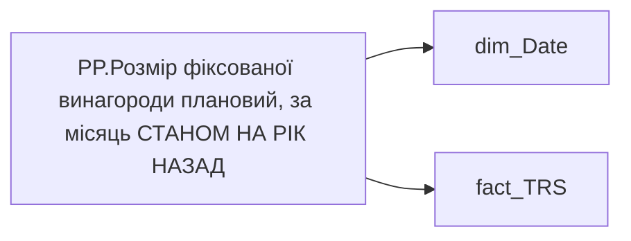

# PP.Розмір фіксованої винагороди плановий, за місяць СТАНОМ НА РІК НАЗАД

*тека `Personal_Profile\TRS` · формат `#,0`*

!!! abstract "Джерела даних"
    `DM.vw_R27_fact_TRS_PDP`

## Бізнес-суть

PAYMENTS_PLAN_UAH → Розмір фіксованої винагороди плановий, за місяць СТАНОМ НА РІК НАЗАД; PAYMENTS_PLAN_UAH → Сума (рік тому); PAYMENTS_PLAN_UAH → Оклад по годинам (рік тому); PAYMENTS_PLAN_UAH → % зміни фіксованої винагороди

Відібрати записи по працівнику [person_key], періоду [Period], організації [organization_key], підрозділу [division_key], де trs_category = Фіксована винагорода, is_payments_plan  = "1" Потрібно відібрати записи станом на 12 міс. тому, де ACCRUAL_TYPES_KEY = 5e416521-f6d6-80e3-bcde-48aec8a474fe та IS_PAYMENTS_PLAN =1 Сума за поточний місяць (план) - Відібрати записи по працівнику [person_key], періоду [Period], організації [organization_key], підрозділу [division_key], де category_name = Фіксована винагорода, IS_ACTUAL  = "1", END_DATE > поточна дата, або END_DATE = "01.01.2001".  <br>Сума ста

**Вимоги:** `Індивідуальний-профіль-працівника/Сторінка-Винагорода-працівника`, `Індивідуальний-профіль-працівника/Сторінка-Винагорода-працівника/Деталізація-на-сторінці-Винагорода`, `Індивідуальний-профіль-працівника/Сторінка-Винагорода-працівника/Доопрацювання-сторінки-ТРС`, `Командний-профіль/Сторінка-Моя-команда/ТЗ.-Деталізація-метрик-групового-профілю-звіту`

## На сторінках звіту

[TT:Зміна фікс винагороди](../report/tt-zmina-fiks-vynahorody.md)

## Пов'язані міри

**Використовується в:** [PP.Відсоток зміни фіксованої винагороди](../measures/pp-vidsotok-zminy-fiksovanoi-vynahorody.md)

---

## Технічний опис

| Властивість | Значення |
|---|---|
| Тип | міра |
| Home table | _Measures |
| displayFolder | `Personal_Profile\TRS` |
| formatString | `#,0` |
| dataType | — |
| Прихована | ні |

### DAX

```dax
	VAR _CurrMonthStart =
		DATE ( YEAR ( TODAY() ), MONTH ( TODAY() ), 1 )
	VAR _PrevYearSameMonthStart =
		EDATE ( _CurrMonthStart, -12 )
	VAR _prev_year = 
		CALCULATE(
			AVERAGE(fact_TRS[PAYMENTS_PLAN_UAH]),
			fact_TRS[TRS_CATEGORY] = "Фіксована винагорода",
            'fact_TRS'[IS_PAYMENTS_PLAN] = 1,
			TREATAS({_PrevYearSameMonthStart}, 'dim_Date'[Date])
		)
	RETURN _prev_year
```

### Джерела даних

Вихідні таблиці: `DM.vw_R27_fact_TRS_PDP`

Колонки: `Date`, `IS_PAYMENTS_PLAN`, `PAYMENTS_PLAN_UAH`, `TRS_CATEGORY`

Power Query: `dim_Date`

### Залежності (таблиці й колонки)

Таблиці: `dim_Date`, `fact_TRS`

Колонки: `dim_Date[Date]`, `fact_TRS[IS_PAYMENTS_PLAN]`, `fact_TRS[PAYMENTS_PLAN_UAH]`, `fact_TRS[TRS_CATEGORY]`

### Схема



## Нотатки

_порожньо_
