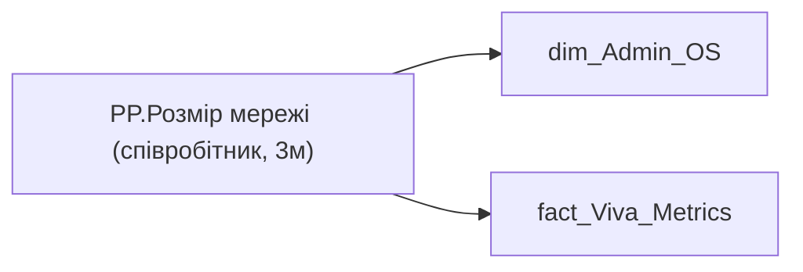

# PP.Розмір мережі (співробітник, 3м)

*тека `Personal_Profile\Viva\Viva Networks`*

## Бізнес-суть

!!! note "Бізнес-визначення відсутнє"
    Поля міри не зіставлено з wiki «Таблицями джерел даних». Можна заповнити вручну в `manualNotes`.

## На сторінках звіту

[Personal Profile](../report/personal-profile.md)

## Пов'язані міри

**Використовує:** [PP.Розмір мережі (Холдинг, 3м)](../measures/pp-rozmir-merezhi-kholdynh-3m.md)

**Використовується в:** [PP.Метрика.Розмір/ширина мережі 3м](../measures/pp-metryka-rozmir-shyryna-merezhi-3m.md), [PP.Розмір мережі (Холдинг, 3м)](../measures/pp-rozmir-merezhi-kholdynh-3m.md)

---

## Технічний опис

| Властивість | Значення |
|---|---|
| Тип | міра |
| Home table | _Measures |
| displayFolder | `Personal_Profile\Viva\Viva Networks` |
| formatString | — |
| dataType | — |
| Прихована | ні |

### DAX

```dax
VAR employee = 
FIRSTNONBLANKVALUE(
		VALUES('dim_Admin_OS'[ORDER_NUM]),
		CALCULATE(SELECTEDVALUE('dim_Admin_OS'[EMPLOYEE_ID])))

VAR __val =
CALCULATE(
	[PP.Розмір мережі (Холдинг, 3м)],
	fact_Viva_Metrics[EMPLOYEE_ID] = employee)

RETURN __val
```

### Джерела даних

Вихідні таблиці: `DM.vw_R27_dim_Employee_Access_List`

Колонки: `EMPLOYEE_ID`, `ORDER_NUM`

Power Query: `dim_Admin_OS`

### Залежності (таблиці й колонки)

Таблиці: `dim_Admin_OS`, `fact_Viva_Metrics`

Колонки: `dim_Admin_OS[EMPLOYEE_ID]`, `dim_Admin_OS[ORDER_NUM]`, `fact_Viva_Metrics[EMPLOYEE_ID]`

### Схема



## Нотатки

_порожньо_
