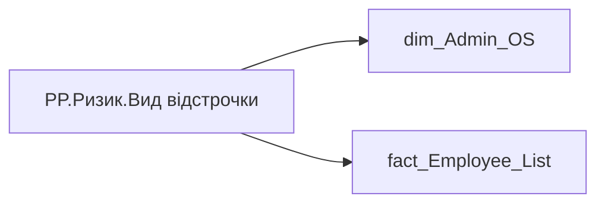

# PP.Ризик.Вид відстрочки

*тека `Personal_Profile\Паспорт\Ризики`*

## Технічний опис

| Властивість | Значення |
|---|---|
| Тип | міра |
| Home table | _Measures |
| displayFolder | `Personal_Profile\Паспорт\Ризики` |
| formatString | — |
| dataType | — |
| Прихована | ні |

### DAX

```dax
VAR _employee_id = SELECTEDVALUE('dim_Admin_OS'[EMPLOYEE_ID])
VAR _reason =
	CALCULATE(
		SELECTEDVALUE('fact_Employee_List'[DEFERMENT_REASON]),
		'fact_Employee_List'[EMPLOYEE_ID] = _employee_id
	)
VAR _atRisk =
	CALCULATE(
		SELECTEDVALUE('fact_Employee_List'[IS_AT_RISK]),
		'fact_Employee_List'[EMPLOYEE_ID] = _employee_id
	)
RETURN
	SWITCH(
		TRUE(),
		NOT ISBLANK(_reason), _reason,
		_atRisk = 1, "Під ризиком мобілізації",
		"Дані відсутні"
	)
```

### Джерела даних

Вихідні таблиці: `DM.vw_R27_dim_Employee_Access_List`

Колонки: `DEFERMENT_REASON`, `EMPLOYEE_ID`, `IS_AT_RISK`

Power Query: `dim_Admin_OS`

### Залежності (таблиці й колонки)

Таблиці: `dim_Admin_OS`, `fact_Employee_List`

Колонки: `dim_Admin_OS[EMPLOYEE_ID]`, `fact_Employee_List[DEFERMENT_REASON]`, `fact_Employee_List[EMPLOYEE_ID]`, `fact_Employee_List[IS_AT_RISK]`

### Схема



---

## Бізнес-суть

DEFERMENT_REASON → Вид відстрочки; DEFERMENT_REASON → Відстрочка від призову; DEFERMENT_REASON → Причина відстрочки; IS_AT_RISK → Під ризиком мобілізації; IS_AT_RISK → Ризик мобілізації; IS_AT_RISK → Доля чоловіків під ризиком мобілізації (%)

"За віком"  <br> "Троє дітей"  <br>"За станом здоров'я"  <br>"Бронювання"  <br>Якщо поле deferment_reason is null, тоді треба перевірити поле is_at_risk. Якщо is_at_risk = 1, тоді "Під ризиком", інакше - проставити лейбл "Дані відсутні". Якщо значення в полі відсутнє, то показати текст "Дані відсутні"  або знак "-". "За віком"  <br> "Троє дітей"  <br>"За станом здоров'я"  <br>"Бронювання"  <br>Якщо поле deferment_reason is null, тоді треба перевірити поле is_at_risk. Якщо is_at_risk = 1, тоді "Під ризиком", інакше - проставити лейбл "Дані відсутні". "За віком"  <br> "Троє дітей"  <br>"За стано

**Вимоги:** `Індивідуальний-профіль-працівника/Паспортна-частина-індивідуального-профілю-співробітника`, `Індивідуальний-профіль-працівника/Паспортна-частина-індивідуального-профілю-співробітника/Сторінка-Картка-(паспорт)-працівника/Редизайн-паспортної-частини`, `Індивідуальний-профіль-працівника/Сторінка-Загальна-інформація-про-працівника`, `Командний-профіль/Паспортна-частина-групового-профілю/Сторінка-Картка-команди`, `Командний-профіль/Сторінка-Загальна-інформація-про-команду`, `Командний-профіль/Сторінка-Загальна-інформація-про-команду/Редизайн-сторінки-Загальна-інформація`, `Командний-профіль/Сторінка-Моя-команда/ТЗ.-Деталізація-метрик-групового-профілю-звіту`

## На сторінках звіту

[Personal Profile](../report/personal-profile.md)

## Пов'язані міри

_Прямих зв'язків з іншими мірами немає._

## Нотатки

_порожньо_
