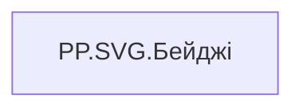

# PP.SVG.Бейджі

| Властивість | Значення |
|---|---|
| Тип | міра |
| Home table | _Measures |
| displayFolder | `Personal_Profile\Паспорт\Бейджі` |
| formatString | — |
| dataType | — |
| Прихована | ні |

## DAX

```dax
VAR _fontFamily = "Segoe UI, sans-serif"

// === Real measures ===
VAR _starsYearsReal = [PP.Бейдж.Зірка МХП]
VAR _trenerReal     = [PP.Бейдж.Тренерство]
VAR _mentorReal     = [PP.Бейдж.Наставництво]
VAR _ideasReal      = [PP.Бейдж.Банк ідей]
VAR _hasStarReal    = NOT (ISBLANK(_starsYearsReal) || _starsYearsReal = "Дані відсутні")
VAR _hasTrenerReal  = NOT (ISBLANK(_trenerReal) || _trenerReal = "В розробці")
VAR _hasMentorReal  = NOT (ISBLANK(_mentorReal) || _mentorReal = "В розробці")
VAR _hasIdeasReal   = NOT (ISBLANK(_ideasReal)  || _ideasReal  = "В розробці")

// === Прив'язка до реальних мір ===
VAR _hasStar     = _hasStarReal
VAR _hasTrener   = _hasTrenerReal
VAR _hasMentor   = _hasMentorReal
VAR _hasIdeas    = _hasIdeasReal

VAR _starsYears  = _starsYearsReal

// Count з has-флагів (для adaptive layout — потрібен до побудови _badgesAll)
VAR _Count =
    (IF(_hasStar,   1, 0)) +
    (IF(_hasTrener, 1, 0)) +
    (IF(_hasMentor, 1, 0)) +
    (IF(_hasIdeas,  1, 0))

// === Adaptive labels: повний для Зірки тільки якщо вона єдиний бейдж ===
VAR _starLbl  = IF(_Count = 1, "Зірка МХП " & _starsYears, "Зірка")
VAR _trenerLbl = "Тренер"
VAR _mentorLbl = "Ментор"
VAR _ideasLbl  = "Ідеї"

VAR _badgesAll =
    UNION(
        ROW("@ord", 1, "@kind", "star",   "@label", _starLbl,   "@show", _hasStar),
        ROW("@ord", 2, "@kind", "trener", "@label", _trenerLbl, "@show", _hasTrener),
        ROW("@ord", 3, "@kind", "mentor", "@label", _mentorLbl, "@show", _hasMentor),
        ROW("@ord", 4, "@kind", "ideas",  "@label", _ideasLbl,  "@show", _hasIdeas)
    )
VAR _badges = FILTER(_badgesAll, [@show] = TRUE())
VAR _data   = ADDCOLUMNS(_badges, "@i", RANKX(_badges, [@ord], , ASC, Dense) - 1)

// === Layout ===
VAR _W        = 200
VAR _H        = 22
VAR _TileH    = 16
VAR _ColGap   = 4
VAR _StartY   = 3
VAR _StripeW  = 3
VAR _TileRx   = 2
VAR _FontSize = 8

// Adaptive tile width:
//  _Count = 1  → 170 (під довгий label "Зірка МХП — отримана в YYYY")
//  _Count ≥ 2  → авто-fit по ширині viewBox: (200 - (n-1)*4) / n
VAR _TileW =
    SWITCH(
        TRUE(),
        _Count = 1, 170,
        _Count = 2, 98,
        _Count = 3, 64,
        _Count = 4, 47,
        0
    )

VAR _ContentW = _Count * _TileW + (_Count - 1) * _ColGap
VAR _StartX   = (_W - _ContentW) / 2

// === Icons ===
VAR _StarIcon =
    "<polygon points='0,-7 2.1,-2.2 7,-2.2 3,1.3 4.4,7 0,3.5 -4.4,7 -3,1.3 -7,-2.2 -2.1,-2.2' fill='#F4B400' stroke='#C28800' stroke-width='0.5'/>"
VAR _TrenerIcon =
    "<g stroke='#2C5282' stroke-width='1.2' fill='none'><circle cx='0' cy='0' r='6'/><circle cx='0' cy='0' r='3'/><circle cx='0' cy='0' r='1' fill='#2C5282'/></g>"
VAR _MentorIcon =
    "<g fill='#7B61FF'><circle cx='-2.4' cy='-1.6' r='2.4'/><circle cx='2.4' cy='-1.6' r='2.4'/><path d='M-5.6,5.6 Q-5.6,1.6 -2.4,1.6 Q0,1.6 0,4 Q0,1.6 2.4,1.6 Q5.6,1.6 5.6,5.6 Z'/></g>"
VAR _IdeasIcon =
    "<g fill='#FBBF24' stroke='#9A6E00' stroke-width='0.5'><circle cx='0' cy='-1.6' r='4.6'/><rect x='-1.8' y='2.4' width='3.6' height='1.6' rx='0.8' fill='#9A6E00' stroke='none'/><rect x='-1.4' y='4.2' width='2.8' height='1.1' rx='0.5' fill='#9A6E00' stroke='none'/></g>"

VAR _tiles = CONCATENATEX(
    _data,
    VAR _kind  = [@kind]
    VAR _label = [@label]
    VAR _idx   = [@i]
    VAR _x     = _StartX + _idx * (_TileW + _ColGap)
    VAR _y     = _StartY
    VAR _stripeColor = SWITCH(_kind,
        "star",   "#F4B400",
        "trener", "#2C5282",
        "mentor", "#7B61FF",
        "ideas",  "#FBBF24",
        "#CBD5E1"
    )
    VAR _icon = SWITCH(_kind,
        "star",   _StarIcon,
        "trener", _TrenerIcon,
        "mentor", _MentorIcon,
        "ideas",  _IdeasIcon,
        ""
    )
    VAR _iconCx  = _x + _StripeW + 7
    VAR _iconCy  = _y + _TileH / 2
    VAR _labelX  = _x + _StripeW + 13
    VAR _labelY  = _y + _TileH / 2 + 2
    VAR _tileBg =
        "<rect x='" & _x & "' y='" & _y & "' width='" & _TileW & "' height='" & _TileH & "' rx='" & _TileRx & "' fill='#FFFFFF' stroke='#E3E8EE' stroke-width='0.7'/>"
    VAR _stripe =
        "<path d='M" & (_x + _TileRx) & "," & _y &
        " H" & (_x + _StripeW) &
        " V" & (_y + _TileH) &
        " H" & (_x + _TileRx) &
        " Q" & _x & "," & (_y + _TileH) & " " & _x & "," & (_y + _TileH - _TileRx) &
        " V" & (_y + _TileRx) &
        " Q" & _x & "," & _y & " " & (_x + _TileRx) & "," & _y &
        " Z' fill='" & _stripeColor & "'/>"
    VAR _iconGroup =
        "<g transform='translate(" & _iconCx & "," & _iconCy & ") scale(0.7)'>" & _icon & "</g>"
    VAR _labelText =
        "<text x='" & _labelX & "' y='" & _labelY & "' text-anchor='start' style='font-family:" & _fontFamily & "; font-size:" & _FontSize & "px; fill:#1A202C; font-weight:600;'>" & _label & "</text>"
    RETURN "<g>" & _tileBg & _stripe & _iconGroup & _labelText & "</g>",
    "",
    [@ord], ASC
)

// === Pure SVG, explicit pixel dimensions ===
VAR _SVG =
    "<svg xmlns='http://www.w3.org/2000/svg' " &
    "width='" & _W & "' height='" & _H & "' " &
    "viewBox='0 0 " & _W & " " & _H & "' " &
    "preserveAspectRatio='xMidYMid meet' " &
    "style='display:block;'>" &
    _tiles &
    "</svg>"

RETURN
    IF(_Count = 0, BLANK(), _SVG)
```

## Джерела

—

## Бізнес-суть

!!! warning "Без бізнес-визначення"
    Поля міри не знайдено у wiki «Таблицях джерел даних». Заповніть `manualNotes`.

## Залежності

Міри: [PP.Бейдж.Банк ідей](../measures/pp-beidzh-bank-idei.md), [PP.Бейдж.Зірка МХП](../measures/pp-beidzh-zirka-mkhp.md), [PP.Бейдж.Наставництво](../measures/pp-beidzh-nastavnytstvo.md), [PP.Бейдж.Тренерство](../measures/pp-beidzh-trenerstvo.md)


## Схема



## Нотатки

_порожньо_
