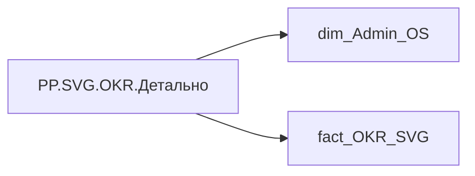

# PP.SVG.OKR.Детально

*тека `Personal_Profile\Результативність та оцінка\OKR`*

## Технічний опис

| Властивість | Значення |
|---|---|
| Тип | міра |
| Home table | _Measures |
| displayFolder | `Personal_Profile\Результативність та оцінка\OKR` |
| formatString | — |
| dataType | — |
| Прихована | ні |

### DAX

```dax
VAR _svgW = 1291
VAR _col1W = 180
VAR _col2W = 240
VAR _col3W = 420
VAR _col4W = 420
VAR _cs1 = 4
VAR _cs2 = _cs1 + _col1W + 3
VAR _cs3 = _cs2 + _col2W + 3
VAR _cs4 = _cs3 + _col3W + 3
VAR _headerH = 28
VAR _goalBarH = 5
VAR _barH = 4
VAR _cardGap = 2
VAR _okrGap = 8
VAR _padTop = 34
VAR _yearSep = 32
VAR _bg = "#F9F8F8"
VAR _cardBg = "#F0F1F3"
VAR _cardBrd = "#E0E4E8"
VAR _yearBg = "#E4E8EE"
VAR _greyFill = "#9AA5B0"
VAR _greyTxt = "#7A8A9A"
VAR _goalBarMaxW = _col1W - 30
VAR _krBarMaxW = _col2W - 28

VAR _current = SELECTEDVALUE('dim_Admin_OS'[EMPLOYEE_ID])
VAR _filtered = FILTER(fact_OKR_SVG, fact_OKR_SVG[EMPLOYEE_ID] = _current)

VAR _okrVisList = SUMMARIZE(_filtered, fact_OKR_SVG[PLAN_YEAR], fact_OKR_SVG[OKR_OBJECTIVE_ID])
VAR _okrVisStats = 
    ADDCOLUMNS(
        _okrVisList,
        "@goalH",
            VAR _y = fact_OKR_SVG[PLAN_YEAR] VAR _o = fact_OKR_SVG[OKR_OBJECTIVE_ID]
            RETURN MAXX(FILTER(_filtered, fact_OKR_SVG[PLAN_YEAR]=_y && fact_OKR_SVG[OKR_OBJECTIVE_ID]=_o), fact_OKR_SVG[GOAL_H]),
        "@firstPad",
            VAR _y = fact_OKR_SVG[PLAN_YEAR] VAR _o = fact_OKR_SVG[OKR_OBJECTIVE_ID]
            RETURN MAXX(FILTER(_filtered, fact_OKR_SVG[PLAN_YEAR]=_y && fact_OKR_SVG[OKR_OBJECTIVE_ID]=_o), fact_OKR_SVG[FIRST_ROW_PAD]),
        "@okrRankNew",
            VAR _y = fact_OKR_SVG[PLAN_YEAR]
            RETURN RANKX(FILTER(_okrVisList, fact_OKR_SVG[PLAN_YEAR]=_y), fact_OKR_SVG[OKR_OBJECTIVE_ID], , ASC, DENSE) - 1
    )
VAR _okrVisWithY = 
    ADDCOLUMNS(
        _okrVisStats,
        "@okrYOff",
            VAR _y = fact_OKR_SVG[PLAN_YEAR] VAR _r = [@okrRankNew]
            RETURN SUMX(
                FILTER(_okrVisStats, fact_OKR_SVG[PLAN_YEAR]=_y && [@okrRankNew] < _r),
                [@goalH] + _okrGap
            )
    )

VAR _yearVisList = SUMMARIZE(_okrVisWithY, fact_OKR_SVG[PLAN_YEAR])
VAR _yearVisStats = 
    ADDCOLUMNS(
        _yearVisList,
        "@yearH",
            VAR _y = fact_OKR_SVG[PLAN_YEAR]
            RETURN SUMX(FILTER(_okrVisWithY, fact_OKR_SVG[PLAN_YEAR]=_y), [@goalH] + _okrGap) - _okrGap,
        "@yearRankNew",
            RANKX(_yearVisList, fact_OKR_SVG[PLAN_YEAR], , DESC, DENSE) - 1
    )
VAR _yearVisWithY = 
    ADDCOLUMNS(
        _yearVisStats,
        "@yearYOff",
            VAR _r = [@yearRankNew]
            RETURN SUMX(
                FILTER(_yearVisStats, [@yearRankNew] < _r),
                [@yearH] + _yearSep
            )
    )

VAR _krVis = 
    ADDCOLUMNS(
        _filtered,
        "@krIdxNew",
            VAR _y = fact_OKR_SVG[PLAN_YEAR] VAR _o = fact_OKR_SVG[OKR_OBJECTIVE_ID]
            RETURN RANKX(
                FILTER(_filtered, fact_OKR_SVG[PLAN_YEAR]=_y && fact_OKR_SVG[OKR_OBJECTIVE_ID]=_o),
                fact_OKR_SVG[KR_DESCRIPTION], , ASC, DENSE
            ) - 1,
        "@isFirstNew",
            VAR _y = fact_OKR_SVG[PLAN_YEAR] VAR _o = fact_OKR_SVG[OKR_OBJECTIVE_ID]
            VAR _rk = RANKX(
                FILTER(_filtered, fact_OKR_SVG[PLAN_YEAR]=_y && fact_OKR_SVG[OKR_OBJECTIVE_ID]=_o),
                fact_OKR_SVG[KR_DESCRIPTION], , ASC, DENSE
            )
            RETURN IF(_rk = 1, 1, 0)
    )

VAR _krVisFinal = 
    ADDCOLUMNS(
        _krVis,
        "@yearYOff",
            VAR _y = fact_OKR_SVG[PLAN_YEAR]
            RETURN MAXX(FILTER(_yearVisWithY, fact_OKR_SVG[PLAN_YEAR]=_y), [@yearYOff]),
        "@okrYOff",
            VAR _y = fact_OKR_SVG[PLAN_YEAR] VAR _o = fact_OKR_SVG[OKR_OBJECTIVE_ID]
            RETURN MAXX(FILTER(_okrVisWithY, fact_OKR_SVG[PLAN_YEAR]=_y && fact_OKR_SVG[OKR_OBJECTIVE_ID]=_o), [@okrYOff]),
        "@okrRankNew",
            VAR _y = fact_OKR_SVG[PLAN_YEAR] VAR _o = fact_OKR_SVG[OKR_OBJECTIVE_ID]
            RETURN MAXX(FILTER(_okrVisWithY, fact_OKR_SVG[PLAN_YEAR]=_y && fact_OKR_SVG[OKR_OBJECTIVE_ID]=_o), [@okrRankNew]),
        "@firstPad",
            VAR _y = fact_OKR_SVG[PLAN_YEAR] VAR _o = fact_OKR_SVG[OKR_OBJECTIVE_ID]
            RETURN MAXX(FILTER(_okrVisWithY, fact_OKR_SVG[PLAN_YEAR]=_y && fact_OKR_SVG[OKR_OBJECTIVE_ID]=_o), [@firstPad]),
        "@goalH",
            VAR _y = fact_OKR_SVG[PLAN_YEAR] VAR _o = fact_OKR_SVG[OKR_OBJECTIVE_ID]
            RETURN MAXX(FILTER(_okrVisWithY, fact_OKR_SVG[PLAN_YEAR]=_y && fact_OKR_SVG[OKR_OBJECTIVE_ID]=_o), [@goalH]),
        "@prevKrSum",
            VAR _y = fact_OKR_SVG[PLAN_YEAR] VAR _o = fact_OKR_SVG[OKR_OBJECTIVE_ID] VAR _ki = [@krIdxNew]
            RETURN SUMX(
                FILTER(_krVis, fact_OKR_SVG[PLAN_YEAR]=_y && fact_OKR_SVG[OKR_OBJECTIVE_ID]=_o && [@krIdxNew] < _ki),
                fact_OKR_SVG[ROW_H_BASE]
            )
    )

VAR _krRender = 
    ADDCOLUMNS(
        _krVisFinal,
        "@yYearStart", _padTop + [@yearYOff],
        "@yLabel", _padTop + [@yearYOff] + 22,
        "@yBase", _padTop + [@yearYOff] + _yearSep + [@okrYOff],
        "@yKR", 
            _padTop + [@yearYOff] + _yearSep + [@okrYOff] + [@prevKrSum] 
            + IF([@krIdxNew] > 0, [@firstPad], 0) + [@krIdxNew] * _cardGap,
        "@rowH", fact_OKR_SVG[ROW_H_BASE] + IF([@isFirstNew] = 1, [@firstPad], 0),
        "@isYearFirst", IF([@isFirstNew] = 1 && [@okrRankNew] = 0, 1, 0)
    )

VAR _maxY = MAXX(_krRender, [@yKR] + [@rowH] + 10)
VAR _minY = MINX(_krRender, [@yYearStart])
VAR _vbY = IF(ISBLANK(_minY), 34, _minY)
VAR _dynH = IF(ISBLANK(_maxY), 200, MAX(_maxY - _vbY, 200))

VAR _htmlHeader = 
    "<div style='position:sticky;top:0;z-index:10;background:" & _bg & "'>" &
    "<svg xmlns='http://www.w3.org/2000/svg' width='" & _svgW & "' height='" & _headerH & "' font-family='Segoe UI,sans-serif' font-size='11' font-weight='600' fill='#FFFFFF' text-anchor='middle'>" &
    "<rect width='" & _svgW & "' height='" & _headerH & "' fill='#1B3A5C' rx='3'/>" &
    "<text x='" & (_cs1 + _col1W / 2) & "' y='18'>OKR цілі</text>" &
    "<text x='" & (_cs2 + _col2W / 2) & "' y='18'>Ключові результати</text>" &
    "<text x='" & (_cs3 + _col3W / 2) & "' y='18'>Планові метрики</text>" &
    "<text x='" & (_cs4 + _col4W / 2) & "' y='18'>Фактичні метрики</text>" &
    "</svg></div>"

VAR _styleBlock = 
    "<style>" &
    ".a{font-size:11px;font-weight:600;fill:#1B3A5C}" &
    ".b{font-size:10px;fill:#3A4A5A}" &
    ".w{font-size:10px;fill:#7A8A9A}" &
    ".v{font-size:20px;font-weight:700}" &
    ".k{font-size:13px;font-weight:700}" &
    ".s{font-size:9px;fill:#7A8A9A}" &
    ".y{font-size:14px;font-weight:700;fill:#1B3A5C;text-anchor:middle}" &
    "</style>"

VAR _svgBody = 
    "<svg xmlns='http://www.w3.org/2000/svg' width='" & _svgW & "' height='" & _dynH & "' " &
    "viewBox='0 " & _vbY & " " & _svgW & " " & _dynH & "' font-family='Segoe UI,sans-serif'>" &
    "<defs>" &
      _styleBlock &
      "<linearGradient id='grad_yg' x1='0' y1='0' x2='1' y2='0'>" &
        "<stop offset='0%' stop-color='#FFE521'/>" &
        "<stop offset='100%' stop-color='#02BD3D'/>" &
      "</linearGradient>" &
      "<linearGradient id='grad_yr' x1='0' y1='0' x2='1' y2='0'>" &
        "<stop offset='0%' stop-color='#FFE521'/>" &
        "<stop offset='100%' stop-color='#F23711'/>" &
      "</linearGradient>" &
    "</defs>" &
    "<rect x='0' y='" & _vbY & "' width='" & _svgW & "' height='" & _dynH & "' fill='" & _bg & "'/>" &
    CONCATENATEX(
        _krRender,

        VAR _yB = [@yBase]
        VAR _yK = [@yKR]
        VAR _gH = [@goalH]
        VAR _rH = [@rowH]
        VAR _iF = [@isFirstNew]
        VAR _iYF = [@isYearFirst]
        VAR _yL = [@yLabel]
        VAR _yYS = [@yYearStart]
        VAR _lOD = fact_OKR_SVG[LINES_OD]
        VAR _lKD = fact_OKR_SVG[LINES_KD]
        VAR _lKM = fact_OKR_SVG[LINES_KM]
        VAR _lKF = fact_OKR_SVG[LINES_KF]
        VAR _x1 = _cs1 + 14
        VAR _x2 = _cs2 + 12
        VAR _x3 = _cs3 + 10
        VAR _x4 = _cs4 + 10

        VAR _okrIsDel = IF(LEFT(fact_OKR_SVG[OD_L1_E], 6) = "DELETE", 1, 0)
        VAR _krIsDel  = IF(LEFT(fact_OKR_SVG[KD_L1_E], 6) = "DELETE", 1, 0)
        VAR _okrFillEff = IF(_okrIsDel = 1, _greyFill, fact_OKR_SVG[OKR_FILL])
        VAR _okrTxtEff  = IF(_okrIsDel = 1, _greyTxt,  fact_OKR_SVG[OKR_TXT])
        VAR _krFillEff  = IF(_krIsDel = 1,  _greyFill, fact_OKR_SVG[KR_FILL])
        VAR _krTxtEff   = IF(_krIsDel = 1,  _greyTxt,  fact_OKR_SVG[KR_TXT])

        VAR _yearLabel = 
            IF(_iYF = 1,
                "<rect x='0' y='" & _yYS & "' width='" & _svgW & "' height='32' fill='" & _yearBg & "' rx='3'/>" &
                "<text class='y' x='" & (_svgW / 2) & "' y='" & _yL & "'>" & fact_OKR_SVG[YEAR_LABEL] & "</text>",
                "")

        VAR _goalWtY = _yB + 22 + _lOD * 14
        VAR _goalValY = _yB + 44 + _lOD * 14
        VAR _goalBarY = _yB + 52 + _lOD * 14
        VAR _odTspans = 
            IF(_lOD >= 2,  "<tspan x='" & _x1 & "' dy='14'>" & fact_OKR_SVG[OD_L2_E]  & "</tspan>", "") &
            IF(_lOD >= 3,  "<tspan x='" & _x1 & "' dy='14'>" & fact_OKR_SVG[OD_L3_E]  & "</tspan>", "") &
            IF(_lOD >= 4,  "<tspan x='" & _x1 & "' dy='14'>" & fact_OKR_SVG[OD_L4_E]  & "</tspan>", "") &
            IF(_lOD >= 5,  "<tspan x='" & _x1 & "' dy='14'>" & fact_OKR_SVG[OD_L5_E]  & "</tspan>", "") &
            IF(_lOD >= 6,  "<tspan x='" & _x1 & "' dy='14'>" & fact_OKR_SVG[OD_L6_E]  & "</tspan>", "") &
            IF(_lOD >= 7,  "<tspan x='" & _x1 & "' dy='14'>" & fact_OKR_SVG[OD_L7_E]  & "</tspan>", "") &
            IF(_lOD >= 8,  "<tspan x='" & _x1 & "' dy='14'>" & fact_OKR_SVG[OD_L8_E]  & "</tspan>", "") &
            IF(_lOD >= 9,  "<tspan x='" & _x1 & "' dy='14'>" & fact_OKR_SVG[OD_L9_E]  & "</tspan>", "") &
            IF(_lOD >= 10, "<tspan x='" & _x1 & "' dy='14'>" & fact_OKR_SVG[OD_L10_E] & "</tspan>", "")
        VAR _goal = 
            IF(_iF = 1,
                "<rect x='" & _cs1 & "' y='" & _yB & "' width='" & _col1W & "' height='" & _gH & "' fill='" & _cardBg & "' stroke='" & _cardBrd & "' rx='5'/>" &
                "<rect x='" & _cs1 & "' y='" & _yB & "' width='5' height='" & _gH & "' fill='" & _okrFillEff & "' rx='3'/>" &
                "<text class='a' x='" & _x1 & "' y='" & (_yB + 18) & "'>" & fact_OKR_SVG[OD_L1_E] & _odTspans & "</text>" &
                "<text class='w' x='" & _x1 & "' y='" & _goalWtY & "'>" & fact_OKR_SVG[OKR_WT_LBL] & "</text>" &
                "<text class='v' x='" & _x1 & "' y='" & _goalValY & "' fill='" & _okrTxtEff & "'>" & fact_OKR_SVG[OKR_VAL_LBL] & "</text>" &
                "<rect x='" & _x1 & "' y='" & _goalBarY & "' width='" & _goalBarMaxW & "' height='" & _goalBarH & "' fill='" & _cardBrd & "' rx='2'/>" &
                "<rect x='" & _x1 & "' y='" & _goalBarY & "' width='" & fact_OKR_SVG[OKR_BAR_W] & "' height='" & _goalBarH & "' fill='" & _okrFillEff & "' rx='2'/>",
                "")

        VAR _krValY = _yK + 19 + _lKD * 14
        VAR _krBarY = _yK + 26 + _lKD * 14
        VAR _kdTspans = 
            IF(_lKD >=  2, "<tspan x='" & _x2 & "' dy='14'>" & fact_OKR_SVG[KD_L2_E]  & "</tspan>", "") &
            IF(_lKD >=  3, "<tspan x='" & _x2 & "' dy='14'>" & fact_OKR_SVG[KD_L3_E]  & "</tspan>", "") &
            IF(_lKD >=  4, "<tspan x='" & _x2 & "' dy='14'>" & fact_OKR_SVG[KD_L4_E]  & "</tspan>", "") &
            IF(_lKD >=  5, "<tspan x='" & _x2 & "' dy='14'>" & fact_OKR_SVG[KD_L5_E]  & "</tspan>", "") &
            IF(_lKD >=  6, "<tspan x='" & _x2 & "' dy='14'>" & fact_OKR_SVG[KD_L6_E]  & "</tspan>", "") &
            IF(_lKD >=  7, "<tspan x='" & _x2 & "' dy='14'>" & fact_OKR_SVG[KD_L7_E]  & "</tspan>", "") &
            IF(_lKD >=  8, "<tspan x='" & _x2 & "' dy='14'>" & fact_OKR_SVG[KD_L8_E]  & "</tspan>", "") &
            IF(_lKD >=  9, "<tspan x='" & _x2 & "' dy='14'>" & fact_OKR_SVG[KD_L9_E]  & "</tspan>", "") &
            IF(_lKD >= 10, "<tspan x='" & _x2 & "' dy='14'>" & fact_OKR_SVG[KD_L10_E] & "</tspan>", "")
        VAR _kr = 
            "<rect x='" & _cs2 & "' y='" & _yK & "' width='" & _col2W & "' height='" & _rH & "' fill='" & _cardBg & "' stroke='" & _cardBrd & "' rx='5'/>" &
            "<rect x='" & _cs2 & "' y='" & _yK & "' width='4' height='" & _rH & "' fill='" & _krFillEff & "' rx='2'/>" &
            "<text class='b' x='" & _x2 & "' y='" & (_yK + 17) & "'>" & fact_OKR_SVG[KD_L1_E] & _kdTspans & "</text>" &
            "<text class='k' x='" & _x2 & "' y='" & _krValY & "' fill='" & _krTxtEff & "'>" & fact_OKR_SVG[KR_VAL_LBL] & "</text>" &
            "<text class='s' x='" & (_cs2 + 52) & "' y='" & _krValY & "'>" & fact_OKR_SVG[KR_WT_LBL] & "</text>" &
            "<rect x='" & _x2 & "' y='" & _krBarY & "' width='" & _krBarMaxW & "' height='" & _barH & "' fill='" & _cardBrd & "' rx='1'/>" &
            "<rect x='" & _x2 & "' y='" & _krBarY & "' width='" & fact_OKR_SVG[KR_BAR_W] & "' height='" & _barH & "' fill='" & _krFillEff & "' rx='1'/>"

        VAR _kmTspans = 
            IF(_lKM >=  2, "<tspan x='" & _x3 & "' dy='14'>" & fact_OKR_SVG[KM_L2_E]  & "</tspan>", "") &
            IF(_lKM >=  3, "<tspan x='" & _x3 & "' dy='14'>" & fact_OKR_SVG[KM_L3_E]  & "</tspan>", "") &
            IF(_lKM >=  4, "<tspan x='" & _x3 & "' dy='14'>" & fact_OKR_SVG[KM_L4_E]  & "</tspan>", "") &
            IF(_lKM >=  5, "<tspan x='" & _x3 & "' dy='14'>" & fact_OKR_SVG[KM_L5_E]  & "</tspan>", "") &
            IF(_lKM >=  6, "<tspan x='" & _x3 & "' dy='14'>" & fact_OKR_SVG[KM_L6_E]  & "</tspan>", "") &
            IF(_lKM >=  7, "<tspan x='" & _x3 & "' dy='14'>" & fact_OKR_SVG[KM_L7_E]  & "</tspan>", "") &
            IF(_lKM >=  8, "<tspan x='" & _x3 & "' dy='14'>" & fact_OKR_SVG[KM_L8_E]  & "</tspan>", "") &
            IF(_lKM >=  9, "<tspan x='" & _x3 & "' dy='14'>" & fact_OKR_SVG[KM_L9_E]  & "</tspan>", "") &
            IF(_lKM >= 10, "<tspan x='" & _x3 & "' dy='14'>" & fact_OKR_SVG[KM_L10_E] & "</tspan>", "")
        VAR _plan = 
            "<rect x='" & _cs3 & "' y='" & _yK & "' width='" & _col3W & "' height='" & _rH & "' fill='" & _cardBg & "' stroke='" & _cardBrd & "' rx='5'/>" &
            "<text class='b' x='" & _x3 & "' y='" & (_yK + 17) & "'>" & fact_OKR_SVG[KM_L1_E] & _kmTspans & "</text>"

        VAR _kfTspans = 
            IF(_lKF >=  2, "<tspan x='" & _x4 & "' dy='14'>" & fact_OKR_SVG[KF_L2_E]  & "</tspan>", "") &
            IF(_lKF >=  3, "<tspan x='" & _x4 & "' dy='14'>" & fact_OKR_SVG[KF_L3_E]  & "</tspan>", "") &
            IF(_lKF >=  4, "<tspan x='" & _x4 & "' dy='14'>" & fact_OKR_SVG[KF_L4_E]  & "</tspan>", "") &
            IF(_lKF >=  5, "<tspan x='" & _x4 & "' dy='14'>" & fact_OKR_SVG[KF_L5_E]  & "</tspan>", "") &
            IF(_lKF >=  6, "<tspan x='" & _x4 & "' dy='14'>" & fact_OKR_SVG[KF_L6_E]  & "</tspan>", "") &
            IF(_lKF >=  7, "<tspan x='" & _x4 & "' dy='14'>" & fact_OKR_SVG[KF_L7_E]  & "</tspan>", "") &
            IF(_lKF >=  8, "<tspan x='" & _x4 & "' dy='14'>" & fact_OKR_SVG[KF_L8_E]  & "</tspan>", "") &
            IF(_lKF >=  9, "<tspan x='" & _x4 & "' dy='14'>" & fact_OKR_SVG[KF_L9_E]  & "</tspan>", "") &
            IF(_lKF >= 10, "<tspan x='" & _x4 & "' dy='14'>" & fact_OKR_SVG[KF_L10_E] & "</tspan>", "")
        VAR _fact = 
            "<rect x='" & _cs4 & "' y='" & _yK & "' width='" & _col4W & "' height='" & _rH & "' fill='" & _cardBg & "' stroke='" & _cardBrd & "' rx='5'/>" &
            "<text class='b' x='" & _x4 & "' y='" & (_yK + 17) & "'>" & fact_OKR_SVG[KF_L1_E] & _kfTspans & "</text>"

        RETURN _yearLabel & _goal & _kr & _plan & _fact
    ) &
    "</svg>"

RETURN _htmlHeader & _svgBody
```

### Джерела даних

Вихідні таблиці: `DM.vw_R27_dim_Employee_Access_List`

Колонки: `EMPLOYEE_ID`, `FIRST_ROW_PAD`, `GOAL_H`, `KD_L10_E`, `KD_L1_E`, `KD_L2_E`, `KD_L3_E`, `KD_L4_E`, `KD_L5_E`, `KD_L6_E`, `KD_L7_E`, `KD_L8_E`, `KD_L9_E`, `KF_L10_E`, `KF_L1_E`, `KF_L2_E`, `KF_L3_E`, `KF_L4_E`, `KF_L5_E`, `KF_L6_E`, `KF_L7_E`, `KF_L8_E`, `KF_L9_E`, `KM_L10_E`, `KM_L1_E`, `KM_L2_E`, `KM_L3_E`, `KM_L4_E`, `KM_L5_E`, `KM_L6_E`, `KM_L7_E`, `KM_L8_E`, `KM_L9_E`, `KR_BAR_W`, `KR_DESCRIPTION`, `KR_FILL`, `KR_TXT`, `KR_VAL_LBL`, `KR_WT_LBL`, `LINES_KD`, `LINES_KF`, `LINES_KM`, `LINES_OD`, `OD_L10_E`, `OD_L1_E`, `OD_L2_E`, `OD_L3_E`, `OD_L4_E`, `OD_L5_E`, `OD_L6_E`, `OD_L7_E`, `OD_L8_E`, `OD_L9_E`, `OKR_BAR_W`, `OKR_FILL`, `OKR_OBJECTIVE_ID`, `OKR_TXT`, `OKR_VAL_LBL`, `OKR_WT_LBL`, `PLAN_YEAR`, `ROW_H_BASE`, `YEAR_LABEL`

Power Query: `dim_Admin_OS`

### Залежності (таблиці й колонки)

Таблиці: `dim_Admin_OS`, `fact_OKR_SVG`

Колонки: `dim_Admin_OS[EMPLOYEE_ID]`, `fact_OKR_SVG[EMPLOYEE_ID]`, `fact_OKR_SVG[FIRST_ROW_PAD]`, `fact_OKR_SVG[GOAL_H]`, `fact_OKR_SVG[KD_L10_E]`, `fact_OKR_SVG[KD_L1_E]`, `fact_OKR_SVG[KD_L2_E]`, `fact_OKR_SVG[KD_L3_E]`, `fact_OKR_SVG[KD_L4_E]`, `fact_OKR_SVG[KD_L5_E]`, `fact_OKR_SVG[KD_L6_E]`, `fact_OKR_SVG[KD_L7_E]`, `fact_OKR_SVG[KD_L8_E]`, `fact_OKR_SVG[KD_L9_E]`, `fact_OKR_SVG[KF_L10_E]`, `fact_OKR_SVG[KF_L1_E]`, `fact_OKR_SVG[KF_L2_E]`, `fact_OKR_SVG[KF_L3_E]`, `fact_OKR_SVG[KF_L4_E]`, `fact_OKR_SVG[KF_L5_E]`, `fact_OKR_SVG[KF_L6_E]`, `fact_OKR_SVG[KF_L7_E]`, `fact_OKR_SVG[KF_L8_E]`, `fact_OKR_SVG[KF_L9_E]`, `fact_OKR_SVG[KM_L10_E]`, `fact_OKR_SVG[KM_L1_E]`, `fact_OKR_SVG[KM_L2_E]`, `fact_OKR_SVG[KM_L3_E]`, `fact_OKR_SVG[KM_L4_E]`, `fact_OKR_SVG[KM_L5_E]`, `fact_OKR_SVG[KM_L6_E]`, `fact_OKR_SVG[KM_L7_E]`, `fact_OKR_SVG[KM_L8_E]`, `fact_OKR_SVG[KM_L9_E]`, `fact_OKR_SVG[KR_BAR_W]`, `fact_OKR_SVG[KR_DESCRIPTION]`, `fact_OKR_SVG[KR_FILL]`, `fact_OKR_SVG[KR_TXT]`, `fact_OKR_SVG[KR_VAL_LBL]`, `fact_OKR_SVG[KR_WT_LBL]`, `fact_OKR_SVG[LINES_KD]`, `fact_OKR_SVG[LINES_KF]`, `fact_OKR_SVG[LINES_KM]`, `fact_OKR_SVG[LINES_OD]`, `fact_OKR_SVG[OD_L10_E]`, `fact_OKR_SVG[OD_L1_E]`, `fact_OKR_SVG[OD_L2_E]`, `fact_OKR_SVG[OD_L3_E]`, `fact_OKR_SVG[OD_L4_E]`, `fact_OKR_SVG[OD_L5_E]`, `fact_OKR_SVG[OD_L6_E]`, `fact_OKR_SVG[OD_L7_E]`, `fact_OKR_SVG[OD_L8_E]`, `fact_OKR_SVG[OD_L9_E]`, `fact_OKR_SVG[OKR_BAR_W]`, `fact_OKR_SVG[OKR_FILL]`, `fact_OKR_SVG[OKR_OBJECTIVE_ID]`, `fact_OKR_SVG[OKR_TXT]`, `fact_OKR_SVG[OKR_VAL_LBL]`, `fact_OKR_SVG[OKR_WT_LBL]`, `fact_OKR_SVG[PLAN_YEAR]`, `fact_OKR_SVG[ROW_H_BASE]`, `fact_OKR_SVG[YEAR_LABEL]`

### Схема



---

## Бізнес-суть

!!! note "Бізнес-визначення відсутнє"
    Поля міри не зіставлено з wiki «Таблицями джерел даних». Можна заповнити вручну в `manualNotes`.

## На сторінках звіту

[Personal Profile](../report/personal-profile.md)

## Пов'язані міри

**Використовується в:** [PP.SVG.OKR.Size](../measures/pp-svg-okr-size.md)

## Нотатки

_порожньо_
