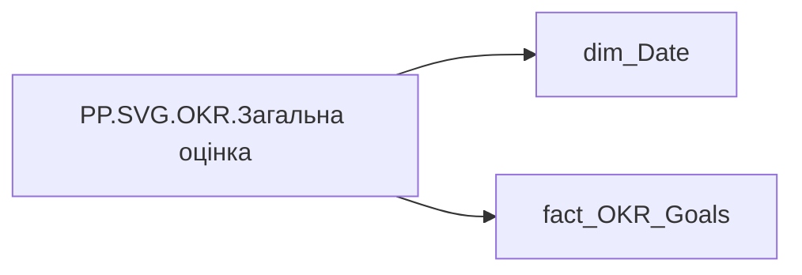

# PP.SVG.OKR.Загальна оцінка

| Властивість | Значення |
|---|---|
| Тип | міра |
| Home table | _Measures |
| displayFolder | `Personal_Profile\Результативність та оцінка\OKR` |
| formatString | — |
| dataType | — |
| Прихована | ні |

## DAX

```dax
VAR _fontFamily = "Segoe UI"
VAR _labelColor = "#1A202C"
VAR _dimColor = "#718096"
VAR _trackColor = "#EDF2F7"

// ─── Колір блоку статусу плану ───
VAR _statusBg = "#F1F5F9"
VAR _statusBorder = "#E2E8F0"
VAR _statusText = "#64748B"

// ─── Висота візуалу (фіксована) ───
VAR _H = 200

// ─── Дані ───
// Грань: рік × calc'fact_OKR_Goals'[CALC_PERFORMANCE_STR_RATE].
// Якщо в межах одного року 2+ унікальних значення calc'fact_OKR_Goals'[CALC_PERFORMANCE_STR_RATE] —
// кожне дає окремий рядок (окремий стовпець), без усереднення.

// 1) Ключі-грані. SUMMARIZE — ЛИШЕ групування (без обчислюваних стовпців).
//    Замінити 'fact_OKR_Goals' на реальну таблицю фактів, що містить
//    calc'fact_OKR_Goals'[CALC_PERFORMANCE_STR_RATE] і пов'язана з 'dim_Date'.
VAR _keys =
    SUMMARIZE(
        'fact_OKR_Goals',
        'dim_Date'[Year],
        'fact_OKR_Goals'[CALC_PERFORMANCE_STR_RATE]
    )

// 2) Scope користувача + відсів порожніх комбінацій одним FILTER.
VAR _keysUser =
    FILTER(
        _keys,
        NOT(ISBLANK([PP.OKR.Current_user.Загальна  оцінка OKR]))
    )

// 3) Приєднання мір на готову грань (context transition на рядку _keysUser
//    фіксує конкретний рік + конкретне calc'fact_OKR_Goals'[CALC_PERFORMANCE_STR_RATE]).
VAR _data =
    ADDCOLUMNS(
        _keysUser,
        "Value", [PP.OKR.Current_user.Загальна  оцінка OKR],
        "ColorCat", [PP.OKR.Current_user.Загальна колірна оцінка OKR],
        "Bonus", [PP.OKR.Current_user.Коефіцієнт індивідуального бонусу],
        "PlanStatus", [PP.OKR.Current_user.Статус плану]
    )

// ─── Масштаб ───
VAR _maxVal = MAXX(_data, [Value])
VAR _MaxValue = MAX(_maxVal, 100)

// ─── Параметри блоку статусу (потрібні до розрахунку ширини колонки) ───
//    _statusFontSize — фіксований кегль тексту статусу
//    _statusCharW    — приблизна ширина символу Segoe UI semibold при 8px
//    _statusPadX     — горизонтальний відступ усередині пілюлі з кожного боку
VAR _statusFontSize = 8
VAR _statusCharW = 4.8
VAR _statusPadX = 10

// Ширина пілюлі статусу для кожного рядка + найширша по всіх рядках
VAR _dataW =
    ADDCOLUMNS(
        _data,
        "@StatusW",
            MAX(44, (LEN([PlanStatus]) * _statusCharW) + (_statusPadX * 2))
    )
VAR _MaxStatusW = MAXX(_dataW, [@StatusW])

// ─── Геометрія: горизонталь ───
VAR _BarCount = COUNTROWS(_data)
VAR _ColGap = 14
VAR _BarWidth = 30
VAR _Rx = 6

// Ширина колонки = найбільше з: базова 72 або найширша пілюля статусу.
// CEILING(..,2) округлює до парного px, щоб центр колонки _cx лишався цілим
// (інакше дробове число у координатах ламається локаллю з комою-роздільником).
VAR _ColWidth = MAX(72, CEILING(_MaxStatusW, 2))

VAR _TotalW = (_BarCount * _ColWidth) + ((_BarCount - 1) * _ColGap)

// Симетричні резерви з обох боків → блок колонок центрується по горизонталі;
// у правому резерві розміщується легенда.
VAR _LegendReserve = 110
VAR _W = _LegendReserve + _TotalW + _LegendReserve
VAR _StartX = _LegendReserve

// ─── Геометрія: вертикаль ───
// Y-координати (зверху вниз: риска+бонус → оцінка → бар → рік → пілюля категорії → статус плану)
VAR _BonusY = 16
VAR _ScoreY = 36
VAR _BarTop = 48
VAR _BarBot = 132
VAR _BarMaxH = _BarBot - _BarTop
VAR _YearY = 148
VAR _CatY = 168
VAR _StatusY = 178
VAR _StatusPillH = 14

// ─── Градієнти + тінь ───
VAR _Defs =
    "<defs>" &
        "<linearGradient id='grad_yg' x1='0' y1='1' x2='0' y2='0'>" &
            "<stop offset='0%' stop-color='#FFE521'/>" &
            "<stop offset='100%' stop-color='#02BD3D'/>" &
        "</linearGradient>" &
        "<linearGradient id='grad_yr' x1='0' y1='1' x2='0' y2='0'>" &
            "<stop offset='0%' stop-color='#F23711'/>" &
            "<stop offset='100%' stop-color='#FFE521'/>" &
        "</linearGradient>" &
        "<filter id='sh'><feDropShadow dx='0' dy='2' stdDeviation='3' flood-opacity='0.12'/></filter>" &
    "</defs>"

// ─── Легенда (у правому резерві) ───
VAR _legendX = _W - 12
VAR _legendY = _H / 2
VAR _dashLen = 12
VAR _Legend =
    "<line x1='" & FORMAT(_legendX - 90, "0") & "' y1='" & FORMAT(_legendY, "0") & "' x2='" & FORMAT(_legendX - 90 + _dashLen, "0") & "' y2='" & FORMAT(_legendY, "0") & "' stroke='" & _labelColor & "' stroke-width='2' stroke-linecap='round'/>" &
    "<text x='" & FORMAT(_legendX - 90 + _dashLen + 4, "0") & "' y='" & FORMAT(_legendY + 3, "0") & "' style='font-family:" & _fontFamily & "; font-size:8px; fill:" & _dimColor & "; font-weight:500;'>Коеф.інд.бонусу</text>"

// ─── Колонки ───
VAR _Cols = CONCATENATEX(
    ADDCOLUMNS(
        _data,
        // Рік більше не унікальний у _data (на рік може бути кілька оцінок),
        // тому RANKX лише за роком дав би однаковий ранг → однаковий _x → накладання.
        // Композитний ключ "рік|оцінка" робить ранг унікальним; порядок усередині
        // року довільний (за вимогою — неважливий).
        "@i",
            RANKX(
                _data,
                FORMAT('dim_Date'[Year], "0000") & "|" & 'fact_OKR_Goals'[CALC_PERFORMANCE_STR_RATE],
                ,
                ASC,
                Dense
            ) - 1
    ),

    VAR _v = [Value]
    VAR _cat = [ColorCat]
    VAR _bon = [Bonus]
    VAR _status = [PlanStatus]

    VAR _fill = SWITCH(_cat,
        "Супер зелений", "#009051",
        "Зелений",       "#02BD3D",
        "Жовто-зелений", "url(#grad_yg)",
        "Жовтий",        "#FFE521",
        "Жовто-червоний","url(#grad_yr)",
        "Червоний",      "#F23711",
        "#A0AEC0"
    )

    VAR _textColor = SWITCH(_cat,
        "Супер зелений", "#009051",
        "Зелений",       "#02BD3D",
        "Жовто-зелений", "#2D9A2D",
        "Жовтий",        "#B8960A",
        "Жовто-червоний","#D06010",
        "Червоний",      "#F23711",
        "#A0AEC0"
    )

    VAR _pillBg = SWITCH(_cat,
        "Супер зелений", "#E6F5ED",
        "Зелений",       "#E8FAE8",
        "Жовто-зелений", "#EEF7E6",
        "Жовтий",        "#FFF9E0",
        "Жовто-червоний","#FFF0E0",
        "Червоний",      "#FFEBE6",
        "#F7FAFC"
    )

    VAR _catShort = SWITCH(_cat,
        "Супер зелений", "Супер",
        "Зелений",       "Зелений",
        "Жовто-зелений", "Жовт-Зел",
        "Жовтий",        "Жовтий",
        "Жовто-червоний","Жовт-Черв",
        "Червоний",      "Червоний",
        "—"
    )

    VAR _x = _StartX + [@i] * (_ColWidth + _ColGap)
    VAR _cx = _x + (_ColWidth / 2)
    VAR _bx = _cx - (_BarWidth / 2)

    VAR _h = MIN(DIVIDE(_v, _MaxValue, 0), 1) * _BarMaxH
    VAR _y = _BarBot - _h

    // 1) Риска + бонус (найвище)
    VAR _bonusText =
        IF(ISBLANK(_bon), "—", FORMAT(_bon, "0.0"))
    VAR _dashX1 = _cx - 16
    VAR _dashX2 = _cx - 6

    VAR _bonusMark =
        "<line x1='" & FORMAT(_dashX1, "0.0") & "' y1='" & _BonusY & "' x2='" & FORMAT(_dashX2, "0.0") & "' y2='" & _BonusY & "' stroke='" & _labelColor & "' stroke-width='2' stroke-linecap='round'/>" &
        "<text x='" & FORMAT(_dashX2 + 4, "0.0") & "' y='" & FORMAT(_BonusY + 4, "0.0") & "' style='font-family:" & _fontFamily & "; font-size:10px; fill:" & _labelColor & "; font-weight:700;'>" &
        _bonusText &
        "</text>"

    // 2) Значення OKR (під бонусом, над баром)
    VAR _scoreLabel =
        "<text x='" & _cx & "' y='" & _ScoreY & "' text-anchor='middle' style='font-family:" & _fontFamily & "; font-size:13px; fill:" & _textColor & "; font-weight:800;'>" &
        FORMAT(_v, "0.0") &
        "</text>"

    // 3) Трек
    VAR _track =
        "<rect x='" & FORMAT(_bx, "0.0") & "' y='" & _BarTop & "' width='" & _BarWidth & "' height='" & _BarMaxH & "' rx='" & _Rx & "' fill='" & _trackColor & "'/>"

    // 4) Бар
    VAR _bar =
        "<rect x='" & FORMAT(_bx, "0.0") & "' y='" & FORMAT(_y, "0.0") & "' width='" & _BarWidth & "' height='" & FORMAT(_h, "0.0") & "' rx='" & _Rx & "' fill='" & _fill & "' filter='url(#sh)'/>"

    // 5) Рік
    VAR _yearLabel =
        "<text x='" & _cx & "' y='" & _YearY & "' text-anchor='middle' style='font-family:" & _fontFamily & "; font-size:11px; fill:" & _labelColor & "; font-weight:700;'>" &
        FORMAT('dim_Date'[Year], "0") &
        "</text>"

    // 6) Пілюля категорії
    VAR _pillW = 52
    VAR _pillH = 14
    VAR _pillX = _cx - (_pillW / 2)
    VAR _pillY = _CatY - 10

    VAR _catPill =
        "<rect x='" & FORMAT(_pillX, "0.0") & "' y='" & FORMAT(_pillY, "0.0") & "' width='" & _pillW & "' height='" & _pillH & "' rx='7' fill='" & _pillBg & "' stroke='" & _textColor & "' stroke-width='0.5' stroke-opacity='0.3'/>" &
        "<text x='" & _cx & "' y='" & FORMAT(_CatY + 1, "0.0") & "' text-anchor='middle' style='font-family:" & _fontFamily & "; font-size:7.5px; fill:" & _textColor & "; font-weight:600;'>" & _catShort & "</text>"

    // 7) Блок статусу плану (найнижче)
    //    Кегль фіксований; ширина пілюлі = довжина тексту × _statusCharW + поля.
    //    Пілюля гарантовано вписується у колонку (_ColWidth ≥ найширша пілюля).
    VAR _statusLen = LEN(_status)
    VAR _statusPillW = MAX(44, (_statusLen * _statusCharW) + (_statusPadX * 2))
    VAR _statusPillX = _cx - (_statusPillW / 2)
    //    Захист від символу & у тексті статусу (інакше ламає SVG-розмітку)
    VAR _statusSafe = SUBSTITUTE(_status, "&", "&amp;")

    VAR _statusPill =
        "<rect x='" & FORMAT(_statusPillX, "0.0") & "' y='" & _StatusY & "' width='" & FORMAT(_statusPillW, "0.0") & "' height='" & _StatusPillH & "' rx='8' fill='" & _statusBg & "' stroke='" & _statusBorder & "' stroke-width='1'/>" &
        "<text x='" & _cx & "' y='" & FORMAT(_StatusY + 10, "0") & "' text-anchor='middle' style='font-family:" & _fontFamily & "; font-size:" & _statusFontSize & "px; fill:" & _statusText & "; font-weight:600;'>" &
        _statusSafe &
        "</text>"

    RETURN _bonusMark & _scoreLabel & _track & _bar & _yearLabel & _catPill & _statusPill,
    "",
    [@i], ASC
)

// ─── Лінія 100% ───
VAR _refY = _BarBot - (DIVIDE(100, _MaxValue, 0) * _BarMaxH)
VAR _refLine =
    IF(
        _MaxValue > 100,
        "<line x1='" & FORMAT(_StartX - 5, "0.0") & "' y1='" & FORMAT(_refY, "0.0") & "' x2='" & FORMAT(_StartX + _TotalW + 5, "0.0") & "' y2='" & FORMAT(_refY, "0.0") & "' stroke='" & _dimColor & "' stroke-width='0.5' stroke-dasharray='4,3' stroke-opacity='0.5'/>" &
        "<text x='" & FORMAT(_StartX - 8, "0.0") & "' y='" & FORMAT(_refY + 3, "0.0") & "' text-anchor='end' style='font-family:" & _fontFamily & "; font-size:7px; fill:" & _dimColor & ";'>100</text>",
        ""
    )

RETURN
"<svg xmlns='http://www.w3.org/2000/svg' width='" & FORMAT(_W, "0") & "' height='" & FORMAT(_H, "0") & "' viewBox='0 0 " & FORMAT(_W, "0") & " " & FORMAT(_H, "0") & "'>"
& _Defs
& _Legend
& _refLine
& _Cols
& "</svg>"
```

## Джерела

Вихідні таблиці: `DM.R27_fact_OKR_Goals`

Колонки: `CALC_PERFORMANCE_STR_RATE`, `Year`

Power Query: `dim_Date`

## Бізнес-суть

CALC_PERFORMANCE_STR_RATE → Загальна оцінка ОКР; CALC_PERFORMANCE_STR_RATE → Загальна оцінка OKR; CALC_PERFORMANCE_STR_RATE → Оцінка OKR

Останнє НЕ пусте актуальне значення на дату (date) поточного запису

**Вимоги:** `Індивідуальний-профіль-працівника/Історія-по-посадам`, `Індивідуальний-профіль-працівника/Історія-по-посадам/Реліз-1.-Історія-по-посадам`, `Індивідуальний-профіль-працівника/Сторінка-Результативність-та-оцінка`, `Командний-профіль/Паспортна-частина-групового-профілю/Редизайн-паспортної-частини-групового-профілю`, `Командний-профіль/Сторінка-Моя-команда/ТЗ.-Деталізація-метрик-групового-профілю-звіту`, `Командний-профіль/Сторінка-Результативність-та-оцінка-команди/Створити-блок-Виконання-OKR`

## Залежності

Міри: [PP.OKR.Current_user.Загальна  оцінка OKR](../measures/pp-okr-current-user-zahalna-otsinka-okr.md), [PP.OKR.Current_user.Загальна колірна оцінка OKR](../measures/pp-okr-current-user-zahalna-kolirna-otsinka-okr.md), [PP.OKR.Current_user.Коефіцієнт індивідуального бонусу](../measures/pp-okr-current-user-koefitsiient-indyvidualnoho-bonusu.md), [PP.OKR.Current_user.Статус плану](../measures/pp-okr-current-user-status-planu.md)

Таблиці: `dim_Date`, `fact_OKR_Goals`

Колонки: `dim_Date[Year]`, `fact_OKR_Goals[CALC_PERFORMANCE_STR_RATE]`

## Схема



## Нотатки

_порожньо_
