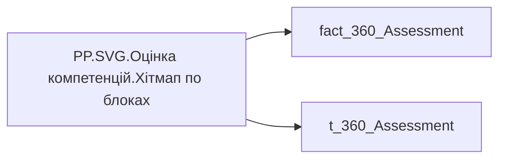

# PP.SVG.Оцінка компетенцій.Хітмап по блоках

## Технічний опис

| Властивість | Значення |
|---|---|
| Тип | міра |
| Home table | _Measures |
| displayFolder | — |
| formatString | — |
| dataType | — |
| Прихована | ні |

### DAX

```dax
VAR _ff = "Segoe UI"

-- ── Палітра грейдів (єдина точка редагування кольорів) ──
VAR _cTopA  = "#16C8E8"   // TOP A — бірюзовий
VAR _cA     = "#2EA84F"   // A — зелений
VAR _cB     = "#F2B100"   // B — жовтий
VAR _cC     = "#9A9A9A"   // C — сірий
VAR _cD     = "#E2231A"   // D — червоний
VAR _cBlank = "#F0F0F0"   // немає значення
VAR _hdrColor = "#3A4660" // підписи рядків/стовпців/легенди

-- ── Розмір візуала (підставити з Формат → Розмір і розташування) ──
VAR _canvasW = 1285       // Ширина візуала
VAR _canvasH = 198        // Висота візуала

-- ── Розміри шрифтів (єдина точка налаштування) ──
VAR _fsLabel  = 11        // назви блоків
VAR _fsHeader = 11        // заголовки стовпців
VAR _fsValue  = 10        // значення в клітинці
VAR _fsLegend = 11       // легенда
VAR _charRatio = 0.58     // приблизна ширина символу кирилиці відносно кегля (для ширини колонки підписів)

-- ── Стовпці = вибрані рядки параметра поля t_360_Assessment ──
-- складений ключ field-параметра = [t_360_Assessment] + [t_360_Assessment Поля] → у SUMMARIZE обовʼязкові обидва
VAR _fieldRaw =
    SUMMARIZE(
        t_360_Assessment,
        t_360_Assessment[t_360_Assessment],            -- назва поля (заголовок)
        t_360_Assessment[t_360_Assessment Поля],       -- частина складеного ключа (не використовується, лише для коректності)
        t_360_Assessment[t_360_Assessment Замовлення]  -- порядок із параметра
    )
VAR _fields =
    ADDCOLUMNS(
        _fieldRaw,
        "@col", RANKX(_fieldRaw, t_360_Assessment[t_360_Assessment Замовлення], , ASC, Dense) - 1
    )
VAR _nCols = COUNTROWS(_fields)

-- ── Рядки = блоки ──
VAR _catRaw = SUMMARIZE('fact_360_Assessment', 'fact_360_Assessment'[Category_Name])
VAR _cats =
    ADDCOLUMNS(_catRaw, "@r", RANKX(_catRaw, 'fact_360_Assessment'[Category_Name], , ASC, Dense))
VAR _rowCount = COUNTROWS(_cats)

-- ── Клітинки: значення обраної параметром міри під фільтром категорії ──
VAR _cells =
    ADDCOLUMNS(
        CROSSJOIN(_cats, _fields),
        "Val",
            VAR _cat  = 'fact_360_Assessment'[Category_Name]
            VAR _disp = t_360_Assessment[t_360_Assessment]
            RETURN
                CALCULATE(
                    SWITCH(
                        _disp,
                        "Самооцінка",       [PP.Оцінка компетенцій.Самооцінка],
                        "Експертна оцінка", [PP.Оцінка компетенцій.Експертна оцінка],
                        "Оцінка 360",       [PP.Оцінка компетенцій.Оцінка 360],
                        "Керівник",         [PP.Оцінка компетенцій.Оцінка керівника],
                        "Колеги",           [PP.Оцінка компетенцій.Оцінка колег],
                        "Крос-колеги",      [PP.Оцінка компетенцій.Оцінка крос-колег],
                        "Підлеглі",         [PP.Оцінка компетенцій.Оцінка підлеглих]
                    ),
                    'fact_360_Assessment'[Category_Name] = _cat
                )
    )

-- ── Геометрія: клітинки заповнюють фіксоване полотно _canvasW × _canvasH ──
VAR _maxLen = MAXX(_cats, LEN('fact_360_Assessment'[Category_Name]))
VAR _labelW = ROUNDUP(4 + _maxLen * _fsLabel * _charRatio + 8, 0)   -- ліва колонка під назви блоків
VAR _legendW   = 70                                                 -- права колонка під легенду
VAR _legendGap = 12
VAR _gap       = 6                                                  -- проміжок між клітинками
-- горизонталь: клітинки на всю ширину між підписами й легендою
VAR _plotW = _canvasW - _labelW - _legendGap - _legendW
VAR _cellW = DIVIDE(_plotW - MAX(_nCols - 1, 0) * _gap, MAX(_nCols, 1))
VAR _legX  = _labelW + _plotW + _legendGap                         // = _canvasW - _legendW
-- вертикаль: рядки на всю висоту під заголовком
VAR _headerY = 16                                                  // базова лінія заголовків стовпців
VAR _gridTop = 24                                                  // верх першого рядка
VAR _botPad  = 8
VAR _rowGap  = 6
VAR _availH   = _canvasH - _gridTop - _botPad
VAR _rowPitch = DIVIDE(_availH, MAX(_rowCount, 1))                 // крок рядка від висоти полотна
VAR _cellH    = (_rowPitch - _rowGap) * 0.8
-- легенда: вертикальний стек, центрований по фактичній висоті сітки
VAR _gridH     = _rowCount * _rowPitch - _rowGap
VAR _legPitch  = 20
VAR _legBlockH = 5 * _legPitch
VAR _legTop    = _gridTop + MAX(0, (_gridH - _legBlockH) / 2)

-- ── Заголовки стовпців (з параметра поля) ──
VAR _ColHeaders =
    CONCATENATEX(
        _fields,
        VAR _hx = _labelW + [@col] * (_cellW + _gap) + _cellW / 2
        RETURN
            "<text x='" & FORMAT(_hx, "0.0", "en-US") & "' y='" & _headerY & "' text-anchor='middle' style='font-family:" & _ff & "; font-size:" & _fsHeader & "px; fill:" & _hdrColor & "; font-weight:600;'>" & SUBSTITUTE(t_360_Assessment[t_360_Assessment], "&", "&amp;") & "</text>",
        "",
        [@col], ASC
    )

-- ── Назви блоків (ліва колонка, один рядок) ──
VAR _RowLabels =
    CONCATENATEX(
        _cats,
        VAR _cat = 'fact_360_Assessment'[Category_Name]
        VAR _yc  = _gridTop + ([@r] - 1) * _rowPitch + _cellH / 2 + _fsLabel * 0.35
        RETURN
            "<text x='4' y='" & FORMAT(_yc, "0.0", "en-US") & "' style='font-family:" & _ff & "; font-size:" & _fsLabel & "px; fill:" & _hdrColor & "; font-weight:600;'>" & SUBSTITUTE(_cat, "&", "&amp;") & "</text>",
        "",
        [@r], ASC
    )

-- ── Клітинки хітмапу ──
VAR _cellsSvg =
    CONCATENATEX(
        _cells,
        VAR _v = [Val]
        VAR _class =
            SWITCH(
                TRUE(),
                ISBLANK(_v), "",
                _v < 3,    "D",
                _v < 3.4,  "C",
                _v < 3.75, "B",
                _v <= 4.25,"A",
                "TOP A"
            )
        VAR _col =
            SWITCH(_class, "TOP A",_cTopA, "A",_cA, "B",_cB, "C",_cC, "D",_cD, _cBlank)
        VAR _txtCol = SWITCH(_class, "A","#FFFFFF", "D","#FFFFFF", "#1F2A44")
        VAR _label  = IF(ISBLANK(_v), "—", FORMAT(_v, "0.00") & " (" & _class & ")")
        VAR _x  = _labelW + [@col] * (_cellW + _gap)
        VAR _y  = _gridTop + ([@r] - 1) * _rowPitch
        VAR _cx = _x + _cellW / 2
        VAR _cy = _y + _cellH / 2 + _fsValue * 0.35
        RETURN
            "<rect x='" & FORMAT(_x, "0.0", "en-US") & "' y='" & FORMAT(_y, "0.0", "en-US") & "' width='" & FORMAT(_cellW, "0.0", "en-US") & "' height='" & FORMAT(_cellH, "0.0", "en-US") & "' rx='6' fill='" & _col & "'/>" &
            "<text x='" & FORMAT(_cx, "0.0", "en-US") & "' y='" & FORMAT(_cy, "0.0", "en-US") & "' text-anchor='middle' style='font-family:" & _ff & "; font-size:" & _fsValue & "px; fill:" & _txtCol & "; font-weight:700;'>" & _label & "</text>",
        "",
        [@r], ASC, [@col], ASC
    )

-- ── Легенда грейдів праворуч (вертикальний стек) ──
VAR _legendTbl =
    UNION(
        ROW("Lbl","TOP A","Clr",_cTopA,"Ord",0),
        ROW("Lbl","A",    "Clr",_cA,   "Ord",1),
        ROW("Lbl","B",    "Clr",_cB,   "Ord",2),
        ROW("Lbl","C",    "Clr",_cC,   "Ord",3),
        ROW("Lbl","D",    "Clr",_cD,   "Ord",4)
    )
VAR _legendSvg =
    CONCATENATEX(
        _legendTbl,
        VAR _sqY  = _legTop + [Ord] * _legPitch + (_legPitch - 11) / 2
        VAR _txtY = _legTop + [Ord] * _legPitch + _legPitch / 2 + _fsLegend * 0.35
        RETURN
            "<rect x='" & FORMAT(_legX, "0.0", "en-US") & "' y='" & FORMAT(_sqY, "0.0", "en-US") & "' width='11' height='11' rx='3' fill='" & [Clr] & "'/>" &
            "<text x='" & FORMAT(_legX + 15, "0.0", "en-US") & "' y='" & FORMAT(_txtY, "0.0", "en-US") & "' style='font-family:" & _ff & "; font-size:" & _fsLegend & "px; fill:" & _hdrColor & "; font-weight:600;'>" & [Lbl] & "</text>",
        "",
        [Ord], ASC
    )

RETURN
"<svg xmlns='http://www.w3.org/2000/svg' width='100%' height='100%' viewBox='0 0 " & FORMAT(_canvasW, "0") & " " & FORMAT(_canvasH, "0") & "' preserveAspectRatio='xMidYMid meet'>"
& _ColHeaders
& _RowLabels
& _cellsSvg
& _legendSvg
& "</svg>"
```

### Джерела даних

Вихідні таблиці: `DM.vw_R27_fact_360_Assessment`

Колонки: `Category_Name`, `t_360_Assessment`, `t_360_Assessment Замовлення`, `t_360_Assessment Поля`

Power Query: `fact_360_Assessment`

### Залежності (таблиці й колонки)

Таблиці: `fact_360_Assessment`, `t_360_Assessment`

Колонки: `fact_360_Assessment[Category_Name]`, `t_360_Assessment[t_360_Assessment Замовлення]`, `t_360_Assessment[t_360_Assessment Поля]`, `t_360_Assessment[t_360_Assessment]`

### Схема



---

## Бізнес-суть

!!! note "Бізнес-визначення відсутнє"
    Поля міри не зіставлено з wiki «Таблицями джерел даних». Можна заповнити вручну в `manualNotes`.

## На сторінках звіту

- [Personal Profile](../report/personal-profile.md) — Результативність та оцінка › Оцінка компет.Детально

## Пов'язані міри

**Використовує:** [PP.Оцінка компетенцій.Експертна оцінка](../measures/pp-otsinka-kompetentsii-ekspertna-otsinka.md), [PP.Оцінка компетенцій.Оцінка 360](../measures/pp-otsinka-kompetentsii-otsinka-360.md), [PP.Оцінка компетенцій.Оцінка керівника](../measures/pp-otsinka-kompetentsii-otsinka-kerivnyka.md), [PP.Оцінка компетенцій.Оцінка колег](../measures/pp-otsinka-kompetentsii-otsinka-koleh.md), [PP.Оцінка компетенцій.Оцінка крос-колег](../measures/pp-otsinka-kompetentsii-otsinka-kros-koleh.md), [PP.Оцінка компетенцій.Оцінка підлеглих](../measures/pp-otsinka-kompetentsii-otsinka-pidlehlykh.md), [PP.Оцінка компетенцій.Самооцінка](../measures/pp-otsinka-kompetentsii-samootsinka.md)

## Нотатки

_порожньо_
