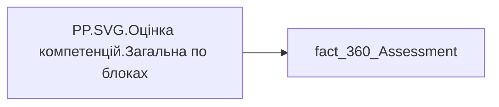

# PP.SVG.Оцінка компетенцій.Загальна по блоках

## Технічний опис

| Властивість | Значення |
|---|---|
| Тип | міра |
| Home table | _Measures |
| displayFolder | — |
| formatString | — |
| dataType | — |
| Прихована | ні |

### DAX

```dax
VAR _fontFamily = "Segoe UI"

// ─── Палітра (єдиний синій ряд + м'які доріжки) ───
VAR _cSelf   = "#2547D0"   // Самооцінка — насичений королівський синій
VAR _cExpert = "#9DBFF9"   // ЕО (Експертна оцінка) — світлий блакитний
VAR _cR360   = "#5B8DEF"   // Оцінка 360 — середній блакитний
VAR _tSelf   = "#D5E0FA"   // доріжка Самооцінки (світлий тон того ж кольору)
VAR _tExpert = "#E8F1FE"   // доріжка ЕО
VAR _tR360   = "#DCE8FC"   // доріжка Оцінки 360
VAR _valColor  = "#1F2A44" // підпис значення — глибокий синьо-сірий
VAR _catColor  = "#3A4660" // підпис категорії
VAR _legColor  = "#3A4660" // текст легенди
VAR _lineColor = "#9AA7BD" // лінія «Тотал» — приглушений сірий
VAR _lineText  = "#6B7890" // підпис «Тотал»

// ─── Шкала ───
VAR _MaxValue = 5

// ─── Дані: три міри по кожній категорії ───
VAR _data =
    ADDCOLUMNS(
        SUMMARIZE('fact_360_Assessment', 'fact_360_Assessment'[Category_Name]),
        "Self",   [PP.Оцінка компетенцій.Самооцінка],
        "Expert", [PP.Оцінка компетенцій.Експертна оцінка],
        "R360",   [PP.Оцінка компетенцій.Оцінка 360]
    )
// лишити категорії, де є хоча б одне значення
VAR _dataF =
    FILTER(
        _data,
        NOT(ISBLANK([Self])) || NOT(ISBLANK([Expert])) || NOT(ISBLANK([R360]))
    )

// ─── Лінія «Тотал» ───
// Джерело — [PP.Оцінка компетенцій.Загальна] по всіх категоріях.
VAR _totalVal =
    CALCULATE(
        [PP.Оцінка компетенцій.Загальна],
        REMOVEFILTERS('fact_360_Assessment'[Category_Name])
    )
VAR _totalLabel = "Тотал · " & FORMAT(_totalVal, "0.00")

// ─── Геометрія: горизонталь (координати = пікселі відображення) ───
VAR _ContainerW = 700
VAR _MaxW = ROUND(_ContainerW * 0.9, 0)             // 630 — стеля ширини (запас 10% від контейнера)
VAR _PadL = 0                                       // ліве поле прибрано
// Ширина підпису «Тотал · X.XX» праворуч від барів (≈6.4px на символ + відступ)
VAR _RightReserve = 14 + LEN(_totalLabel) * 6.4
VAR _BarWidth = 18
VAR _BarGapIn = 6                                   // проміжок між барами в групі
VAR _GroupWidth = (_BarWidth * 3) + (_BarGapIn * 2) // 66
VAR _Rx = _BarWidth / 2                             // 9 — капсула

// Проміжок між блоками: помірний, адаптивний (стискається лише якщо категорій забагато).
// Область рахується від стелі _MaxW, щоб gap при потребі стискався під 630.
VAR _GroupGapDesired = 44
VAR _BarCount = COUNTROWS(_dataF)
VAR _GroupsAreaW = _MaxW - _PadL - _RightReserve
VAR _MaxGapFits = IF(_BarCount > 1, (_GroupsAreaW - _BarCount * _GroupWidth) / (_BarCount - 1), 0)
VAR _GroupGap = MAX(6, MIN(_GroupGapDesired, _MaxGapFits))
VAR _GroupsW = _BarCount * _GroupWidth + MAX(_BarCount - 1, 0) * _GroupGap
VAR _StartX = _PadL                                 // вирівнювання по лівому краю

// Полотно = фактична ширина вмісту (бари зліва + підпис справа), але не більше стелі.
// Так зникає порожнє місце справа, а SVG лишається в межах контейнера → без прокрутки.
VAR _ContentW = _StartX + _GroupsW + _RightReserve
VAR _W = ROUND(MIN(_MaxW, _ContentW), 0)

// ─── Геометрія: вертикаль (фіксована безпечна висота) ───
VAR _LegendY = 10
VAR _ValueY = 32
VAR _BarTop = 38
VAR _BarBot = 118
VAR _BarMaxH = _BarBot - _BarTop                    // 80
VAR _CatY1 = 135
VAR _CatY2 = 148
VAR _H = 155
VAR _ValueFont = 10
VAR _CatFont = 11

// ─── Легенда (вирівняна по лівому краю) ───
VAR _legW1 = 16 + LEN("Самооцінка") * 7
VAR _legW2 = 16 + LEN("ЕО") * 7
VAR _legW3 = 16 + LEN("Оцінка 360") * 7
VAR _legGap = 18
VAR _legStartX = _PadL                              // легенда від лівого краю
VAR _legX1 = _legStartX
VAR _legX2 = _legStartX + _legW1 + _legGap
VAR _legX3 = _legStartX + _legW1 + _legGap + _legW2 + _legGap
VAR _Legend =
    "<circle cx='" & FORMAT(_legX1 + 5, "0.0", "en-US") & "' cy='" & _LegendY & "' r='5' fill='" & _cSelf & "'/>" &
    "<text x='" & FORMAT(_legX1 + 15, "0.0", "en-US") & "' y='" & (_LegendY + 4) & "' style='font-family:" & _fontFamily & "; font-size:12px; fill:" & _legColor & "; font-weight:600;'>Самооцінка</text>" &
    "<circle cx='" & FORMAT(_legX2 + 5, "0.0", "en-US") & "' cy='" & _LegendY & "' r='5' fill='" & _cExpert & "'/>" &
    "<text x='" & FORMAT(_legX2 + 15, "0.0", "en-US") & "' y='" & (_LegendY + 4) & "' style='font-family:" & _fontFamily & "; font-size:12px; fill:" & _legColor & "; font-weight:600;'>ЕО</text>" &
    "<circle cx='" & FORMAT(_legX3 + 5, "0.0", "en-US") & "' cy='" & _LegendY & "' r='5' fill='" & _cR360 & "'/>" &
    "<text x='" & FORMAT(_legX3 + 15, "0.0", "en-US") & "' y='" & (_LegendY + 4) & "' style='font-family:" & _fontFamily & "; font-size:12px; fill:" & _legColor & "; font-weight:600;'>Оцінка 360</text>"

// ─── Групи барів ───
VAR _Cols =
    CONCATENATEX(
        ADDCOLUMNS(
            _dataF,
            "@i", RANKX(_dataF, [Category_Name], , ASC, Dense) - 1
        ),
        VAR _cat = [Category_Name]
        VAR _vSelf = [Self]
        VAR _vExpert = [Expert]
        VAR _vR360 = [R360]

        VAR _x = _StartX + [@i] * (_GroupWidth + _GroupGap)
        VAR _x1 = _x
        VAR _x2 = _x + _BarWidth + _BarGapIn
        VAR _x3 = _x + 2 * (_BarWidth + _BarGapIn)
        VAR _cxG = _x + _GroupWidth / 2

        VAR _hSelf = MIN(DIVIDE(_vSelf, _MaxValue, 0), 1) * _BarMaxH
        VAR _ySelf = _BarBot - _hSelf
        VAR _hExpert = MIN(DIVIDE(_vExpert, _MaxValue, 0), 1) * _BarMaxH
        VAR _yExpert = _BarBot - _hExpert
        VAR _hR360 = MIN(DIVIDE(_vR360, _MaxValue, 0), 1) * _BarMaxH
        VAR _yR360 = _BarBot - _hR360

        // доріжки (повна висота)
        VAR _tracks =
            "<rect x='" & FORMAT(_x1, "0.0", "en-US") & "' y='" & _BarTop & "' width='" & _BarWidth & "' height='" & _BarMaxH & "' rx='" & _Rx & "' fill='" & _tSelf & "'/>" &
            "<rect x='" & FORMAT(_x2, "0.0", "en-US") & "' y='" & _BarTop & "' width='" & _BarWidth & "' height='" & _BarMaxH & "' rx='" & _Rx & "' fill='" & _tExpert & "'/>" &
            "<rect x='" & FORMAT(_x3, "0.0", "en-US") & "' y='" & _BarTop & "' width='" & _BarWidth & "' height='" & _BarMaxH & "' rx='" & _Rx & "' fill='" & _tR360 & "'/>"

        // заливки (тільки за наявності значення)
        VAR _fills =
            IF(ISBLANK(_vSelf), "", "<rect x='" & FORMAT(_x1, "0.0", "en-US") & "' y='" & FORMAT(_ySelf, "0.0", "en-US") & "' width='" & _BarWidth & "' height='" & FORMAT(_hSelf, "0.0", "en-US") & "' rx='" & _Rx & "' fill='" & _cSelf & "'/>") &
            IF(ISBLANK(_vExpert), "", "<rect x='" & FORMAT(_x2, "0.0", "en-US") & "' y='" & FORMAT(_yExpert, "0.0", "en-US") & "' width='" & _BarWidth & "' height='" & FORMAT(_hExpert, "0.0", "en-US") & "' rx='" & _Rx & "' fill='" & _cExpert & "'/>") &
            IF(ISBLANK(_vR360), "", "<rect x='" & FORMAT(_x3, "0.0", "en-US") & "' y='" & FORMAT(_yR360, "0.0", "en-US") & "' width='" & _BarWidth & "' height='" & FORMAT(_hR360, "0.0", "en-US") & "' rx='" & _Rx & "' fill='" & _cR360 & "'/>")

        // підписи значень над барами
        VAR _vlabels =
            "<text x='" & FORMAT(_x1 + _BarWidth / 2, "0.0", "en-US") & "' y='" & _ValueY & "' text-anchor='middle' style='font-family:" & _fontFamily & "; font-size:" & _ValueFont & "px; fill:" & _valColor & "; font-weight:600;'>" & IF(ISBLANK(_vSelf), "", FORMAT(_vSelf, "0.00")) & "</text>" &
            "<text x='" & FORMAT(_x2 + _BarWidth / 2, "0.0", "en-US") & "' y='" & _ValueY & "' text-anchor='middle' style='font-family:" & _fontFamily & "; font-size:" & _ValueFont & "px; fill:" & _valColor & "; font-weight:600;'>" & IF(ISBLANK(_vExpert), "", FORMAT(_vExpert, "0.00")) & "</text>" &
            "<text x='" & FORMAT(_x3 + _BarWidth / 2, "0.0", "en-US") & "' y='" & _ValueY & "' text-anchor='middle' style='font-family:" & _fontFamily & "; font-size:" & _ValueFont & "px; fill:" & _valColor & "; font-weight:600;'>" & IF(ISBLANK(_vR360), "", FORMAT(_vR360, "0.00")) & "</text>"

        // підпис категорії у два рядки (розрив за першим пробілом)
        VAR _spacePos = SEARCH(" ", _cat, 1, 0)
        VAR _catLine1 = IF(_spacePos > 0, LEFT(_cat, _spacePos - 1), _cat)
        VAR _catLine2 = IF(_spacePos > 0, MID(_cat, _spacePos + 1, 200), "")
        VAR _catLabel =
            "<text x='" & FORMAT(_cxG, "0.0", "en-US") & "' y='" & _CatY1 & "' text-anchor='middle' style='font-family:" & _fontFamily & "; font-size:" & _CatFont & "px; fill:" & _catColor & "; font-weight:600;'>" & SUBSTITUTE(_catLine1, "&", "&amp;") & "</text>" &
            IF(_catLine2 = "", "", "<text x='" & FORMAT(_cxG, "0.0", "en-US") & "' y='" & _CatY2 & "' text-anchor='middle' style='font-family:" & _fontFamily & "; font-size:" & _CatFont & "px; fill:" & _catColor & "; font-weight:600;'>" & SUBSTITUTE(_catLine2, "&", "&amp;") & "</text>")

        RETURN _tracks & _fills & _vlabels & _catLabel,
        "",
        [@i], ASC
    )

// ─── Лінія «Тотал» (тонка штрихова, поверх барів) ───
VAR _refY = _BarBot - MIN(DIVIDE(_totalVal, _MaxValue, 0), 1) * _BarMaxH
VAR _lineX1 = _StartX
VAR _lineX2 = _StartX + _GroupsW + 6
VAR _labelX = _StartX + _GroupsW + 12
VAR _TotalLine =
    "<line x1='" & FORMAT(_lineX1, "0.0", "en-US") & "' y1='" & FORMAT(_refY, "0.0", "en-US") & "' x2='" & FORMAT(_lineX2, "0.0", "en-US") & "' y2='" & FORMAT(_refY, "0.0", "en-US") & "' stroke='" & _lineColor & "' stroke-width='1.5' stroke-dasharray='6,4' stroke-linecap='round'/>" &
    "<text x='" & FORMAT(_labelX, "0.0", "en-US") & "' y='" & FORMAT(_refY + 4, "0.0", "en-US") & "' style='font-family:" & _fontFamily & "; font-size:11px; fill:" & _lineText & "; font-weight:600;'>" & _totalLabel & "</text>"

RETURN
"<svg xmlns='http://www.w3.org/2000/svg' width='" & FORMAT(_W, "0") & "' height='" & FORMAT(_H, "0") & "' viewBox='0 0 " & FORMAT(_W, "0") & " " & FORMAT(_H, "0") & "' preserveAspectRatio='xMidYMid meet'>"
& _Legend
& _Cols
& _TotalLine
& "</svg>"
```

### Джерела даних

Вихідні таблиці: `DM.vw_R27_fact_360_Assessment`

Колонки: `Category_Name`

Power Query: `fact_360_Assessment`

### Залежності (таблиці й колонки)

Таблиці: `fact_360_Assessment`

Колонки: `fact_360_Assessment[Category_Name]`

### Схема



---

## Бізнес-суть

!!! note "Бізнес-визначення відсутнє"
    Поля міри не зіставлено з wiki «Таблицями джерел даних». Можна заповнити вручну в `manualNotes`.

## На сторінках звіту

_Не використовується на основних сторінках звіту._

## Пов'язані міри

**Використовує:** [PP.Оцінка компетенцій.Експертна оцінка](../measures/pp-otsinka-kompetentsii-ekspertna-otsinka.md), [PP.Оцінка компетенцій.Загальна](../measures/pp-otsinka-kompetentsii-zahalna.md), [PP.Оцінка компетенцій.Оцінка 360](../measures/pp-otsinka-kompetentsii-otsinka-360.md), [PP.Оцінка компетенцій.Самооцінка](../measures/pp-otsinka-kompetentsii-samootsinka.md)

## Нотатки

_порожньо_
