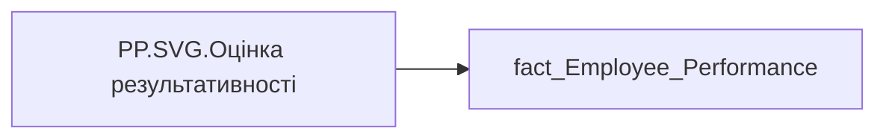

# PP.SVG.Оцінка результативності

*тека `Personal_Profile\Результативність та оцінка\Результативність`*

!!! abstract "Джерела даних"
    `DM.vw_R27_fact_Employee_Performance_PBI`

## Бізнес-суть

performance_PBI_order → Сортування (для виведення 4-х останніх періодів)

**Вимоги:** `Індивідуальний-профіль-працівника/Паспортна-частина-індивідуального-профілю-співробітника/Зміна-джерела-даних-для-павутинки-Оцінка-результативності`, `Індивідуальний-профіль-працівника/Паспортна-частина-індивідуального-профілю-співробітника/Сторінка-Картка-(паспорт)-працівника/ТЗ-на-побудову-візуала-Павутинка-по-оцінці-результативності-працівника`, `Індивідуальний-профіль-працівника/Сторінка-Результативність-та-оцінка`, `Командний-профіль/Паспортна-частина-групового-профілю/Редизайн-паспортної-частини-групового-профілю`, `Командний-профіль/Сторінка-Результативність-та-оцінка-команди`

## На сторінках звіту

[Personal Profile](../report/personal-profile.md)

## Пов'язані міри

**Використовує:** [PP.Оцінка результативності.Керівником](../measures/pp-otsinka-rezultatyvnosti-kerivnykom.md), [PP.Оцінка результативності.Самооцінка](../measures/pp-otsinka-rezultatyvnosti-samootsinka.md)

---

## Технічний опис

| Властивість | Значення |
|---|---|
| Тип | міра |
| Home table | _Measures |
| displayFolder | `Personal_Profile\Результативність та оцінка\Результативність` |
| formatString | — |
| dataType | — |
| Прихована | ні |

### DAX

```dax
VAR _fontFamily = "Segoe UI"
VAR _labelColor = "#003A5D"
VAR _MaxValue = 5

// --- Параметри підпису ---
VAR _ValueFontSize = 10
VAR _TopTextH = 28
VAR _BottomMargin = 22

// --- Дані ---
VAR _data_sup = SUMMARIZE(
	'fact_Employee_Performance',
	'fact_Employee_Performance'[performance_PBI_order],
	'fact_Employee_Performance'[performence_period],
	"Value1", [PP.Оцінка результативності.Керівником],
	"Value2", [PP.Оцінка результативності.Самооцінка]
)

// --- Геометрія полотна ---
VAR _W = 640
VAR _H = 150
VAR _MarginTop = 8
VAR _MarginLR = 40
VAR _ChartTop = _MarginTop + _TopTextH
VAR _ChartBot = _H - _BottomMargin
VAR _ChartH = _ChartBot - _ChartTop

VAR _BarCount = COUNTROWS(_data_sup)
VAR _BarWidth = 20
VAR _BarGap = 10
VAR _GroupWidth = (_BarWidth * 2) + _BarGap
VAR _AvailableW = _W - 2 * _MarginLR
VAR _GroupGap = IF(_BarCount > 1, (_AvailableW - _BarCount * _GroupWidth) / (_BarCount - 1), 0)
VAR _StartX = _MarginLR

// --- Побудова ---
VAR _BarsSVG = CONCATENATEX(
	ADDCOLUMNS(
		ADDCOLUMNS(
			_data_sup,
			"@i", RANKX(_data_sup, [performance_PBI_order], , ASC, Dense) - 1
		),
		"@xGroup", _StartX + [@i] * (_GroupWidth + _GroupGap)
	),
	VAR _v1 = [Value1]
	VAR _v2 = [Value2]

	VAR _class1 = SWITCH(TRUE(),
		ISBLANK(_v1), "",
		_v1 < 3, "D",
		_v1 <= 3.39, "C",
		_v1 <= 3.89, "B",
		_v1 <= 4.29, "A",
		_v1 <= 5.00, "A+"
	)

	VAR _class2 = SWITCH(TRUE(),
		ISBLANK(_v2), "",
		_v2 < 3, "D",
		_v2 <= 3.39, "C",
		_v2 <= 3.89, "B",
		_v2 <= 4.29, "A",
		_v2 <= 5.00, "A+"
	)

	VAR _ColorFill1 = SWITCH(_class1,
		"A+", "#8bd6ea",
		"A", "#5a974d",
		"B", "#e9c246",
		"C", "#a5a4a6",
		"D", "#9e241e",
		"#a5a4a6"
	)

	VAR _ColorFill2 = SWITCH(_class2,
		"A+", "#8bd6ea",
		"A", "#5a974d",
		"B", "#e9c246",
		"C", "#a5a4a6",
		"D", "#9e241e",
		"#a5a4a6"
	)

	VAR _label1 = FORMAT(_v1, "0.0")
	VAR _label2 = FORMAT(_v2, "0.0")

	VAR _x1 = [@xGroup]
	VAR _x2 = [@xGroup] + _BarWidth + _BarGap
	VAR _cx = [@xGroup] + (_GroupWidth / 2)
	VAR _cx1 = _x1 + (_BarWidth / 2)
	VAR _cx2 = _x2 + (_BarWidth / 2)

	VAR _h1 = MIN(DIVIDE(_v1, _MaxValue, 0), 1) * _ChartH
	VAR _y1 = _ChartBot - _h1
	VAR _h2 = MIN(DIVIDE(_v2, _MaxValue, 0), 1) * _ChartH
	VAR _y2 = _ChartBot - _h2

	VAR _rects =
		"<rect x='" & _x1 & "' y='" & _ChartTop & "' width='" & _BarWidth & "' height='" & _ChartH & "' fill='" & _ColorFill1 & "' fill-opacity='0.1' stroke='" & _ColorFill1 & "' stroke-width='1' stroke-opacity='0.3' />" &
		"<rect x='" & _x2 & "' y='" & _ChartTop & "' width='" & _BarWidth & "' height='" & _ChartH & "' fill='" & _ColorFill2 & "' fill-opacity='0.1' />" &
		"<rect x='" & _x1 & "' y='" & FORMAT(_y1, "0.0") & "' width='" & _BarWidth & "' height='" & FORMAT(_h1, "0.0") & "' fill='" & _ColorFill1 & "' stroke='" & _ColorFill1 & "' stroke-width='1' />" &
		"<rect x='" & _x2 & "' y='" & FORMAT(_y2, "0.0") & "' width='" & _BarWidth & "' height='" & FORMAT(_h2, "0.0") & "' fill='" & _ColorFill2 & "' fill-opacity='0.7' />"

	VAR _labels =
		"<text x='" & _cx1 & "' y='" & (_ChartTop - 12) & "' text-anchor='middle' style='font-family:" & _fontFamily & "; font-size:" & _ValueFontSize & "px; fill:" & _labelColor & "; font-weight:700;'>" & _label1 & "</text>" &
		"<text x='" & _cx2 & "' y='" & (_ChartTop - 12) & "' text-anchor='middle' style='font-family:" & _fontFamily & "; font-size:" & _ValueFontSize & "px; fill:" & _labelColor & ";'>" & _label2 & "</text>"

	VAR _periodLabel =
		"<text x='" & _cx & "' y='" & (_H - 5) & "' text-anchor='middle' style='font-family:" & _fontFamily & "; font-size:12px; fill:" & _labelColor & "; font-weight:600;'>" &
		SUBSTITUTE([performence_period], "&", "&amp;") &
		"</text>"

	RETURN _rects & _labels & _periodLabel,
	"",
	[performance_PBI_order], ASC
)

RETURN
"<svg xmlns='http://www.w3.org/2000/svg' width='100%' height='" & _H & "' viewBox='0 0 " & _W & " " & _H & "' preserveAspectRatio='xMinYMid meet'>
	" & _BarsSVG & "
</svg>"
```

### Джерела даних

Вихідні таблиці: `DM.vw_R27_fact_Employee_Performance_PBI`

Колонки: `performance_PBI_order`, `performence_period`

Power Query: `fact_Employee_Performance`

### Залежності (таблиці й колонки)

Таблиці: `fact_Employee_Performance`

Колонки: `fact_Employee_Performance[performance_PBI_order]`, `fact_Employee_Performance[performence_period]`

### Схема



## Нотатки

_порожньо_
