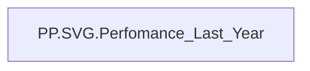

# PP.SVG.Perfomance_Last_Year

| Властивість | Значення |
|---|---|
| Тип | міра |
| Home table | _Measures |
| displayFolder | `Personal_Profile\Паспорт\Результативність` |
| formatString | — |
| dataType | — |
| Прихована | ні |

## DAX

```dax
-------------SUM--------------------------------
-- 1) ОТРИМУЄМО SCORE ТА ВИЗНАЧАЄМО КОЛЬОРИ
------------------------------------------
VAR _ScoreValue = [PP.Оцінка результативності поточний рік]

VAR _ClassLetter = 
	SWITCH(
		TRUE(),
		ISBLANK(_ScoreValue), "",
		_ScoreValue < 3, "D",
		_ScoreValue <= 3.39, "C",
		_ScoreValue <= 3.89, "B",
		_ScoreValue <= 4.29, "A",
		_ScoreValue <= 5.00, "TOP A"
	)

VAR _ArcColor =
	SWITCH(
		_ClassLetter,
		"", "#a5a4a6",
		"D", "#9e241e",
		"C", "#a5a4a6",
		"B", "#e9c246",
		"A", "#5a974d",
		"TOP A", "#8bd6ea"
	)

VAR _TextColor  =
	SWITCH(
		_ClassLetter,
		"D", "#7e1d18",
		"C", "#848385",
		"B", "#ba9b38",
		"A", "#48793e",
		"TOP A", "#6faabd"
	)
---------------------------------------------
-- 2) ОБЧИСЛЮЄМО ПРОГРЕС (0..1)
---------------------------------------------
VAR _Progress = DIVIDE(_ScoreValue,5,0)

---------------------------------------------
-- 3) ПАРАМЕТРИ РОЗМІРУ ТА КОЛА
---------------------------------------------
VAR _BoxSize       = 240  
VAR _Center        = _BoxSize / 2
VAR _Radius        = 90    
VAR _StrokeW       = 25    
VAR _Circumference = 2 * PI() * _Radius

-- для “front” (Score):
VAR _DashOffsetFore = (1 - _Progress) * _Circumference

---------------------------------------------
-- 4) ДВА КОЛА: BACK (прозорість 20%) + FORE (непрозоре)
---------------------------------------------
VAR _BackCircle =
	"<circle cx='" & _Center & "' cy='" & _Center &
	"' r='" & _Radius & "' fill='none' " &
	"stroke='" & _ArcColor & "' stroke-opacity='0.2' stroke-width='" & _StrokeW & "' " &
	"stroke-dasharray='" & ROUND(_Circumference,0) & "' " &
	"stroke-dashoffset='0' " &
	"stroke-linecap='round' " & 
	"style='transform: rotate(-90deg); transform-origin: " & _Center & "px " & _Center & "px' />"

VAR _ForeCircle =
	"<circle cx='" & _Center & "' cy='" & _Center &
	"' r='" & _Radius & "' fill='none' " &
	"stroke='" & _ArcColor & "' stroke-width='" & _StrokeW & "' " &
	"stroke-dasharray='" & ROUND(_Circumference,0) & "' " &
	"stroke-dashoffset='" & ROUND(_DashOffsetFore,0) & "' " &
	"stroke-linecap='round' " &
	"style='transform: rotate(-90deg); transform-origin: " & _Center & "px " & _Center & "px' />"

---------------------------------------------
-- 5) ТЕКСТ У ЦЕНТРІ (2 РЯДКИ)
---------------------------------------------
VAR _TextElements =
	"<text x='" & _Center & "' y='" & _Center & "' fill='" & _TextColor &
	"' font-size='30' text-anchor='middle' dominant-baseline='middle'>" &
		"<tspan x='" & _Center & "' dy='-0.4em'>" &
			FORMAT(_ScoreValue,"0.00") &
		"</tspan>" &
		"<tspan x='" & _Center & "' dy='1.4em' font-size='30'>" &
			_ClassLetter &
		"</tspan>" &
	"</text>"

---------------------------------------------
-- 6) ЗБИРАЄМО ADAPTIVE SVG (без width/height)
---------------------------------------------
VAR _SvgContent =
	"<svg viewBox='0 0 " & _BoxSize & " " & _BoxSize &
	"' style='width:100%; height:auto;' xmlns='http://www.w3.org/2000/svg'>" &
		_BackCircle &
		_ForeCircle &
		_TextElements &
	"</svg>"

RETURN
_SvgContent
```

## Джерела

—

## Бізнес-суть

!!! warning "Без бізнес-визначення"
    Поля міри не знайдено у wiki «Таблицях джерел даних». Заповніть `manualNotes`.

## Залежності

Міри: [PP.Оцінка результативності поточний рік](../measures/pp-otsinka-rezultatyvnosti-potochnyi-rik.md)


## Схема



## Нотатки

_порожньо_
