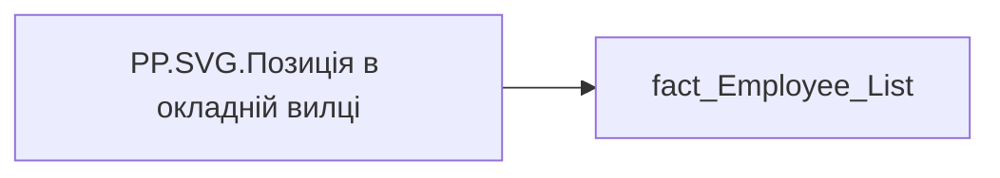

# PP.SVG.Позиція в окладній вилці

| Властивість | Значення |
|---|---|
| Тип | міра |
| Home table | _Measures |
| displayFolder | `Personal_Profile\TRS` |
| formatString | — |
| dataType | — |
| Прихована | ні |

## DAX

```dax
-- Вхідні міри
VAR _Min = [PP.Мінімум вилки]                            // ліва межа
VAR _Mid = [pp.Середина вилки]                           // середина
VAR _Max = [pp.Максимум вилки]                           // права межа
VAR _Pct = [PP.Позиція в окладній вилці]                 // ЧИСЛО (compa-ratio = оклад / середина), напр. 0,8667
VAR _salary = MAX( fact_Employee_List[MIN_TARIFF_RATE] ) // оклад -> значення у виносці + позиція маркера

-- Прапорець: приховати числові значення меж ТА підписи, якщо будь-яке з min/mid/max = 0
VAR _hideBounds = ( _Min = 0 || _Mid = 0 || _Max = 0 )

-- Зона (додано "Вище максимуму": оклад строго більший за максимум вилки)
VAR _position = _Pct - 1                                 // = (оклад - середина) / середина
VAR _zone =
    SWITCH(
        TRUE(),
        _salary < _Min,      "Нижче мінімума",
        _salary > _Max,      "Вище максимуму",
        _position <= -0.051, "Мінімум-середина",
        _position <= 0.05,   "Середина",
        _position > 0.05,    "Середина-Максимум",
        "Дані відсутні"
    )
-- Колір зони (hex з еталонної діаграми; "Вище максимуму" — вигаданий фіолетовий)
VAR _zoneColor =
    SWITCH(
        _zone,
        "Нижче мінімума",     "#E73737",
        "Мінімум-середина",   "#FB8B00",
        "Середина",           "#469F45",
        "Середина-Максимум",  "#248DE5",
        "Вище максимуму",     "#7C4DFF",
        "Дані відсутні",      "#B0BFC6",
        "#063E61"
    )
-- Колір тексту в пігулці: темний на світло-сірій зоні, інакше білий
VAR _pillText = IF( _zone = "Дані відсутні", "#3A4750", "#FFFFFF" )
VAR _header = _zone & ":  " & FORMAT( _Pct, "0.00%", "en-US" )

-- Полотно: 449x123 = 88% від обʼєкта 510x140 (запас, щоб не було прокрутки)
VAR _x0   = 20                                  // лівий край смуги
VAR _x1   = 429                                 // правий край смуги
VAR _barW = _x1 - _x0                           // 409
VAR _pw   = 100                                 // ширина виноски

-- Частки позицій уздовж діапазону (0 = мінімум, 1 = максимум)
VAR _fMid  = DIVIDE( _Mid - _Min, _Max - _Min, 0 )
VAR _frac  = DIVIDE( _salary - _Min, _Max - _Min, 0 )
VAR _fracC = MIN( MAX( _frac, 0 ), 1 )

-- Координати X
VAR _midX     = _x0 + _barW * _fMid
VAR _markerX  = _x0 + _barW * _fracC
VAR _cx       = MIN( MAX( _markerX, _x0 + _pw / 2 ), _x1 - _pw / 2 )  // центр виноски без виходу за полотно
VAR _lowZoneW = _midX - _x0
VAR _upZoneW  = _x1 - _midX

-- Текст (en-US -> крапка детермінована; групи -> пробіл)
VAR _tSalary = SUBSTITUTE( FORMAT( _salary, "#,##0", "en-US" ), ",", " " ) & " грн"
VAR _tMin    = SUBSTITUTE( FORMAT( _Min,    "#,##0", "en-US" ), ",", " " ) & " грн"
VAR _tMid    = SUBSTITUTE( FORMAT( _Mid,    "#,##0", "en-US" ), ",", " " ) & " грн"
VAR _tMax    = SUBSTITUTE( FORMAT( _Max,    "#,##0", "en-US" ), ",", " " ) & " грн"

VAR _svg =
    "<svg xmlns='http://www.w3.org/2000/svg' width='449' height='123' viewBox='0 0 449 123'>"
        // нижня зона (мінімум -> середина)
        & "<rect x='20' y='70' width='" & FORMAT( _lowZoneW, "0.0", "en-US" ) & "' height='16' fill='#DCE6EC'/>"
        // верхня зона (середина -> максимум)
        & "<rect x='" & FORMAT( _midX, "0.0", "en-US" ) & "' y='70' width='" & FORMAT( _upZoneW, "0.0", "en-US" ) & "' height='16' fill='#C3D7E3'/>"
        // біла межа на середині
        & "<line x1='" & FORMAT( _midX, "0.0", "en-US" ) & "' y1='70' x2='" & FORMAT( _midX, "0.0", "en-US" ) & "' y2='86' stroke='#FFFFFF' stroke-width='1'/>"
        // засічка середини над смугою
        & "<line x1='" & FORMAT( _midX, "0.0", "en-US" ) & "' y1='65' x2='" & FORMAT( _midX, "0.0", "en-US" ) & "' y2='70' stroke='#5B6B75' stroke-width='1.5' stroke-linecap='round'/>"
        // рамка смуги
        & "<rect x='20' y='70' width='409' height='16' fill='none' stroke='#C9D4DB' stroke-width='1'/>"
        // голка маркера (navy, частина шкали)
        & "<line x1='" & FORMAT( _markerX, "0.0", "en-US" ) & "' y1='58' x2='" & FORMAT( _markerX, "0.0", "en-US" ) & "' y2='86' stroke='#063E61' stroke-width='2' stroke-linecap='round'/>"
        // точка на смузі (navy)
        & "<circle cx='" & FORMAT( _markerX, "0.0", "en-US" ) & "' cy='78' r='3.5' fill='#063E61'/>"
        // хвіст виноски -> колір зони
        & "<polygon points='"
            & FORMAT( _cx - 6, "0.0", "en-US" ) & ",52 "
            & FORMAT( _cx + 6, "0.0", "en-US" ) & ",52 "
            & FORMAT( _markerX, "0.0", "en-US" ) & ",58' fill='" & _zoneColor & "'/>"
        // тіло пігулки -> колір зони + оклад (адаптивний колір тексту)
        & "<rect x='" & FORMAT( _cx - _pw / 2, "0.0", "en-US" ) & "' y='30' width='100' height='22' rx='6' fill='" & _zoneColor & "'/>"
        & "<text x='" & FORMAT( _cx, "0.0", "en-US" ) & "' y='41' font-size='12' font-weight='600' font-family='Segoe UI, sans-serif' fill='" & _pillText & "' text-anchor='middle' dominant-baseline='central'>" & _tSalary & "</text>"
        // заголовок (navy)
        & "<text x='20' y='20' font-size='13' font-weight='600' font-family='Segoe UI, sans-serif' fill='#063E61' text-anchor='start'>" & _header & "</text>"
        // значення меж під смугою (приховуються, якщо _hideBounds = TRUE)
        & IF( _hideBounds, "", "<text x='20' y='98' font-size='11' font-weight='600' font-family='Segoe UI, sans-serif' fill='#063E61' text-anchor='start'>" & _tMin & "</text>" )
        & IF( _hideBounds, "", "<text x='" & FORMAT( _midX, "0.0", "en-US" ) & "' y='98' font-size='11' font-weight='600' font-family='Segoe UI, sans-serif' fill='#063E61' text-anchor='middle'>" & _tMid & "</text>" )
        & IF( _hideBounds, "", "<text x='429' y='98' font-size='11' font-weight='600' font-family='Segoe UI, sans-serif' fill='#063E61' text-anchor='end'>" & _tMax & "</text>" )
        // підписи (приховуються, якщо _hideBounds = TRUE)
        & IF( _hideBounds, "", "<text x='20' y='109' font-size='9' font-family='Segoe UI, sans-serif' fill='#6B7A85' text-anchor='start'>мінімум</text>" )
        & IF( _hideBounds, "", "<text x='" & FORMAT( _midX, "0.0", "en-US" ) & "' y='109' font-size='9' font-family='Segoe UI, sans-serif' fill='#6B7A85' text-anchor='middle'>середина</text>" )
        & IF( _hideBounds, "", "<text x='429' y='109' font-size='9' font-family='Segoe UI, sans-serif' fill='#6B7A85' text-anchor='end'>максимум</text>" )
    & "</svg>"
RETURN _svg
```

## Джерела


Колонки: `MIN_TARIFF_RATE`

Power Query: `fact_Employee_List`

## Бізнес-суть

MIN_TARIFF_RATE → Оклад; MIN_TARIFF_RATE → Позиція в окладній вилці; MIN_TARIFF_RATE → Зарплата (вилки); MIN_TARIFF_RATE → Розподіл за вилкою зарплат; MIN_TARIFF_RATE → Положення у вилці

Розрахункове поле.  <br>Потрібно визначити в якому діапазоні знаходиться сума значень (min_tariff_rate + сума доплати за роз'їзний характер роботи+сума доплати за шкідливі умови праці+премія за місяць.)  <br>Сума доплати за роз'їзний характер роботи - значення поля PAYMENT_PLAN_SUM, де  ACCRUAL_ORG_CODE = 00193, IS_ACTUAL  = "1", END_DATE > поточна дата, або END_DATE = "01.01.2001  <br>Сума доплати за шкідливі умови праці - значення поля PAYMENT_PLAN_SUM, де  ACCRUAL_ORG_CODE = 00146, IS_ACTUAL  = "1", END_DATE > поточна дата, або END_DATE = "01.01.2001<br>Премія за місяць - значення поля PAYM

**Вимоги:** `Індивідуальний-профіль-працівника/Історія-по-посадам`, `Індивідуальний-профіль-працівника/Історія-по-посадам/Реліз-1.-Історія-по-посадам`, `Індивідуальний-профіль-працівника/Сторінка-Винагорода-працівника`, `Індивідуальний-профіль-працівника/Сторінка-Винагорода-працівника/Доопрацювання-сторінки-ТРС`, `Допоміжні-вітрини-для-звіту/Таблиця-для-розрахунку-агрегованих-метрик-по-звіту`, `Командний-профіль/Сторінка-TRS-команди`, `Командний-профіль/Сторінка-TRS-команди/Сторінка-Винагорода-групового-профілю#вимоги-до-звіту`, `Командний-профіль/Сторінка-Моя-команда/ТЗ.-Деталізація-метрик-групового-профілю-звіту`

## Залежності

Міри: [PP.Мінімум вилки](../measures/pp-minimum-vylky.md), [PP.Позиція в окладній вилці](../measures/pp-pozytsiia-v-okladnii-vyltsi.md)

Таблиці: `fact_Employee_List`

Колонки: `fact_Employee_List[MIN_TARIFF_RATE]`

## Схема



## Нотатки

_порожньо_
