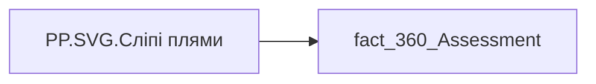

# PP.SVG.Сліпі плями

## Технічний опис

| Властивість | Значення |
|---|---|
| Тип | міра |
| Home table | _Measures |
| displayFolder | — |
| formatString | — |
| dataType | — |
| Прихована | ні |

### DAX

```dax
VAR _fontFamily = "Segoe UI"

// ─── Палітра ───
VAR _cExpert = "#4F86E8"   // ЕО
VAR _cMgr    = "#7E78DC"   // Керівником
VAR _cPeer   = "#49A6C9"   // Колег
VAR _cCross  = "#9CB3F0"   // Крос-колег
VAR _cSub    = "#6FC0CE"   // Підлеглих
VAR _cDelta  = "#E14B3C"   // дельта (оцінювач нижче самооцінки) — червоний
VAR _trackColor  = "#EDF1F8" // доріжка
VAR _selfLineCol = "#46506A" // опорна лінія самооцінки
VAR _valColor    = "#1F2A44" // підпис значення
VAR _catColor    = "#3A4660" // підпис компетенції
VAR _legColor    = "#3A4660" // текст легенди
VAR _hintColor   = "#A7AFBC" // підказка

// ─── Шкала ───
VAR _MaxValue = 5

// ─── Дані: самооцінка + 5 оцінювачів по компетенції ───
VAR _data =
    ADDCOLUMNS(
        SUMMARIZE('fact_360_Assessment', 'fact_360_Assessment'[Competency_Name]),
        "Self",   [PP.Оцінка компетенцій.Самооцінка],
        "Expert", [PP.Оцінка компетенцій.Експертна оцінка],
        "Mgr",    [PP.Оцінка компетенцій.Оцінка керівника],
        "Peer",   [PP.Оцінка компетенцій.Оцінка колег],
        "Cross",  [PP.Оцінка компетенцій.Оцінка крос-колег],
        "Sub",    [PP.Оцінка компетенцій.Оцінка підлеглих]
    )
// «Сліпі плями»: лишити компетенцію, якщо хоча б один оцінювач < Самооцінки
VAR _dataF =
    FILTER(
        _data,
        NOT(ISBLANK([Self])) &&
        (
            (NOT(ISBLANK([Expert])) && [Expert] < [Self]) ||
            (NOT(ISBLANK([Mgr]))    && [Mgr]    < [Self]) ||
            (NOT(ISBLANK([Peer]))   && [Peer]   < [Self]) ||
            (NOT(ISBLANK([Cross]))  && [Cross]  < [Self]) ||
            (NOT(ISBLANK([Sub]))    && [Sub]    < [Self])
        )
    )

// ─── Горизонталь ───
VAR _ContainerW = 476       // фактична ширина об'єкта
VAR _MaxW = ROUND(_ContainerW * 0.9, 0)             // 428 — стеля ширини (запас 10%)
VAR _PadL = 4
VAR _BarWidth = 18
VAR _BarGapIn = 6
VAR _GroupWidth = (_BarWidth * 5) + (_BarGapIn * 4) // 114 — 5 барів
VAR _GroupGapDesired = 40
VAR _BarCount = COUNTROWS(_dataF)
VAR _isEmpty = NOT(_BarCount > 0)
VAR _GroupsAreaW = _MaxW - _PadL
VAR _MaxGapFits = IF(_BarCount > 1, (_GroupsAreaW - _BarCount * _GroupWidth) / (_BarCount - 1), 0)
VAR _GroupGap = MAX(6, MIN(_GroupGapDesired, _MaxGapFits))
VAR _GroupsW = _BarCount * _GroupWidth + MAX(_BarCount - 1, 0) * _GroupGap

// ── Підказка для порожнього стану ──
VAR _hintText = "Немає сліпих плям"
VAR _hintFont = 12
VAR _hintW = LEN(_hintText) * 6.8 + 8

// ── Захист підписів від обрізання ──
VAR _CatCharW = 6.2
VAR _ValHalf = 11
VAR _firstCat = MINX(_dataF, [Competency_Name])
VAR _firstSp = SEARCH(" ", _firstCat, 1, 0)
VAR _firstL1 = IF(_firstSp > 0, LEFT(_firstCat, _firstSp - 1), _firstCat)
VAR _firstL2 = IF(_firstSp > 0, MID(_firstCat, _firstSp + 1, 200), "")
VAR _firstLabelW = MAX(LEN(_firstL1), LEN(_firstL2)) * _CatCharW
VAR _lastCat = MAXX(_dataF, [Competency_Name])
VAR _lastSp = SEARCH(" ", _lastCat, 1, 0)
VAR _lastL1 = IF(_lastSp > 0, LEFT(_lastCat, _lastSp - 1), _lastCat)
VAR _lastL2 = IF(_lastSp > 0, MID(_lastCat, _lastSp + 1, 200), "")
VAR _lastLabelW = MAX(LEN(_lastL1), LEN(_lastL2)) * _CatCharW
VAR _OverflowLeft = MAX(0, MAX(_firstLabelW / 2 - _GroupWidth / 2, _ValHalf - _BarWidth / 2))
VAR _StartX = _PadL + _OverflowLeft

// ── Праві крайові точки останньої групи ──
VAR _lastGroupLeft = _StartX + MAX(_BarCount - 1, 0) * (_GroupWidth + _GroupGap)
VAR _rightBars = _lastGroupLeft + _GroupWidth
VAR _rightCat = _lastGroupLeft + _GroupWidth / 2 + _lastLabelW / 2
VAR _rightVal = _lastGroupLeft + 4 * (_BarWidth + _BarGapIn) + _BarWidth / 2 + _ValHalf

// ── Легенда: елементи і потрібна ширина (компактна: кегль 10, короткі підписи) ──
VAR _legFont = 10
VAR _legCharW = 5.6
VAR _legMarker = 10
VAR _legTextGap = 5
VAR _legItemGap = 14
VAR _legItems =
    ADDCOLUMNS(
        UNION(
            ROW("@o", 1, "@lbl", "ЕО",          "@col", _cExpert),
            ROW("@o", 2, "@lbl", "Керівник",    "@col", _cMgr),
            ROW("@o", 3, "@lbl", "Колеги",      "@col", _cPeer),
            ROW("@o", 4, "@lbl", "Крос-колеги", "@col", _cCross),
            ROW("@o", 5, "@lbl", "Підлеглі",    "@col", _cSub),
            ROW("@o", 6, "@lbl", "Нижче",       "@col", _cDelta)
        ),
        "@w", _legMarker + _legTextGap + LEN([@lbl]) * _legCharW + _legItemGap
    )
VAR _legNeed = SUMX(_legItems, [@w])
VAR _legSingleRowW = _PadL + _legNeed

// ── Піксельний розмір полотна ──
VAR _contentRight = MAX(MAX(_rightBars, _rightCat), _rightVal) + 4
VAR _W = ROUND(MIN(_MaxW, IF(_isEmpty, _hintW, MAX(_contentRight, _legSingleRowW))), 0)

// ── Легенда: розкладка з автопереносом під ширину _W ──
VAR _legTop = 6
VAR _legLineH = 15
VAR _legRowW = _W - _PadL
VAR _legArranged =
    ADDCOLUMNS(
        _legItems,
        "@cumPrev", SUMX(FILTER(_legItems, [@o] < EARLIER([@o])), [@w])
    )
VAR _legPlaced =
    ADDCOLUMNS(
        ADDCOLUMNS(
            _legArranged,
            "@row", INT(DIVIDE([@cumPrev], _legRowW)),
            "@xRaw", MOD([@cumPrev], _legRowW)
        ),
        "@x", IF([@xRaw] + [@w] > _legRowW, 0, [@xRaw]),
        "@rowFix", IF([@xRaw] + [@w] > _legRowW, [@row] + 1, [@row])
    )
VAR _legRows = MAXX(_legPlaced, [@rowFix]) + 1
VAR _legBlockH = _legRows * _legLineH

// ─── Вертикаль: бари займають простір між легендою і підписами ───
VAR _H = 160
VAR _CatY2 = _H - 4         // 156
VAR _CatY1 = _CatY2 - 13    // 143
VAR _BarBot = _CatY1 - 14   // 129
VAR _ValueY = _legTop + _legBlockH + 12
VAR _BarTop = _ValueY + 6
VAR _BarMaxH = _BarBot - _BarTop

// ── Легенда (рендер) ──
VAR _Legend =
    CONCATENATEX(
        _legPlaced,
        VAR _lx = _PadL + [@x]
        VAR _ly = _legTop + [@rowFix] * _legLineH
        RETURN
            "<rect x='" & FORMAT(_lx, "0.0", "en-US") & "' y='" & FORMAT(_ly, "0.0", "en-US") & "' width='" & _legMarker & "' height='" & _legMarker & "' rx='2' fill='" & [@col] & "'/>" &
            "<text x='" & FORMAT(_lx + _legMarker + _legTextGap, "0.0", "en-US") & "' y='" & FORMAT(_ly + _legMarker - 1, "0.0", "en-US") & "' style='font-family:" & _fontFamily & "; font-size:" & _legFont & "px; fill:" & _legColor & "; font-weight:600;'>" & SUBSTITUTE([@lbl], "&", "&amp;") & "</text>",
        "",
        [@o], ASC
    )

// ── Підказка (svg) ──
VAR _HintY = ROUND(_H / 2, 0)
VAR _Hint =
    "<text x='0' y='" & FORMAT(_HintY, "0") & "' style='font-family:" & _fontFamily & "; font-size:" & _hintFont & "px; fill:" & _hintColor & "; font-weight:600;'>" & _hintText & "</text>"

// ─── Групи ───
VAR _Cols =
    CONCATENATEX(
        ADDCOLUMNS(
            _dataF,
            "@i", RANKX(_dataF, [Competency_Name], , ASC, Dense) - 1
        ),
        VAR _cat = [Competency_Name]
        VAR _vSelf = [Self]
        VAR _i = [@i]
        VAR _groupLeft = _StartX + _i * (_GroupWidth + _GroupGap)
        VAR _selfH = MIN(DIVIDE(_vSelf, _MaxValue, 0), 1) * _BarMaxH
        VAR _selfLineY = _BarBot - _selfH

        VAR _raters =
            UNION(
                ROW("@ord", 1, "@val", [Expert], "@col", _cExpert),
                ROW("@ord", 2, "@val", [Mgr],    "@col", _cMgr),
                ROW("@ord", 3, "@val", [Peer],   "@col", _cPeer),
                ROW("@ord", 4, "@val", [Cross],  "@col", _cCross),
                ROW("@ord", 5, "@val", [Sub],    "@col", _cSub)
            )

        VAR _bars =
            CONCATENATEX(
                _raters,
                VAR _v = [@val]
                VAR _c = [@col]
                VAR _ord = [@ord]
                VAR _bx = _groupLeft + (_ord - 1) * (_BarWidth + _BarGapIn)
                VAR _cxBar = _bx + _BarWidth / 2
                VAR _h = MIN(DIVIDE(_v, _MaxValue, 0), 1) * _BarMaxH
                VAR _yTop = _BarBot - _h
                VAR _track =
                    "<rect x='" & FORMAT(_bx, "0.0", "en-US") & "' y='" & FORMAT(_BarTop, "0.0", "en-US") & "' width='" & _BarWidth & "' height='" & FORMAT(_BarMaxH, "0.0", "en-US") & "' fill='" & _trackColor & "'/>"
                VAR _shape =
                    IF(ISBLANK(_v), "",
                        "<rect x='" & FORMAT(_bx, "0.0", "en-US") & "' y='" & FORMAT(_yTop, "0.0", "en-US") & "' width='" & _BarWidth & "' height='" & FORMAT(_h, "0.0", "en-US") & "' fill='" & _c & "'/>" &
                        IF(_v < _vSelf,
                            "<rect x='" & FORMAT(_bx, "0.0", "en-US") & "' y='" & FORMAT(_selfLineY, "0.0", "en-US") & "' width='" & _BarWidth & "' height='" & FORMAT(_yTop - _selfLineY, "0.0", "en-US") & "' fill='" & _cDelta & "' fill-opacity='0.28'/>",
                            ""
                        )
                    )
                VAR _vlabel =
                    "<text x='" & FORMAT(_cxBar, "0.0", "en-US") & "' y='" & FORMAT(_ValueY, "0.0", "en-US") & "' text-anchor='middle' style='font-family:" & _fontFamily & "; font-size:9px; fill:" & _valColor & "; font-weight:600;'>" & IF(ISBLANK(_v), "", FORMAT(_v, "0.00")) & "</text>"
                RETURN _track & _shape & _vlabel,
                "",
                [@ord], ASC
            )

        VAR _selfLine =
            "<line x1='" & FORMAT(_groupLeft, "0.0", "en-US") & "' y1='" & FORMAT(_selfLineY, "0.0", "en-US") & "' x2='" & FORMAT(_groupLeft + _GroupWidth, "0.0", "en-US") & "' y2='" & FORMAT(_selfLineY, "0.0", "en-US") & "' stroke='" & _selfLineCol & "' stroke-width='1.5' stroke-dasharray='5,3'/>"

        VAR _spacePos = SEARCH(" ", _cat, 1, 0)
        VAR _catLine1 = IF(_spacePos > 0, LEFT(_cat, _spacePos - 1), _cat)
        VAR _catLine2 = IF(_spacePos > 0, MID(_cat, _spacePos + 1, 200), "")
        VAR _cxG = _groupLeft + _GroupWidth / 2
        VAR _catLabel =
            "<text x='" & FORMAT(_cxG, "0.0", "en-US") & "' y='" & FORMAT(_CatY1, "0.0", "en-US") & "' text-anchor='middle' style='font-family:" & _fontFamily & "; font-size:11px; fill:" & _catColor & "; font-weight:600;'>" & SUBSTITUTE(_catLine1, "&", "&amp;") & "</text>" &
            IF(_catLine2 = "", "", "<text x='" & FORMAT(_cxG, "0.0", "en-US") & "' y='" & FORMAT(_CatY2, "0.0", "en-US") & "' text-anchor='middle' style='font-family:" & _fontFamily & "; font-size:11px; fill:" & _catColor & "; font-weight:600;'>" & SUBSTITUTE(_catLine2, "&", "&amp;") & "</text>")

        RETURN _bars & _selfLine & _catLabel,
        "",
        [@i], ASC
    )

VAR _Body = IF(_isEmpty, _Hint, _Legend & _Cols)

RETURN
"<svg xmlns='http://www.w3.org/2000/svg' width='" & FORMAT(_W, "0") & "' height='" & FORMAT(_H, "0") & "' viewBox='0 0 " & FORMAT(_W, "0") & " " & FORMAT(_H, "0") & "' preserveAspectRatio='xMidYMid meet'>"
& _Body
& "</svg>"
```

### Джерела даних

Вихідні таблиці: `DM.vw_R27_fact_360_Assessment`

Колонки: `Competency_Name`

Power Query: `fact_360_Assessment`

### Залежності (таблиці й колонки)

Таблиці: `fact_360_Assessment`

Колонки: `fact_360_Assessment[Competency_Name]`

### Схема



---

## Бізнес-суть

!!! note "Бізнес-визначення відсутнє"
    Поля міри не зіставлено з wiki «Таблицями джерел даних». Можна заповнити вручну в `manualNotes`.

## На сторінках звіту

- [Personal Profile](../report/personal-profile.md) — Результативність та оцінка › Оцінка компет.Детально

## Пов'язані міри

**Використовує:** [PP.Оцінка компетенцій.Експертна оцінка](../measures/pp-otsinka-kompetentsii-ekspertna-otsinka.md), [PP.Оцінка компетенцій.Оцінка керівника](../measures/pp-otsinka-kompetentsii-otsinka-kerivnyka.md), [PP.Оцінка компетенцій.Оцінка колег](../measures/pp-otsinka-kompetentsii-otsinka-koleh.md), [PP.Оцінка компетенцій.Оцінка крос-колег](../measures/pp-otsinka-kompetentsii-otsinka-kros-koleh.md), [PP.Оцінка компетенцій.Оцінка підлеглих](../measures/pp-otsinka-kompetentsii-otsinka-pidlehlykh.md), [PP.Оцінка компетенцій.Самооцінка](../measures/pp-otsinka-kompetentsii-samootsinka.md)

## Нотатки

_порожньо_
