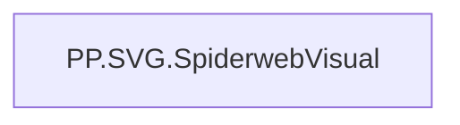

# PP.SVG.SpiderwebVisual

*тека `Personal_Profile\Паспорт\Spider`*

## Технічний опис

| Властивість | Значення |
|---|---|
| Тип | міра |
| Home table | _Measures |
| displayFolder | `Personal_Profile\Паспорт\Spider` |
| formatString | — |
| dataType | — |
| Прихована | ні |

### DAX

```dax
VAR _Indicator1 = [PP.Якість результату виконаних завдань]
VAR _Indicator2 = [PP.Виконання завдань у встановлені терміни]
VAR _Indicator3 = [PP.Ініціативність при виконанні завдань]
VAR _Indicator4 = [PP.Подолання перешкод при вирішенні проблем]
VAR _Indicator5 = [PP.Прийняття відповідальності за отриманий результат]
VAR _Indicator6 = [PP.Відповідність кількості виконаних завдань функціоналу]
VAR _Indicator7 = [PP.Націленість на отримання результату]
VAR _Indicator8 = [PP.Автономність при виконанні завдань]

VAR __boxSize   = 360
VAR __radius    = 100
VAR __offset    = 35
VAR __centerX   = __boxSize / 2
VAR __centerY   = __boxSize / 2

VAR __axisColor       = "#CCCCCC"
VAR __axisLabelColor  = "#333333"
VAR __polygonColor    = "#00A3E0"
VAR __polygonFill     = "rgba(0,163,224,0.25)"
VAR __fontFamily      = "Segoe UI"

VAR __valuesTable =
	UNION(
		ROW("IndicatorName", "Якість результату виконаних завдань",              "Value", _Indicator1, "MaxValue", 5, "@idx", 0),
		ROW("IndicatorName", "Виконання завдань у встановлені терміни",          "Value", _Indicator2, "MaxValue", 5, "@idx", 1),
		ROW("IndicatorName", "Ініціативність при виконанні завдань",             "Value", _Indicator3, "MaxValue", 5, "@idx", 2),
		ROW("IndicatorName", "Подолання перешкод при вирішенні проблем",         "Value", _Indicator4, "MaxValue", 5, "@idx", 3),
		ROW("IndicatorName", "Прийняття відповідальності за отриманий результат","Value", _Indicator5, "MaxValue", 5, "@idx", 4),
		ROW("IndicatorName", "Відповідність кількості виконаних завдань функціоналу", "Value", _Indicator6, "MaxValue", 5, "@idx", 5),
		ROW("IndicatorName", "Націленість на отримання результату",              "Value", _Indicator7, "MaxValue", 5, "@idx", 6),
		ROW("IndicatorName", "Автономність при виконанні завдань",               "Value", _Indicator8, "MaxValue", 5, "@idx", 7)
	)

VAR __count     = COUNTROWS(__valuesTable)
VAR __angleStep = 360.0 / __count

VAR __numCircles = 5
VAR __rings =
	CONCATENATEX(
		GENERATESERIES(1, __numCircles),
		VAR ringIndex = [Value]
		VAR r = (__radius / __numCircles) * ringIndex
		VAR ringPoints =
			CONCATENATEX(
				SELECTCOLUMNS(__valuesTable, "@idx", [@idx]),
				VAR __angDeg = [@idx] * __angleStep - 90
				VAR __angRad = RADIANS(__angDeg)
				VAR x = __centerX + r * COS(__angRad)
				VAR y = __centerY + r * SIN(__angRad)
				RETURN x & "," & y,
				" "
			)
		RETURN
			"<polygon points='" & ringPoints 
			& "' fill='none' stroke='" & __axisColor 
			& "' stroke-width='1' />",
		""
	)

VAR __axes =
	CONCATENATEX(
		SELECTCOLUMNS(__valuesTable, "@idx", [@idx]),
		VAR __angleDeg = [@idx] * __angleStep - 90
		VAR __angleRad = RADIANS(__angleDeg)
		VAR x2 = __centerX + __radius * COS(__angleRad)
		VAR y2 = __centerY + __radius * SIN(__angleRad)
		RETURN
			"<line x1='" & __centerX & "' y1='" & __centerY 
			& "' x2='" & x2 & "' y2='" & y2 
			& "' stroke='" & __axisColor & "' stroke-width='1' />",
		""
	)

VAR __polygonPoints =
	CONCATENATEX(
		SELECTCOLUMNS(__valuesTable, "@idx", [@idx], "@Val",[Value], "@Max",[MaxValue]),
		VAR __angleDeg = [@idx] * __angleStep - 90
		VAR __angleRad = RADIANS(__angleDeg)
		VAR ratio = DIVIDE([@Val], [@Max], 0)
		VAR rVal = ratio * __radius
		VAR px = __centerX + rVal * COS(__angleRad)
		VAR py = __centerY + rVal * SIN(__angleRad)
		RETURN px & "," & py,
		" "
	)
VAR __polygonSVG =
	"<polygon points='" & __polygonPoints 
	& "' fill='" & __polygonFill 
	& "' stroke='" & __polygonColor 
	& "' stroke-width='2' />"

VAR __dataPoints =
	CONCATENATEX(
		SELECTCOLUMNS(__valuesTable, "@idx",[@idx], "@Val",[Value], "@Max",[MaxValue]),
		VAR __angleDeg = [@idx] * __angleStep - 90
		VAR __angleRad = RADIANS(__angleDeg)
		VAR ratio = DIVIDE([@Val], [@Max], 0)
		VAR rVal = ratio * __radius
		VAR px = __centerX + rVal * COS(__angleRad)
		VAR py = __centerY + rVal * SIN(__angleRad)
		RETURN
			"<circle cx='" & px & "' cy='" & py & "' r='3' fill='" & __polygonColor & "' />",
		""
	)

VAR __labels =
	CONCATENATEX(
		SELECTCOLUMNS(__valuesTable, "@idx", [@idx], "@Ind", [IndicatorName], "@Val", [Value]),
		VAR __angleDeg = [@idx] * __angleStep - 90
		VAR __angleRad = RADIANS(__angleDeg)
		VAR baseLX = __centerX + (__radius + __offset) * COS(__angleRad)
		VAR baseLY = __centerY + (__radius + __offset) * SIN(__angleRad)

		VAR lx = baseLX
		VAR ly = baseLY

		VAR nameLine1 = SWITCH([@Ind],
			"Якість результату виконаних завдань", "Якість",
			"Виконання завдань у встановлені терміни", "Виконання",
			"Ініціативність при виконанні завдань", "Ініціативність",
			"Подолання перешкод при вирішенні проблем", "Подолання",
			"Прийняття відповідальності за отриманий результат", "Відповідальність",
			"Відповідність кількості виконаних завдань функціоналу", "Відповідність",
			"Націленість на отримання результату", "Націленість",
			"Автономність при виконанні завдань", "Автономність",
			[@Ind]
		)
		VAR nameLine2 = SWITCH([@Ind],
			"Якість результату виконаних завдань", "результату",
			"Виконання завдань у встановлені терміни", "в терміни",
			"Ініціативність при виконанні завдань", "",
			"Подолання перешкод при вирішенні проблем", "перешкод",
			"Прийняття відповідальності за отриманий результат", "",
			"Відповідність кількості виконаних завдань функціоналу", "функціоналу",
			"Націленість на отримання результату", "на результат",
			"Автономність при виконанні завдань", "",
			BLANK()
		)

		RETURN
			"<text x='" & lx & "' y='" & ly & "' fill='" & __axisLabelColor 
			& "' font-family='" & __fontFamily & "' text-anchor='middle' font-size='10'>"
				& "<tspan x='" & lx & "' dy='0em'>" & nameLine1 & "</tspan>" &
				IF(nameLine2 <> BLANK() && nameLine2 <> "",
					"<tspan x='" & lx & "' dy='1.2em'>" & nameLine2 & "</tspan>",
					""
				) &
				"<tspan x='" & lx & "' dy='1.2em'>" & FORMAT([@Val], "0.0") & "</tspan>" &
			"</text>",
		""
	)

VAR __svgContent =
	"<svg xmlns='http://www.w3.org/2000/svg' viewBox='0 0 " 
		& __boxSize & " " & __boxSize & "'>" &
		__rings &
		__axes &
		__polygonSVG &
		__dataPoints &
		__labels &
	"</svg>"

RETURN __svgContent
```

### Джерела даних

—

### Залежності (таблиці й колонки)

—

### Схема



---

## Бізнес-суть

!!! note "Бізнес-визначення відсутнє"
    Поля міри не зіставлено з wiki «Таблицями джерел даних». Можна заповнити вручну в `manualNotes`.

## На сторінках звіту

- [Personal Profile](../report/personal-profile.md) — Паспортна частина

## Пов'язані міри

**Використовує:** [PP.Ініціативність при виконанні завдань](../measures/pp-initsiatyvnist-pry-vykonanni-zavdan.md), [PP.Автономність при виконанні завдань](../measures/pp-avtonomnist-pry-vykonanni-zavdan.md), [PP.Виконання завдань у встановлені терміни](../measures/pp-vykonannia-zavdan-u-vstanovleni-terminy.md), [PP.Відповідність кількості виконаних завдань функціоналу](../measures/pp-vidpovidnist-kilkosti-vykonanykh-zavdan-funktsionalu.md), [PP.Націленість на отримання результату](../measures/pp-natsilenist-na-otrymannia-rezultatu.md), [PP.Подолання перешкод при вирішенні проблем](../measures/pp-podolannia-pereshkod-pry-vyrishenni-problem.md), [PP.Прийняття відповідальності за отриманий результат](../measures/pp-pryiniattia-vidpovidalnosti-za-otrymanyi-rezultat.md), [PP.Якість результату виконаних завдань](../measures/pp-iakist-rezultatu-vykonanykh-zavdan.md)

## Нотатки

_порожньо_
