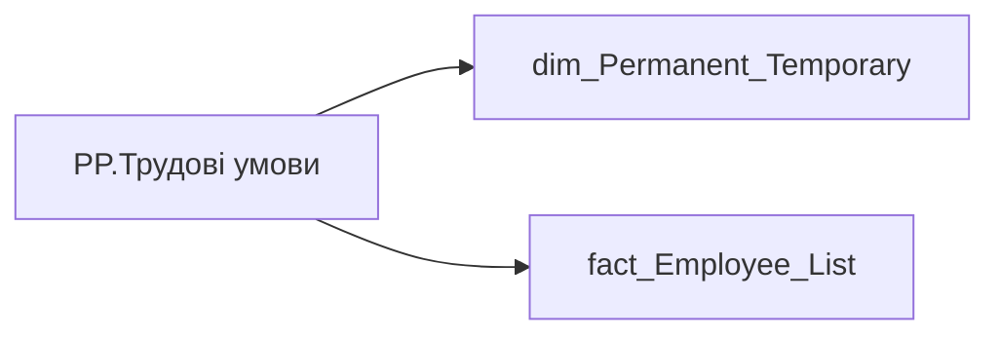

# PP.Трудові умови

| Властивість | Значення |
|---|---|
| Тип | міра |
| Home table | _Measures |
| displayFolder | `Personal_Profile\Загальна інформація` |
| formatString | — |
| dataType | — |
| Прихована | ні |

## DAX

```dax
VAR _fact_table_key= VALUES('fact_Employee_List'[PERMANENT_TEMPORARY_DETAILS_ID])
VAR _result = 
CALCULATE(
	SELECTEDVALUE('dim_Permanent_Temporary'[NAME]),
	TREATAS(_fact_table_key, 'dim_Permanent_Temporary'[PERMANENT_TEMPORARY_DETAILS_KEY])
)
RETURN _result
```

## Джерела

Вихідні таблиці: `DM.vw_R27_dim_Permanent_Temporary`

Колонки: `NAME`, `PERMANENT_TEMPORARY_DETAILS_ID`, `PERMANENT_TEMPORARY_DETAILS_KEY`

Power Query: `dim_Permanent_Temporary`

## Бізнес-суть

NAME → Назва кадрового підрозділу; NAME → Назва батьківського кадрового підрозділу; NAME → Організація, назва; NAME → Групи віку; NAME → division_person_name

Назву тягти із таблиці dwh.dim_divisions по ключу division_person_id=id Поле зберігається в довіднику DM.vw_R27_dim_Group_Age

**Вимоги:** `Допоміжні-вітрини-для-звіту/Вью-по-ієрархії-кадрових-підрозділів`, `Допоміжні-вітрини-для-звіту/Таблиця-для-розрахунку-агрегованих-метрик-по-звіту`, `Командний-профіль/Сторінка-Загальна-інформація-про-команду/Редизайн-сторінки-Загальна-інформація`, `Командний-профіль/Сторінка-Плинність-та-Exits/Плинність-(вітрина)`, `Командний-профіль/Сторінка-Плинність-та-Exits/Плинність-(вітрина)/Додаткові-вимоги-до-вітрини-Плинність`

## Залежності

Таблиці: `dim_Permanent_Temporary`, `fact_Employee_List`

Колонки: `dim_Permanent_Temporary[NAME]`, `dim_Permanent_Temporary[PERMANENT_TEMPORARY_DETAILS_KEY]`, `fact_Employee_List[PERMANENT_TEMPORARY_DETAILS_ID]`

## Схема



## Нотатки

_порожньо_
