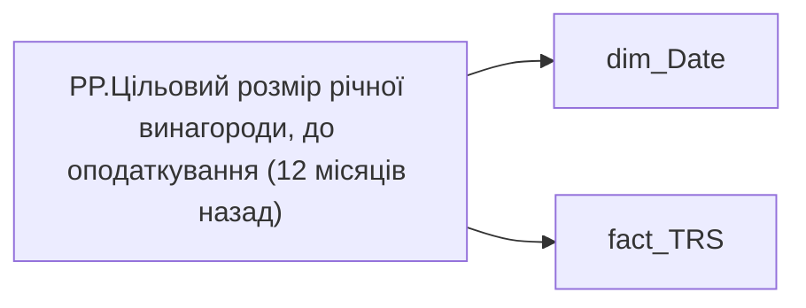

# PP.Цільовий розмір річної винагороди, до оподаткування (12 місяців назад)

*тека `Personal_Profile\TRS`*

## Бізнес-суть

bonus_month_salary_cnt → Премія місячна кіл-ть окладів; bonus_month_salary_cnt → Щомісячна премія; bonus_month_salary_cnt → Доля команди з щомісячною премією, %; bonus_month_salary_cnt → Місячна премія; bonus_quarter_salary_cnt → Премія квартальна кіл-ть окладів; bonus_quarter_salary_cnt → Квартальна премія; bonus_quarter_salary_cnt → Доля команди з квартальню премією, %; bonus_year_salary_cnt → Премія річна кіл-ть окладів; bonus_year_salary_cnt → Річний бонус; bonus_year_salary_cnt → Доля команди з річним бонусом, %; payments_plan_UAH → Розмір фіксованої винагороди плановий, за місяць СТАНОМ НА РІК НАЗАД; payments_plan_UAH → Сума (рік тому); payments_plan_UAH → Оклад по годинам (рік тому); payments_plan_UAH → % зміни фіксованої винагороди

Станом на дату події <br>Це поле має бути доступне у візуалізаціях, побудованих на основі фактової таблиці [DM.vw_R27_fact_Employee_List_PDP]  <br>Відібрати записи по працівнику по працівнику [person_key], періоду [Period], організації [organization_key], підрозділу [division_key], посаді [position_key]<br>BONUS_MONTH_SALARY_CNT  - кількість окладів  <br>Розмір премії = Min_Tariff_Rate помножити на BONUS_MONTH_SALARY_CNT - сума (к-сть окладів*оклад)  <br>Якщо по працівнику записи відсутні, то показати прочерк "-" <br>Відбір робити за період станом на 12 міс. тому  <br>BONUS_MONTH_SALARY_CNT  -

**Вимоги:** `Індивідуальний-профіль-працівника/Історія-по-посадам`, `Індивідуальний-профіль-працівника/Історія-по-посадам/Реліз-1.-Історія-по-посадам`, `Індивідуальний-профіль-працівника/Сторінка-Винагорода-працівника`, `Індивідуальний-профіль-працівника/Сторінка-Винагорода-працівника/Деталізація-на-сторінці-Винагорода`, `Індивідуальний-профіль-працівника/Сторінка-Винагорода-працівника/Доопрацювання-сторінки-ТРС`, `Командний-профіль/Сторінка-TRS-команди`, `Командний-профіль/Сторінка-TRS-команди/Сторінка-Винагорода-групового-профілю#вимоги-до-звіту`, `Командний-профіль/Сторінка-Моя-команда/ТЗ.-Деталізація-метрик-групового-профілю-звіту`

## На сторінках звіту

_Не використовується на основних сторінках звіту._

## Пов'язані міри

**Використовується в:** [GP.Виконання плану ФОП YTD (%)](../measures/gp-vykonannia-planu-fop-ytd.md), [GP.Середнє зростання цільової річної винагороди, до оподаткування](../measures/gp-serednie-zrostannia-tsilovoi-richnoi-vynahorody-do-opodatkuvannia.md), [PP.Зростання цільової річної винагороди, до оподаткування (за останні 12 міс.)](../measures/pp-zrostannia-tsilovoi-richnoi-vynahorody-do-opodatkuvannia-za-ostanni-12-mis.md)

---

## Технічний опис

| Властивість | Значення |
|---|---|
| Тип | міра |
| Home table | _Measures |
| displayFolder | `Personal_Profile\TRS` |
| formatString | — |
| dataType | — |
| Прихована | ні |

### DAX

```dax
VAR _CurrMonthStart =  DATE ( YEAR ( TODAY() ), MONTH ( TODAY() ), 1 )
VAR _PrevYearSameMonthStart =  EDATE ( _CurrMonthStart, -12 )
VAR _Fixed =
	CALCULATE (
		SUMX(
			'fact_TRS',
			'fact_TRS'[payments_plan_UAH]
		),
		'fact_TRS'[CATEGORY_OF_ACCRUAL_SORT] = 1,
		'fact_TRS'[wage_rate_type] <> "СДЕЛЬНАЯ",
		TREATAS ( { _PrevYearSameMonthStart }, 'dim_Date'[Date] )
	)
VAR _Variable =
	CALCULATE (
		AVERAGEX(
			'fact_TRS',
			('fact_TRS'[bonus_month_salary_cnt] * 12 + 'fact_TRS'[bonus_quarter_salary_cnt] * 4 + 'fact_TRS'[bonus_year_salary_cnt])  * 'fact_TRS'[wage_rate]
		),
		TREATAS ( { _PrevYearSameMonthStart }, 'dim_Date'[Date] )
	)
RETURN _Fixed * 12 + _Variable
```

### Джерела даних

Вихідні таблиці: `DM.vw_R27_fact_TRS_PDP`

Колонки: `CATEGORY_OF_ACCRUAL_SORT`, `Date`, `bonus_month_salary_cnt`, `bonus_quarter_salary_cnt`, `bonus_year_salary_cnt`, `payments_plan_UAH`, `wage_rate`, `wage_rate_type`

Power Query: `dim_Date`

### Залежності (таблиці й колонки)

Таблиці: `dim_Date`, `fact_TRS`

Колонки: `dim_Date[Date]`, `fact_TRS[CATEGORY_OF_ACCRUAL_SORT]`, `fact_TRS[bonus_month_salary_cnt]`, `fact_TRS[bonus_quarter_salary_cnt]`, `fact_TRS[bonus_year_salary_cnt]`, `fact_TRS[payments_plan_UAH]`, `fact_TRS[wage_rate]`, `fact_TRS[wage_rate_type]`

### Схема



## Нотатки

_порожньо_
