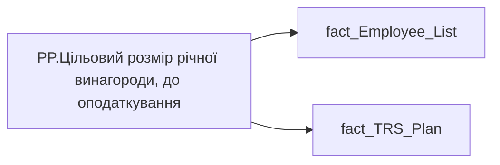

# PP.Цільовий розмір річної винагороди, до оподаткування

*тека `Personal_Profile\TRS` · формат `#,0.00 "грн."; -#,0.00 "грн."`*

## Технічний опис

| Властивість | Значення |
|---|---|
| Тип | міра |
| Home table | _Measures |
| displayFolder | `Personal_Profile\TRS` |
| formatString | `#,0.00 "грн."; -#,0.00 "грн."` |
| dataType | — |
| Прихована | ні |

### DAX

```dax
VAR _Fixed =
	CALCULATE (
		SUMX (
			fact_TRS_Plan,
			IF (
				fact_TRS_Plan[CALC_TYPE_CODE] = "UAH",
				fact_TRS_Plan[INIT_PAYMENT_PLAN_SUM],
				fact_TRS_Plan[PAYMENT_PLAN_SUM]
			)
		),
		fact_TRS_Plan[IS_ACTUAL] = TRUE (),
		fact_TRS_Plan[category_name] = "Фіксована винагорода",
		fact_TRS_Plan[TARIFF_RATE_TYPE_CODE] <> "СДЕЛЬНАЯ",
		fact_TRS_Plan[END_DATE] > TODAY () 	|| fact_TRS_Plan[END_DATE] = DATE (2001, 1, 1)
	)

VAR _Variable = 
	SUMX(
		'fact_Employee_List',
		'fact_Employee_List'[MIN_TARIFF_RATE] * 'fact_Employee_List'[BONUS_MONTH_SALARY_CNT] * 12
		+
		'fact_Employee_List'[MIN_TARIFF_RATE] * 'fact_Employee_List'[BONUS_QUARTER_SALARY_CNT] * 4
		+
		'fact_Employee_List'[MIN_TARIFF_RATE] * 'fact_Employee_List'[BONUS_YEAR_SALARY_CNT])

// VAR _Variable =
//     CALCULATE (
//         SUM ( fact_TRS_Plan[BONES_SIZE] ),
//         fact_TRS_Plan[IS_ACTUAL] = TRUE (),
//         fact_TRS_Plan[CALC_TYPE_CODE] = "UAH",
//         fact_TRS_Plan[category_name] = "Фіксована винагорода"
//     )
RETURN
	_Fixed * 12 + _Variable
```

### Джерела даних

Вихідні таблиці: `DM.vw_R27_fact_TRS_Plan_PDP`

Колонки: `BONES_SIZE`, `BONUS_MONTH_SALARY_CNT`, `BONUS_QUARTER_SALARY_CNT`, `BONUS_YEAR_SALARY_CNT`, `CALC_TYPE_CODE`, `END_DATE`, `INIT_PAYMENT_PLAN_SUM`, `IS_ACTUAL`, `MIN_TARIFF_RATE`, `PAYMENT_PLAN_SUM`, `TARIFF_RATE_TYPE_CODE`, `category_name`

Power Query: `fact_Employee_List`

### Залежності (таблиці й колонки)

Таблиці: `fact_Employee_List`, `fact_TRS_Plan`

Колонки: `fact_Employee_List[BONUS_MONTH_SALARY_CNT]`, `fact_Employee_List[BONUS_QUARTER_SALARY_CNT]`, `fact_Employee_List[BONUS_YEAR_SALARY_CNT]`, `fact_Employee_List[MIN_TARIFF_RATE]`, `fact_TRS_Plan[BONES_SIZE]`, `fact_TRS_Plan[CALC_TYPE_CODE]`, `fact_TRS_Plan[END_DATE]`, `fact_TRS_Plan[INIT_PAYMENT_PLAN_SUM]`, `fact_TRS_Plan[IS_ACTUAL]`, `fact_TRS_Plan[PAYMENT_PLAN_SUM]`, `fact_TRS_Plan[TARIFF_RATE_TYPE_CODE]`, `fact_TRS_Plan[category_name]`

### Схема



---

## Бізнес-суть

BONUS_MONTH_SALARY_CNT → Премія місячна кіл-ть окладів; BONUS_MONTH_SALARY_CNT → Щомісячна премія; BONUS_MONTH_SALARY_CNT → Доля команди з щомісячною премією, %; BONUS_MONTH_SALARY_CNT → Місячна премія; BONUS_QUARTER_SALARY_CNT → Премія квартальна кіл-ть окладів; BONUS_QUARTER_SALARY_CNT → Квартальна премія; BONUS_QUARTER_SALARY_CNT → Доля команди з квартальню премією, %; BONUS_YEAR_SALARY_CNT → Премія річна кіл-ть окладів; BONUS_YEAR_SALARY_CNT → Річний бонус; BONUS_YEAR_SALARY_CNT → Доля команди з річним бонусом, %; MIN_TARIFF_RATE → Оклад; MIN_TARIFF_RATE → Позиція в окладній вилці; MIN_TARIFF_RATE → Зарплата (вилки); MIN_TARIFF_RATE → Розподіл за вилкою зарплат; MIN_TARIFF_RATE → Положення у вилці; BONES_SIZE → Середній розмір щомісячної премії; BONES_SIZE → Середній розмір квартальної премії; BONES_SIZE → Середній розмір річного бонусу; END_DATE → Термін без відпустки в днях по пріоритетному місцю роботи на поточну дату; INIT_PAYMENT_PLAN_SUM → Цільовий розмір річної винагороди, до оподаткування; INIT_PAYMENT_PLAN_SUM → Оклад по годинах; INIT_PAYMENT_PLAN_SUM → Оклад по днях; INIT_PAYMENT_PLAN_SUM → Премія за місяць, %; INIT_PAYMENT_PLAN_SUM → Доплата за шкідливі умови праці, %; INIT_PAYMENT_PLAN_SUM → Роз'їзний характер роботи, %; INIT_PAYMENT_PLAN_SUM → Оренда житла; INIT_PAYMENT_PLAN_SUM → Середній цільовий розмір річної винагороди, до оподаткування; INIT_PAYMENT_PLAN_SUM → Середня зарплата (оклад); INIT_PAYMENT_PLAN_SUM → Доля команди з премією за місяць, %; INIT_PAYMENT_PLAN_SUM → Доля команди з доплатою за шкідливі умови праці, %; INIT_PAYMENT_PLAN_SUM → Доля команди з доплатою за роз’їзний характер роботи, %; INIT_PAYMENT_PLAN_SUM → Середній розмір доплати за шкідливі умови праці; INIT_PAYMENT_PLAN_SUM → Середній розмір доплати за роз’їзний характер роботи; INIT_PAYMENT_PLAN_SUM → Середні витрати на оренду житла; INIT_PAYMENT_PLAN_SUM → Річний цільовий дохід (РЦД); INIT_PAYMENT_PLAN_SUM → Оклад; PAYMENT_PLAN_SUM → Річний цільовий дохід; PAYMENT_PLAN_SUM → Розмір фіксованої винагороди плановий, за місяць ПОТОЧНИЙ; PAYMENT_PLAN_SUM → Сума (на поточний момент); PAYMENT_PLAN_SUM → Середній розмір премії за місяць; PAYMENT_PLAN_SUM → Доля учасників із зміною фіксованої винагороди; PAYMENT_PLAN_SUM → Діапазон фіксованої винагороди (план); TARIFF_RATE_TYPE_CODE → Вид оплати праці (тарифної ставки); TARIFF_RATE_TYPE_CODE → Вид Тарифної Ставки; category_name → Назва блоку

Станом на дату події <br>Це поле має бути доступне у візуалізаціях, побудованих на основі фактової таблиці [DM.vw_R27_fact_Employee_List_PDP]  <br>Відібрати записи по працівнику по працівнику [person_key], періоду [Period], організації [organization_key], підрозділу [division_key], посаді [position_key]<br>BONUS_MONTH_SALARY_CNT  - кількість окладів  <br>Розмір премії = Min_Tariff_Rate помножити на BONUS_MONTH_SALARY_CNT - сума (к-сть окладів*оклад)  <br>Якщо по працівнику записи відсутні, то показати прочерк "-" <br>Відбір робити за період станом на 12 міс. тому  <br>BONUS_MONTH_SALARY_CNT  -

**Вимоги:** `Індивідуальний-профіль-працівника/Історія-по-посадам`, `Індивідуальний-профіль-працівника/Історія-по-посадам/Реліз-1.-Історія-по-посадам`, `Індивідуальний-профіль-працівника/Сторінка-Винагорода-працівника`, `Індивідуальний-профіль-працівника/Сторінка-Винагорода-працівника/Деталізація-на-сторінці-Винагорода`, `Індивідуальний-профіль-працівника/Сторінка-Винагорода-працівника/Доопрацювання-сторінки-ТРС`, `Індивідуальний-профіль-працівника/Сторінка-Винагорода-працівника/РВІ.-Зміна-алгоритму-розрахунку-Річного-цільового-доходу`, `Індивідуальний-профіль-працівника/Сторінка-Результативність-та-оцінка/Блок-Оцінка-компетенцій`, `Допоміжні-вітрини-для-звіту/Таблиця-для-розрахунку-агрегованих-метрик-по-звіту`, `Командний-профіль/Сторінка-TRS-команди`, `Командний-профіль/Сторінка-TRS-команди/Доопрацювання-сторінки-TRS`, `Командний-профіль/Сторінка-TRS-команди/Сторінка-Винагорода-групового-профілю#вимоги-до-звіту`, `Командний-профіль/Сторінка-Моя-команда/ТЗ.-Деталізація-метрик-групового-профілю-звіту`, `Командний-профіль/Сторінка-Результативність-та-оцінка-команди/Блок-Оцінка-компетенцій-(груповий-профіль)`

## На сторінках звіту

[Personal Profile](../report/personal-profile.md)

## Пов'язані міри

**Використовується в:** [GP.Виконання плану ФОП YTD (%)](../measures/gp-vykonannia-planu-fop-ytd.md), [GP.Середнє зростання цільової річної винагороди, до оподаткування](../measures/gp-serednie-zrostannia-tsilovoi-richnoi-vynahorody-do-opodatkuvannia.md), [PP.Зростання цільової річної винагороди, до оподаткування (за останні 12 міс.)](../measures/pp-zrostannia-tsilovoi-richnoi-vynahorody-do-opodatkuvannia-za-ostanni-12-mis.md)

## Нотатки

_порожньо_
