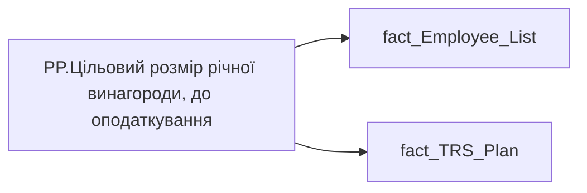

# PP.Цільовий розмір річної винагороди, до оподаткування

*тека `Personal_Profile\TRS` · формат `#,0.00 "грн."; -#,0.00 "грн."`*

## Технічний опис

| Властивість | Значення |
|---|---|
| Тип | міра |
| Home table | _Measures |
| displayFolder | `Personal_Profile\TRS` |
| formatString | `#,0.00 "грн."; -#,0.00 "грн."` |
| dataType | — |
| Прихована | ні |

### DAX

```dax
VAR _Fixed =
	CALCULATE (
		SUMX (
			fact_TRS_Plan,
			IF (
				fact_TRS_Plan[CALC_TYPE_CODE] = "UAH",
				fact_TRS_Plan[INIT_PAYMENT_PLAN_SUM],
				fact_TRS_Plan[PAYMENT_PLAN_SUM]
			)
		),
		fact_TRS_Plan[IS_ACTUAL] = TRUE (),
		fact_TRS_Plan[category_name] = "Фіксована винагорода",
		fact_TRS_Plan[TARIFF_RATE_TYPE_CODE] <> "СДЕЛЬНАЯ",
		fact_TRS_Plan[END_DATE] > TODAY () 	|| fact_TRS_Plan[END_DATE] = DATE (2001, 1, 1)
	)

VAR _Variable = 
	SUMX(
		'fact_Employee_List',
		'fact_Employee_List'[MIN_TARIFF_RATE] * 'fact_Employee_List'[BONUS_MONTH_SALARY_CNT] * 12
		+
		'fact_Employee_List'[MIN_TARIFF_RATE] * 'fact_Employee_List'[BONUS_QUARTER_SALARY_CNT] * 4
		+
		'fact_Employee_List'[MIN_TARIFF_RATE] * 'fact_Employee_List'[BONUS_YEAR_SALARY_CNT])

// VAR _Variable =
//     CALCULATE (
//         SUM ( fact_TRS_Plan[BONES_SIZE] ),
//         fact_TRS_Plan[IS_ACTUAL] = TRUE (),
//         fact_TRS_Plan[CALC_TYPE_CODE] = "UAH",
//         fact_TRS_Plan[category_name] = "Фіксована винагорода"
//     )
RETURN
	_Fixed * 12 + _Variable
```

### Джерела даних

Вихідні таблиці: `DM.vw_R27_fact_TRS_Plan_PDP`

Колонки: `BONES_SIZE`, `BONUS_MONTH_SALARY_CNT`, `BONUS_QUARTER_SALARY_CNT`, `BONUS_YEAR_SALARY_CNT`, `CALC_TYPE_CODE`, `END_DATE`, `INIT_PAYMENT_PLAN_SUM`, `IS_ACTUAL`, `MIN_TARIFF_RATE`, `PAYMENT_PLAN_SUM`, `TARIFF_RATE_TYPE_CODE`, `category_name`

Power Query: `fact_Employee_List`

### Залежності (таблиці й колонки)

Таблиці: `fact_Employee_List`, `fact_TRS_Plan`

Колонки: `fact_Employee_List[BONUS_MONTH_SALARY_CNT]`, `fact_Employee_List[BONUS_QUARTER_SALARY_CNT]`, `fact_Employee_List[BONUS_YEAR_SALARY_CNT]`, `fact_Employee_List[MIN_TARIFF_RATE]`, `fact_TRS_Plan[BONES_SIZE]`, `fact_TRS_Plan[CALC_TYPE_CODE]`, `fact_TRS_Plan[END_DATE]`, `fact_TRS_Plan[INIT_PAYMENT_PLAN_SUM]`, `fact_TRS_Plan[IS_ACTUAL]`, `fact_TRS_Plan[PAYMENT_PLAN_SUM]`, `fact_TRS_Plan[TARIFF_RATE_TYPE_CODE]`, `fact_TRS_Plan[category_name]`

### Схема



---

## Бізнес-суть

**Бізнес-назва:** Цільовий розмір річної винагороди, до оподаткування

### Опис із ТЗ

Це сума по блокам Фіксована винагорода, всього х 12, Змінна винагорода (Щомісячна премія+ Квартальна премія+ Річний бонус) приведена до річної суми.   - **Фіксована винагорода** = Відібрати записи по працівнику `person_key`, періоду `Period`, організації `organization_key`, підрозділу `division_key`, де `category_name` = Фіксована винагорода, `IS_ACTUAL`  = "1",  `TARIFF_RATE_TYPE_CODE` <> "СДЕЛЬНАЯ", `END_DATE` > поточна дата, або `END_DATE` = "01.01.2001".   Значення брати з `INIT_PAYMENT_PLAN_SUM`, якщо `CALC_TYPE_CODE` = "UAH", інакше - `PAYMENT_PLAN_SUM`.    - **Змінна винагорода**(визначається по атрибутах із таблиці DM.`vw_R27_fact_Employee_List_PDP`) = Сума Розмірів премій місячних, квартальних і річних **Розмір місячної премії** = `Min_Tariff_Rate` х `BONUS_MONTH_SALARY_CNT` х 12 - сума (к-сть окладівхОкладх12)   Якщо по працівнику записи відсутні, то показати 0,00 грн.  **Розмір квартальної премії** = `Min_Tariff_Rate` х `BONUS_QUARTER_SALARY_CNT` х 4 - сума (к-сть окладівхОкладх4)   Якщо по працівнику записи відсутні, то показати 0,00 грн.  **Розмір річної премії** = `Min_Tariff_Rate` х `BONUS_YEAR_SALARY_CNT` - сума (к-сть окладівхОклад)   Якщо по працівнику записи відсутні, то показати 0,00 грн.

Це сума по блокам Фіксована винагорода, всього х 12, Змінна винагорода (Щомісячна премія+ Квартальна премія+ Річний бонус)    - **Фіксована винагорода** = Відібрати записи по працівнику `person_key`, періоду `Period`, організації `organization_key`, підрозділу `division_key`, де `category_name` = Фіксована винагорода, `IS_ACTUAL`  = "1",  `TARIFF_RATE_TYPE_CODE` <> "СДЕЛЬНАЯ", `END_DATE` > поточна дата, або `END_DATE` = "01.01.2001".   Значення брати з `INIT_PAYMENT_PLAN_SUM`, якщо `CALC_TYPE_CODE` = "UAH", інакше - `PAYMENT_PLAN_SUM`.    - **Змінна винагорода**(визначається по атрибутах із таблиці DM.`vw_R27_fact_Employee_List_PDP`) = Сума Розмірів премій місячних, квартальних і річних **Розмір премії** = `Min_Tariff_Rate` помножити на `BONUS_MONTH_SALARY_CNT` - сума (к-сть окладів*оклад)   Якщо по працівнику записи відсутні, то показати 0,00 грн.  **Розмір премії** = `Min_Tariff_Rate` помножити на `BONUS_QUARTER_SALARY_CNT` - сума (к-сть окладів*оклад)   Якщо по працівнику записи відсутні, то показати 0,00 грн.  **Розмір премії** = `Min_Tariff_Rate` помножити на `BONUS_YEAR_SALARY_CNT` - сума (к-сть окладів*оклад)   Якщо по працівнику записи відсутні, то показати 0,00 грн.  В деталізацію потрібно вивести розбивку по кожному виду планових нарахувань - див. таблицю ФОП деталізація

**Вимоги (ТЗ):**

- [Індивідуальний профіль працівника › Сторінка Винагорода працівника](https://dev.azure.com/MHPITDepProjects/People%20Digital%20Profile%20%28PDP%29/_wiki/wikis/PDP.wiki?pagePath=/%D0%A4%D1%83%D0%BD%D0%BA%D1%86%D1%96%D0%BE%D0%BD%D0%B0%D0%BB%D1%8C%D0%BD%D1%96%20%D0%B2%D0%B8%D0%BC%D0%BE%D0%B3%D0%B8/%D0%92%D0%B8%D0%BC%D0%BE%D0%B3%D0%B8%20%D0%B4%D0%BE%20%D0%B7%D0%B2%D1%96%D1%82%D1%83%20People%20Digital%20Profile/%D0%86%D0%BD%D0%B4%D0%B8%D0%B2%D1%96%D0%B4%D1%83%D0%B0%D0%BB%D1%8C%D0%BD%D0%B8%D0%B9%20%D0%BF%D1%80%D0%BE%D1%84%D1%96%D0%BB%D1%8C%20%D0%BF%D1%80%D0%B0%D1%86%D1%96%D0%B2%D0%BD%D0%B8%D0%BA%D0%B0/%D0%A1%D1%82%D0%BE%D1%80%D1%96%D0%BD%D0%BA%D0%B0%20%D0%92%D0%B8%D0%BD%D0%B0%D0%B3%D0%BE%D1%80%D0%BE%D0%B4%D0%B0%20%D0%BF%D1%80%D0%B0%D1%86%D1%96%D0%B2%D0%BD%D0%B8%D0%BA%D0%B0)
- [Індивідуальний профіль працівника › Сторінка Винагорода працівника › РВІ. Зміна алгоритму розрахунку Річного цільового доходу](https://dev.azure.com/MHPITDepProjects/People%20Digital%20Profile%20%28PDP%29/_wiki/wikis/PDP.wiki?pagePath=/%D0%A4%D1%83%D0%BD%D0%BA%D1%86%D1%96%D0%BE%D0%BD%D0%B0%D0%BB%D1%8C%D0%BD%D1%96%20%D0%B2%D0%B8%D0%BC%D0%BE%D0%B3%D0%B8/%D0%92%D0%B8%D0%BC%D0%BE%D0%B3%D0%B8%20%D0%B4%D0%BE%20%D0%B7%D0%B2%D1%96%D1%82%D1%83%20People%20Digital%20Profile/%D0%86%D0%BD%D0%B4%D0%B8%D0%B2%D1%96%D0%B4%D1%83%D0%B0%D0%BB%D1%8C%D0%BD%D0%B8%D0%B9%20%D0%BF%D1%80%D0%BE%D1%84%D1%96%D0%BB%D1%8C%20%D0%BF%D1%80%D0%B0%D1%86%D1%96%D0%B2%D0%BD%D0%B8%D0%BA%D0%B0/%D0%A1%D1%82%D0%BE%D1%80%D1%96%D0%BD%D0%BA%D0%B0%20%D0%92%D0%B8%D0%BD%D0%B0%D0%B3%D0%BE%D1%80%D0%BE%D0%B4%D0%B0%20%D0%BF%D1%80%D0%B0%D1%86%D1%96%D0%B2%D0%BD%D0%B8%D0%BA%D0%B0/%D0%A0%D0%92%D0%86.%20%D0%97%D0%BC%D1%96%D0%BD%D0%B0%20%D0%B0%D0%BB%D0%B3%D0%BE%D1%80%D0%B8%D1%82%D0%BC%D1%83%20%D1%80%D0%BE%D0%B7%D1%80%D0%B0%D1%85%D1%83%D0%BD%D0%BA%D1%83%20%D0%A0%D1%96%D1%87%D0%BD%D0%BE%D0%B3%D0%BE%20%D1%86%D1%96%D0%BB%D1%8C%D0%BE%D0%B2%D0%BE%D0%B3%D0%BE%20%D0%B4%D0%BE%D1%85%D0%BE%D0%B4%D1%83)

## На сторінках звіту

- [Personal Profile](../report/personal-profile.md) — Винагорода

## Пов'язані міри

**Використовується в:** [GP.Виконання плану ФОП YTD (%)](../measures/gp-vykonannia-planu-fop-ytd.md), [GP.Середнє зростання цільової річної винагороди, до оподаткування](../measures/gp-serednie-zrostannia-tsilovoi-richnoi-vynahorody-do-opodatkuvannia.md), [PP.Зростання цільової річної винагороди, до оподаткування (за останні 12 міс.)](../measures/pp-zrostannia-tsilovoi-richnoi-vynahorody-do-opodatkuvannia-za-ostanni-12-mis.md)

## Нотатки

_порожньо_
