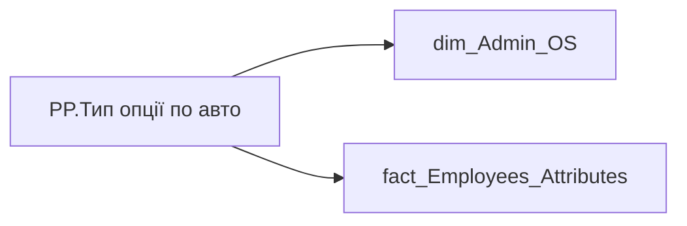

# PP.Тип опції по авто

*тека `Personal_Profile\TRS`*

!!! abstract "Джерела даних"
    `DM.vw_R27_dim_Employee_Access_List`, `DM.vw_R27_fact_Employees_Attributes`

## Бізнес-суть

JOB_TITLE_COMPOSITE_VEHICLE_FORMAT → Тип опції по авто по зведеній посаді; JOB_TITLE_COMPOSITE_VEHICLE_FORMAT → Тип опції по авто по зведеній посаді (план); JOB_TITLE_COMPOSITE_VEHICLE_FORMAT → Опція по авто план

Якщо по посаді працівника відсутня зведена посада або по зведеній посаді не прописано формат авто, то проставити лейбл "Дані відсутні"

**Вимоги:** `Індивідуальний-профіль-працівника/Сторінка-Винагорода-працівника`, `Індивідуальний-профіль-працівника/Сторінка-Винагорода-працівника/Доопрацювання-сторінки-ТРС`, `Командний-профіль/Сторінка-TRS-команди/Доопрацювання-сторінки-TRS`, `Командний-профіль/Сторінка-Моя-команда/ТЗ.-Деталізація-метрик-групового-профілю-звіту`

## На сторінках звіту

[Personal Profile](../report/personal-profile.md)

## Пов'язані міри

_Прямих зв'язків з іншими мірами немає._

---

## Технічний опис

| Властивість | Значення |
|---|---|
| Тип | міра |
| Home table | _Measures |
| displayFolder | `Personal_Profile\TRS` |
| formatString | — |
| dataType | — |
| Прихована | ні |

### DAX

```dax
VAR _employee_id = VALUES('dim_Admin_OS'[EMPLOYEE_ID])
VAR _result = 
CALCULATE(
    SELECTEDVALUE('fact_Employees_Attributes'[JOB_TITLE_COMPOSITE_VEHICLE_FORMAT]),
    ALL('dim_Admin_OS'[USER_ACCESS_ID]),
    TREATAS(_employee_id, 'fact_Employees_Attributes'[EMPLOYEE_ID])
)
RETURN 
    IF(
        ISBLANK(_result) || _result = "Не передбачено",
        "Не передбачено",
        _result
    )
```

### Джерела даних

Вихідні таблиці: `DM.vw_R27_dim_Employee_Access_List`, `DM.vw_R27_fact_Employees_Attributes`

Колонки: `EMPLOYEE_ID`, `JOB_TITLE_COMPOSITE_VEHICLE_FORMAT`, `USER_ACCESS_ID`

Power Query: `dim_Admin_OS`

### Залежності (таблиці й колонки)

Таблиці: `dim_Admin_OS`, `fact_Employees_Attributes`

Колонки: `dim_Admin_OS[EMPLOYEE_ID]`, `dim_Admin_OS[USER_ACCESS_ID]`, `fact_Employees_Attributes[EMPLOYEE_ID]`, `fact_Employees_Attributes[JOB_TITLE_COMPOSITE_VEHICLE_FORMAT]`

### Схема



## Нотатки

_порожньо_
