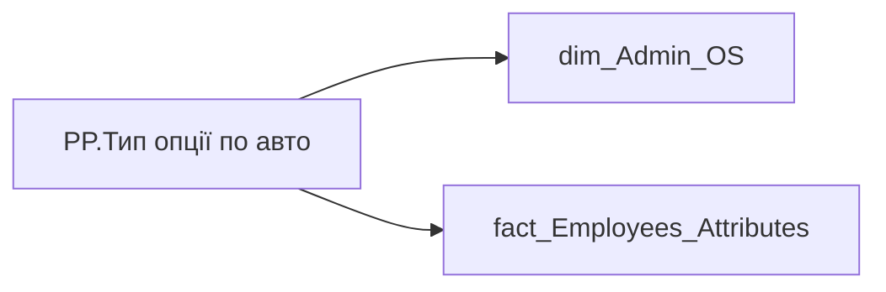

# PP.Тип опції по авто

*тека `Personal_Profile\TRS`*

## Технічний опис

| Властивість | Значення |
|---|---|
| Тип | міра |
| Home table | _Measures |
| displayFolder | `Personal_Profile\TRS` |
| formatString | — |
| dataType | — |
| Прихована | ні |

### DAX

```dax
VAR _employee_id = VALUES('dim_Admin_OS'[EMPLOYEE_ID])
VAR _result = 
CALCULATE(
    SELECTEDVALUE('fact_Employees_Attributes'[JOB_TITLE_COMPOSITE_VEHICLE_FORMAT]),
    ALL('dim_Admin_OS'[USER_ACCESS_ID]),
    TREATAS(_employee_id, 'fact_Employees_Attributes'[EMPLOYEE_ID])
)
RETURN 
    IF(
        ISBLANK(_result) || _result = "Не передбачено",
        "Не передбачено",
        _result
    )
```

### Джерела даних

Вихідні таблиці: `DM.vw_R27_dim_Employee_Access_List`, `DM.vw_R27_fact_Employees_Attributes`

Колонки: `EMPLOYEE_ID`, `JOB_TITLE_COMPOSITE_VEHICLE_FORMAT`, `USER_ACCESS_ID`

Power Query: `dim_Admin_OS`

### Залежності (таблиці й колонки)

Таблиці: `dim_Admin_OS`, `fact_Employees_Attributes`

Колонки: `dim_Admin_OS[EMPLOYEE_ID]`, `dim_Admin_OS[USER_ACCESS_ID]`, `fact_Employees_Attributes[EMPLOYEE_ID]`, `fact_Employees_Attributes[JOB_TITLE_COMPOSITE_VEHICLE_FORMAT]`

### Схема



---

## Бізнес-суть

**Бізнес-назва:** Тип опції по авто

### Опис із ТЗ

В звіті будуть dummy дані, поки не побудовані відповідні вітрини, які є джерелом даних

**Вимоги (ТЗ):**

- [Індивідуальний профіль працівника › Сторінка Винагорода працівника](https://dev.azure.com/MHPITDepProjects/People%20Digital%20Profile%20%28PDP%29/_wiki/wikis/PDP.wiki?pagePath=/%D0%A4%D1%83%D0%BD%D0%BA%D1%86%D1%96%D0%BE%D0%BD%D0%B0%D0%BB%D1%8C%D0%BD%D1%96%20%D0%B2%D0%B8%D0%BC%D0%BE%D0%B3%D0%B8/%D0%92%D0%B8%D0%BC%D0%BE%D0%B3%D0%B8%20%D0%B4%D0%BE%20%D0%B7%D0%B2%D1%96%D1%82%D1%83%20People%20Digital%20Profile/%D0%86%D0%BD%D0%B4%D0%B8%D0%B2%D1%96%D0%B4%D1%83%D0%B0%D0%BB%D1%8C%D0%BD%D0%B8%D0%B9%20%D0%BF%D1%80%D0%BE%D1%84%D1%96%D0%BB%D1%8C%20%D0%BF%D1%80%D0%B0%D1%86%D1%96%D0%B2%D0%BD%D0%B8%D0%BA%D0%B0/%D0%A1%D1%82%D0%BE%D1%80%D1%96%D0%BD%D0%BA%D0%B0%20%D0%92%D0%B8%D0%BD%D0%B0%D0%B3%D0%BE%D1%80%D0%BE%D0%B4%D0%B0%20%D0%BF%D1%80%D0%B0%D1%86%D1%96%D0%B2%D0%BD%D0%B8%D0%BA%D0%B0)

## На сторінках звіту

[Personal Profile](../report/personal-profile.md)

## Пов'язані міри

_Прямих зв'язків з іншими мірами немає._

## Нотатки

_порожньо_
