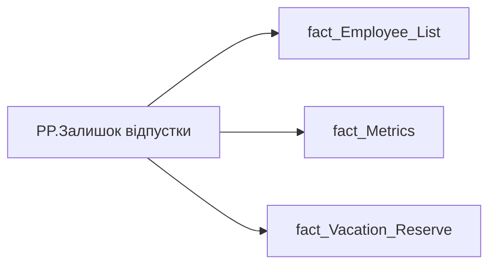

# PP.Залишок відпустки

*тека `Personal_Profile\Здоров'я та благополуччя` · формат `0;-0;0`*

!!! abstract "Джерела даних"
    `DM.vw_R27_fact_Vacation_Reserve_PDP`

## Бізнес-суть

IS_MAIN_POSITION → Пріоритетне місце роботи; IS_MAIN_POSITION → is_main_position; VACATION_RESERVE_BY_MAIN_POSITION → Залишок відпустки

1 - Так  <br>0 - Ні Це залишок днів відпусток, по яким формується резерв відпусток по підприємству /п)  <br>Це поле має бути доступне у візуалізаціях, побудованих на основі фактової таблиці [ DM.vw_R27_fact_Vacation_Reserve].  <br>Цифру округлювати до цілих в більшу сторону, якщо цифра після коми 5-9, і в меншу сторону, якщо цифра після коми 0-4.  <br>Не включати в MVP, але потрібно буде додати цей же показник, але в роках. Це відношення норми днів відпусток до залишку відпусток. Норма днів відпусток - відсутній в джерелах даних, потрібно досліджувати.

**Вимоги:** `Індивідуальний-профіль-працівника/Історія-по-посадам`, `Індивідуальний-профіль-працівника/Історія-по-посадам/Реліз-1.-Історія-по-посадам`, `Індивідуальний-профіль-працівника/Сторінка-Взаємодія-Viva-та-залученість-працівника/Сторінка-Ефективність-працівника/Вітрина-Відвідування-офісів`, `Індивідуальний-профіль-працівника/Сторінка-Загальна-інформація-про-працівника`, `Індивідуальний-профіль-працівника/Сторінка-Здоров'я-та-благополуччя-працівника`, `Командний-профіль/Сторінка-Моя-команда/ТЗ.-Деталізація-метрик-групового-профілю-звіту`, `Командний-профіль/Сторінка-Плинність-та-Exits/ТЗ-на-вітрину-Exits`

## На сторінках звіту

[Personal Profile](../report/personal-profile.md)

## Пов'язані міри

_Прямих зв'язків з іншими мірами немає._

---

## Технічний опис

| Властивість | Значення |
|---|---|
| Тип | міра |
| Home table | _Measures |
| displayFolder | `Personal_Profile\Здоров'я та благополуччя` |
| formatString | `0;-0;0` |
| dataType | — |
| Прихована | ні |

### DAX

```dax
VAR _employee_id = SELECTEDVALUE('fact_Employee_List'[EMPLOYEE_ID])
VAR _main_position = 
	CALCULATE(
		VALUES('fact_Employee_List'[USER_ACCESS_ID]),
		REMOVEFILTERS('fact_Employee_List'),
		'fact_Employee_List'[EMPLOYEE_ID] = _employee_id,
		'fact_Employee_List'[IS_MAIN_POSITION] = 1
	)
VAR _filter0 = TREATAS({_main_position}, 'fact_Vacation_Reserve'[USER_ACCESS_ID])
VAR _res = 
	CALCULATE(
		SUM('fact_Metrics'[VACATION_RESERVE_BY_MAIN_POSITION])
		--,
		--REMOVEFILTERS('fact_Vacation_Reserve'),
		--_filter0
	)
RETURN _res
```

### Джерела даних

Вихідні таблиці: `DM.vw_R27_fact_Vacation_Reserve_PDP`

Колонки: `EMPLOYEE_ID`, `IS_MAIN_POSITION`, `USER_ACCESS_ID`, `VACATION_RESERVE_BY_MAIN_POSITION`

Power Query: `fact_Employee_List`

### Залежності (таблиці й колонки)

Таблиці: `fact_Employee_List`, `fact_Metrics`, `fact_Vacation_Reserve`

Колонки: `fact_Employee_List[EMPLOYEE_ID]`, `fact_Employee_List[IS_MAIN_POSITION]`, `fact_Employee_List[USER_ACCESS_ID]`, `fact_Metrics[VACATION_RESERVE_BY_MAIN_POSITION]`, `fact_Vacation_Reserve[USER_ACCESS_ID]`

### Схема



## Нотатки

_порожньо_
