# Схема моделі

Модель — це **схема-сузір'я**: **28** фактових таблиць, пов'язаних із вимірами через **145** зв'язків (many → one). Щоб не зливати все в одну нечитабельну діаграму, нижче наведено окрему **зіркову схему на кожну фактову таблицю**.

## Конформовані виміри

Виміри, спільні для кількох фактів (число — у скількох фактах використовується). Натисніть на таблицю, щоб відкрити її опис.

| Вимір | Фактів |
|---|---|
| [`dim_Admin_OS`](entities/dim-admin-os.md) | 20 |
| [`dim_Employee_Status`](entities/dim-employee-status.md) | 14 |
| [`dim_Employment_Type`](entities/dim-employment-type.md) | 14 |
| [`dim_Position`](entities/dim-position.md) | 14 |
| [`dim_Position_Category`](entities/dim-position-category.md) | 14 |
| [`dim_Date`](entities/dim-date.md) | 13 |
| [`dim_Person`](entities/dim-person.md) | 13 |
| [`dim_Office`](entities/dim-office.md) | 12 |
| [`dim_Unit`](entities/dim-unit.md) | 12 |
| [`dim_Organization`](entities/dim-organization.md) | 3 |
| [`dim_Performance_Evalution`](entities/dim-performance-evalution.md) | 3 |
| [`dim_OKR_Evalution`](entities/dim-okr-evalution.md) | 2 |
| [`dim_TRS_categories`](entities/dim-trs-categories.md) | 2 |
| [`dim_Work_Format`](entities/dim-work-format.md) | 2 |
| [`dim_Employee_Special_FinBP`](entities/dim-employee-special-finbp.md) | 1 |
| [`dim_Employee_Special_HRBP`](entities/dim-employee-special-hrbp.md) | 1 |
| [`dim_Employee_Special_Head_admin`](entities/dim-employee-special-head-admin.md) | 1 |
| [`dim_Employee_Special_Head_functional`](entities/dim-employee-special-head-functional.md) | 1 |
| [`dim_LP_risks`](entities/dim-lp-risks.md) | 1 |
| [`dim_Permanent_Temporary`](entities/dim-permanent-temporary.md) | 1 |

## Зіркові схеми за фактами

У кожній схемі фактова таблиця у центрі, навколо — її виміри; підпис на зв'язку — ключ з'єднання.

### fact_Average_Income

[`fact_Average_Income`](entities/fact-average-income.md)

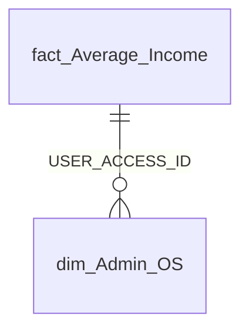

### fact_Burnout_Indicators

[`fact_Burnout_Indicators`](entities/fact-burnout-indicators.md)

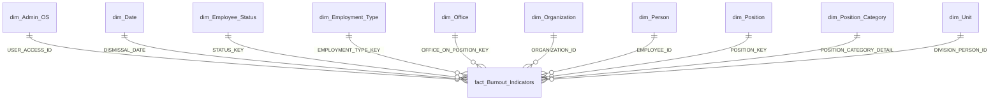

### fact_EXCEL_Group_Profile_General_Metric

[`fact_EXCEL_Group_Profile_General_Metric`](entities/fact-excel-group-profile-general-metric.md)

_Без зв'язків у моделі._

### fact_Employee_History_Position

[`fact_Employee_History_Position`](entities/fact-employee-history-position.md)

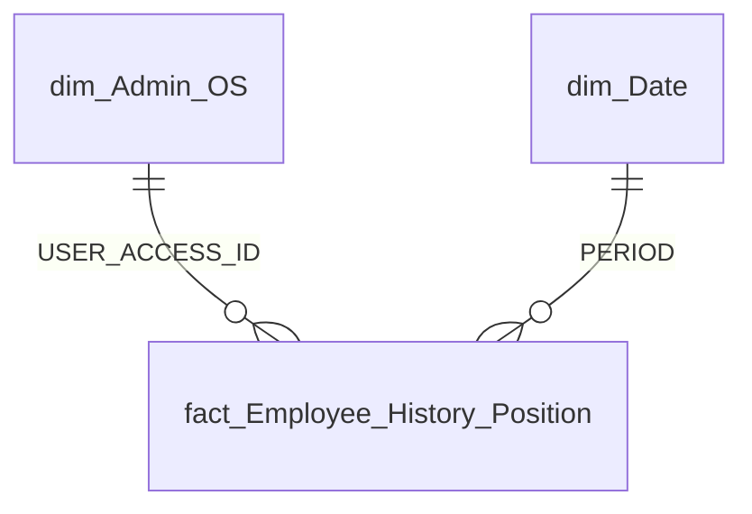

### fact_Employee_List

[`fact_Employee_List`](entities/fact-employee-list.md)

```mermaid
erDiagram
  dim_Admin_OS ||--o{ fact_Employee_List : "USER_ACCESS_ID"
  dim_Employee_Special_FinBP ||--o{ fact_Employee_List : "EMP_HEAD_FUNCTIONAL_ID"
  dim_Employee_Special_HRBP ||--o{ fact_Employee_List : "EMP_HRBP_ID"
  dim_Employee_Special_Head_admin ||--o{ fact_Employee_List : "EMP_HEAD_ADMIN_ID"
  dim_Employee_Special_Head_functional ||--o{ fact_Employee_List : "EMP_HEAD_FUNCTIONAL_ID"
  dim_Employee_Status ||--o{ fact_Employee_List : "STATUS_KEY"
  dim_Employment_Type ||--o{ fact_Employee_List : "EMPLOYMENT_TYPE_KEY"
  dim_Office ||--o{ fact_Employee_List : "OFFICE_ON_POSITION_KEY"
  dim_Organization ||--o{ fact_Employee_List : "ORGANIZATION_KEY"
  dim_Permanent_Temporary ||--o{ fact_Employee_List : "PERMANENT_TEMPORARY_DETAILS_ID"
  dim_Person ||--o{ fact_Employee_List : "PERSON_KEY"
  dim_Position ||--o{ fact_Employee_List : "POSITION_KEY"
  dim_Position_Category ||--o{ fact_Employee_List : "POSITION_CATEGORY_DETAIL"
  dim_Unit ||--o{ fact_Employee_List : "DIVISION_KEY"
  dim_Work_Format ||--o{ fact_Employee_List : "WORK_FORMAT_ON_EMPLOYEE_KEY"
```

### fact_Employee_OKR

[`fact_Employee_OKR`](entities/fact-employee-okr.md)

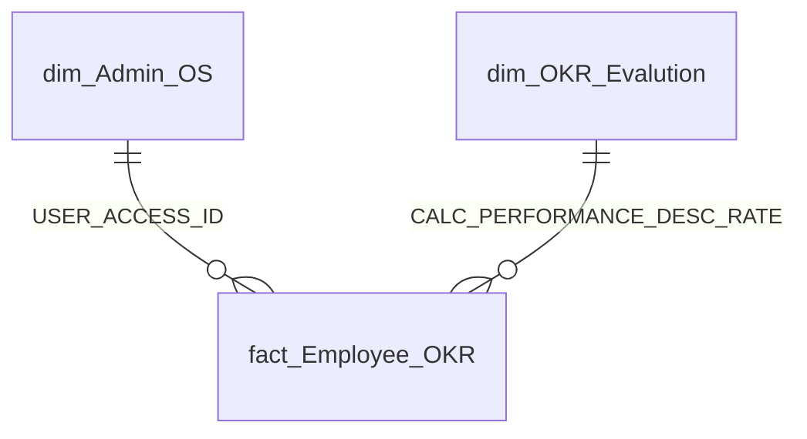

### fact_Employee_Performance

[`fact_Employee_Performance`](entities/fact-employee-performance.md)

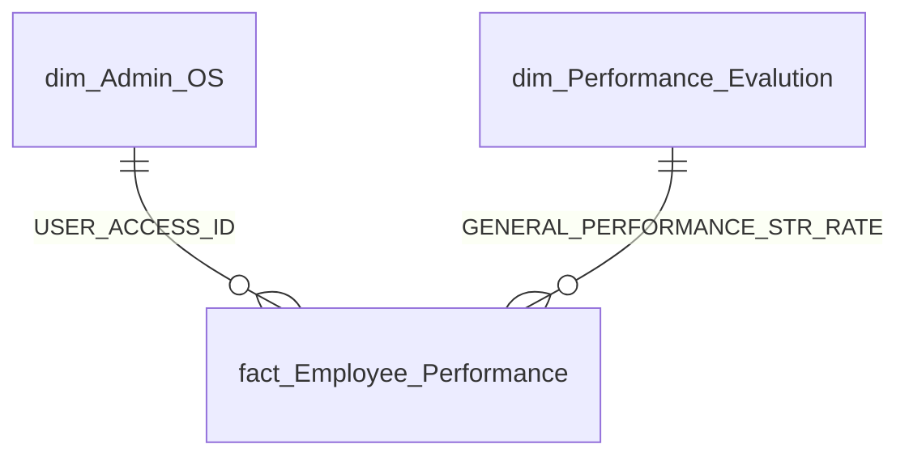

### fact_Employee_Performance_Total

[`fact_Employee_Performance_Total`](entities/fact-employee-performance-total.md)

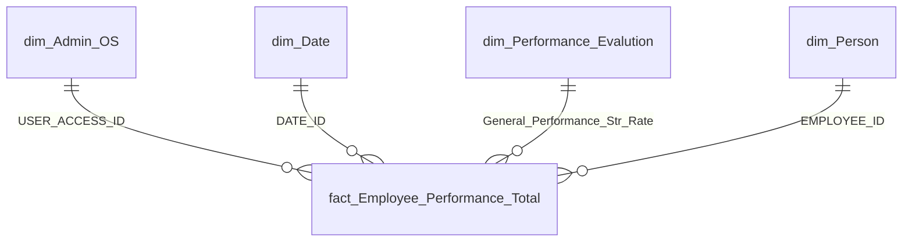

### fact_Employees_Attributes

[`fact_Employees_Attributes`](entities/fact-employees-attributes.md)

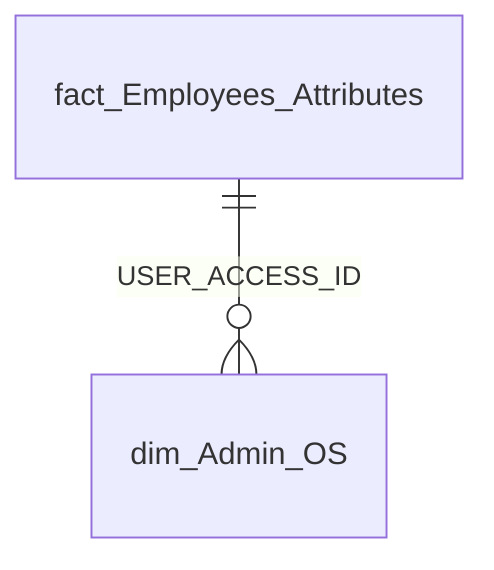

### fact_Gaussian_Curve_OKR

[`fact_Gaussian_Curve_OKR`](entities/fact-gaussian-curve-okr.md)

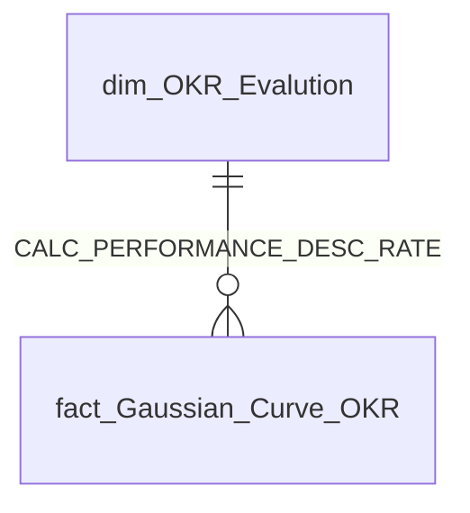

### fact_Gaussian_Curve_Performance

[`fact_Gaussian_Curve_Performance`](entities/fact-gaussian-curve-performance.md)

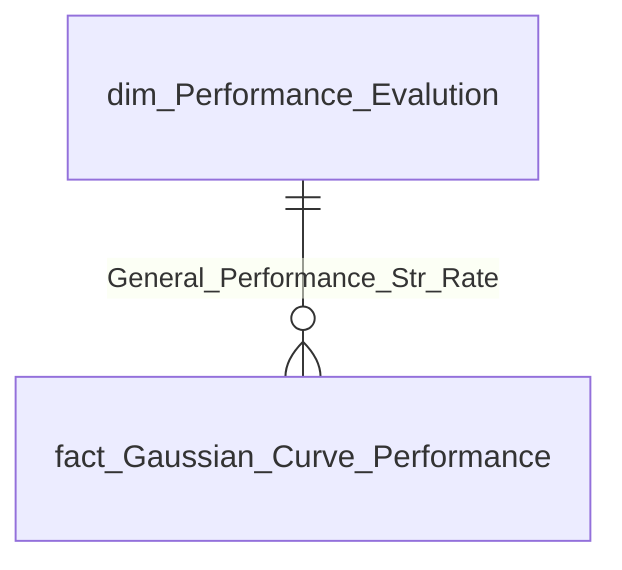

### fact_Loss_of_Productivity

[`fact_Loss_of_Productivity`](entities/fact-loss-of-productivity.md)

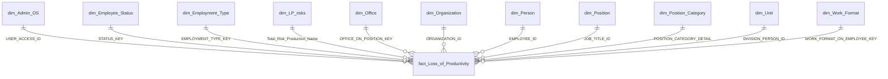

### fact_Metrics

[`fact_Metrics`](entities/fact-metrics.md)

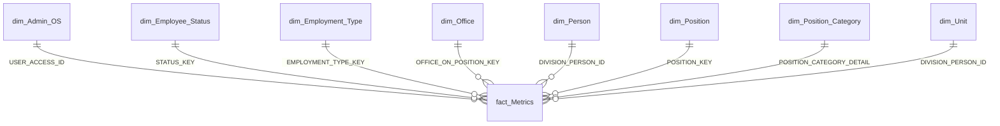

### fact_Mobile_Limit

[`fact_Mobile_Limit`](entities/fact-mobile-limit.md)

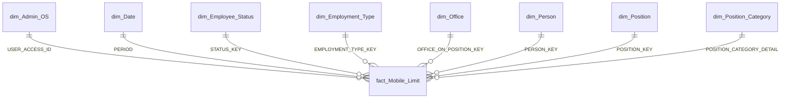

### fact_Monthly_Viva_Insights

[`fact_Monthly_Viva_Insights`](entities/fact-monthly-viva-insights.md)

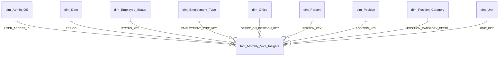

### fact_OKR_Goals

[`fact_OKR_Goals`](entities/fact-okr-goals.md)

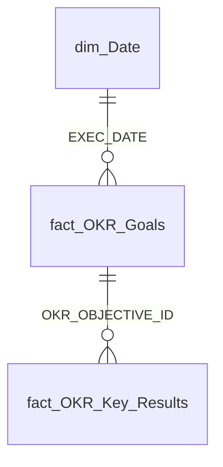

### fact_OKR_Key_Results

[`fact_OKR_Key_Results`](entities/fact-okr-key-results.md)

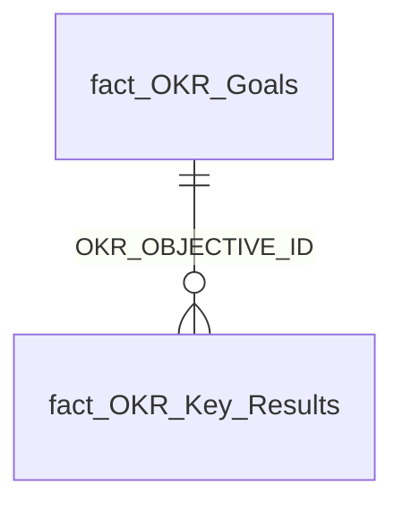

### fact_OKR_SVG

[`fact_OKR_SVG`](entities/fact-okr-svg.md)

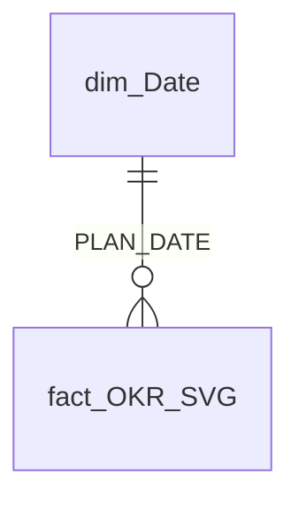

### fact_Repayment_Credit

[`fact_Repayment_Credit`](entities/fact-repayment-credit.md)

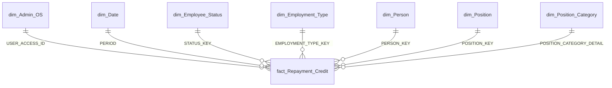

### fact_Sick_Leaves

[`fact_Sick_Leaves`](entities/fact-sick-leaves.md)

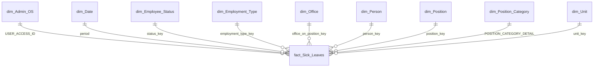

### fact_TRS

[`fact_TRS`](entities/fact-trs.md)

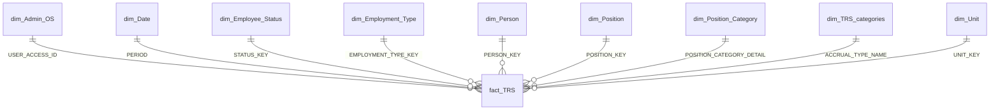

### fact_TRS_Plan

[`fact_TRS_Plan`](entities/fact-trs-plan.md)

```mermaid
erDiagram
  dim_Admin_OS ||--o{ fact_TRS_Plan : "USER_ACCESS_ID"
  dim_Date ||--o{ fact_TRS_Plan : "PERIOD"
  dim_Employee_Status ||--o{ fact_TRS_Plan : "STATUS_KEY"
  dim_Employment_Type ||--o{ fact_TRS_Plan : "EMPLOYMENT_TYPE_ID"
  dim_Office ||--o{ fact_TRS_Plan : "OFFICE_ON_POSITION_KEY"
  dim_Person ||--o{ fact_TRS_Plan : "DIVISION_PERSON_ID"
  dim_Position ||--o{ fact_TRS_Plan : "POSITION_KEY"
  dim_Position_Category ||--o{ fact_TRS_Plan : "POSITION_CATEGORY_DETAIL"
  dim_TRS_categories ||--o{ fact_TRS_Plan : "ACCRUAL_ORG_NAME"
  dim_Unit ||--o{ fact_TRS_Plan : "DIVISION_PERSON_ID"
```

### fact_TRS_plan_fact

[`fact_TRS_plan_fact`](entities/fact-trs-plan-fact.md)

_Без зв'язків у моделі._

### fact_Vacancy

[`fact_Vacancy`](entities/fact-vacancy.md)

```mermaid
erDiagram
  fact_Vacancy ||--o{ dim_Admin_OS : "DIVISION_POSITION_ID"
```

### fact_Vacation

[`fact_Vacation`](entities/fact-vacation.md)

```mermaid
erDiagram
  dim_Admin_OS ||--o{ fact_Vacation : "USER_ACCESS_ID"
  dim_Date ||--o{ fact_Vacation : "PERIOD"
  dim_Employee_Status ||--o{ fact_Vacation : "STATUS_KEY"
  dim_Employment_Type ||--o{ fact_Vacation : "EMPLOYMENT_TYPE_KEY"
  dim_Office ||--o{ fact_Vacation : "OFFICE_ON_POSITION_KEY"
  dim_Person ||--o{ fact_Vacation : "DIVISION_PERSON_ID"
  dim_Position ||--o{ fact_Vacation : "JOB_TITLE_ID"
  dim_Position_Category ||--o{ fact_Vacation : "POSITION_CATEGORY_DETAIL"
  dim_Unit ||--o{ fact_Vacation : "DIVISION_PERSON_ID"
```

### fact_Vacation_Reserve

[`fact_Vacation_Reserve`](entities/fact-vacation-reserve.md)

```mermaid
erDiagram
  dim_Admin_OS ||--o{ fact_Vacation_Reserve : "USER_ACCESS_ID"
  dim_Date ||--o{ fact_Vacation_Reserve : "PERIOD"
  dim_Employee_Status ||--o{ fact_Vacation_Reserve : "STATUS_KEY"
  dim_Employment_Type ||--o{ fact_Vacation_Reserve : "EMPLOYMENT_TYPE_KEY"
  dim_Office ||--o{ fact_Vacation_Reserve : "OFFICE_ON_POSITION_KEY"
  dim_Person ||--o{ fact_Vacation_Reserve : "DIVISION_PERSON_ID"
  dim_Position ||--o{ fact_Vacation_Reserve : "JOB_TITLE_ID"
  dim_Position_Category ||--o{ fact_Vacation_Reserve : "POSITION_CATEGORY_DETAIL"
  dim_Unit ||--o{ fact_Vacation_Reserve : "DIVISION_PERSON_ID"
```

### fact_Viva_Metrics

[`fact_Viva_Metrics`](entities/fact-viva-metrics.md)

```mermaid
erDiagram
  dim_Employee_Status ||--o{ fact_Viva_Metrics : "STATUS_KEY"
  dim_Employment_Type ||--o{ fact_Viva_Metrics : "EMPLOYMENT_TYPE_KEY"
  dim_Office ||--o{ fact_Viva_Metrics : "OFFICE_ON_POSITION_KEY"
  dim_Position ||--o{ fact_Viva_Metrics : "POSITION_KEY"
  dim_Position_Category ||--o{ fact_Viva_Metrics : "POSITION_CATEGORY_DETAIL"
  dim_Unit ||--o{ fact_Viva_Metrics : "DIVISION_PERSON_ID"
```

### fact_employee_seniority_by_month

[`fact_employee_seniority_by_month`](entities/fact-employee-seniority-by-month.md)

```mermaid
erDiagram
  dim_Admin_OS ||--o{ fact_employee_seniority_by_month : "USER_ACCESS_ID"
  dim_Employee_Status ||--o{ fact_employee_seniority_by_month : "STATUS_KEY"
  dim_Employment_Type ||--o{ fact_employee_seniority_by_month : "EMPLOYMENT_TYPE_KEY"
  dim_Office ||--o{ fact_employee_seniority_by_month : "OFFICE_ON_POSITION_KEY"
  dim_Position ||--o{ fact_employee_seniority_by_month : "POSITION_KEY"
  dim_Position_Category ||--o{ fact_employee_seniority_by_month : "POSITION_CATEGORY_DETAIL"
  dim_Unit ||--o{ fact_employee_seniority_by_month : "DIVISION_PERSON_ID"
```

